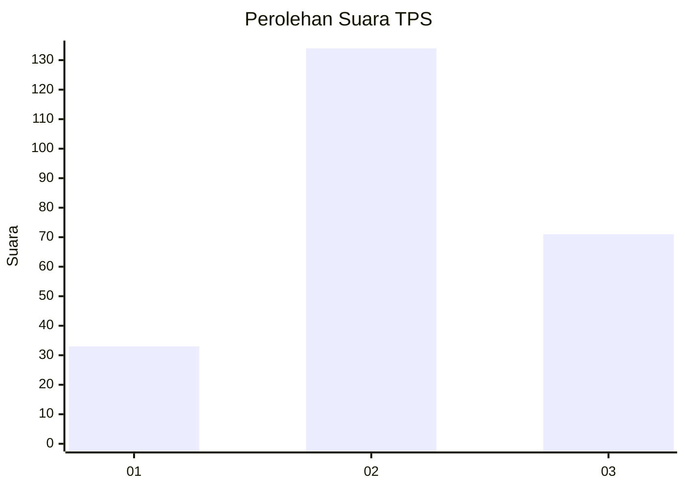
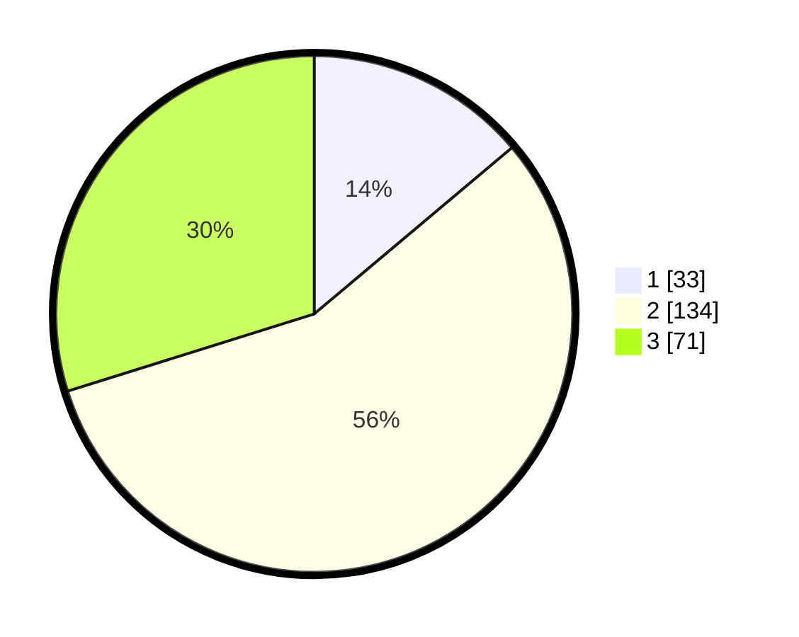

# Hasil

## Grafik

## Tabel

| No. | Nama Paslon    | Suara | Suara (raw) | Persentase |
|:--- |:-------------- | -----:| -----------:| ----------:|
| 1   | ANIES MUHAIMIN | 33    | [33][p-1]   | 13,87      |
| 2   | PRABOWO GIBRAN | 134   | [134][p-2]  | 56,30      |
| 3   | GANJAR MAHFUD  | 71    | [71][p-3]   | 29,83      |

[p-1]: https://github.com/gigit-pemilu/pemilu-2024-51-bali/blob/main/pilpres/hitung-suara/sub/51-bali/sub/01-jembrana/sub/01-negara/sub/2004-kaliakah/sub/019-tps/sub/paslon-1.txt
[p-2]: https://github.com/gigit-pemilu/pemilu-2024-51-bali/blob/main/pilpres/hitung-suara/sub/51-bali/sub/01-jembrana/sub/01-negara/sub/2004-kaliakah/sub/019-tps/sub/paslon-2.txt
[p-3]: https://github.com/gigit-pemilu/pemilu-2024-51-bali/blob/main/pilpres/hitung-suara/sub/51-bali/sub/01-jembrana/sub/01-negara/sub/2004-kaliakah/sub/019-tps/sub/paslon-3.txt

## Foto C Plano

https://sirekap-obj-formc.kpu.go.id/fb41/pemilu/ppwp/51/01/01/20/04/5101012004019-20240214-184852--b5734029-9621-4bb3-a08b-85b38ea800c0.jpg

https://sirekap-obj-formc.kpu.go.id/fb41/pemilu/ppwp/51/01/01/20/04/5101012004019-20240214-185717--e3262b1d-d8d8-46ea-9627-e1236f3b320c.jpg

## Metadata

| Key        | Value               |
| ---------- | ------------------- |
| Time Stamp | 2024-02-15 07:00:44 |

