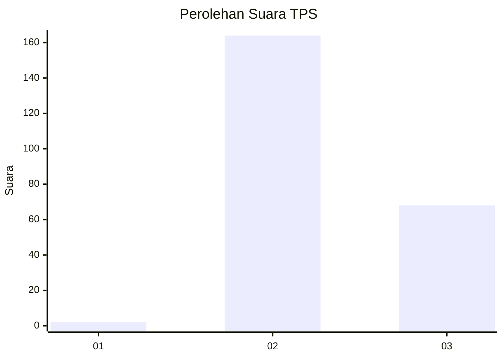
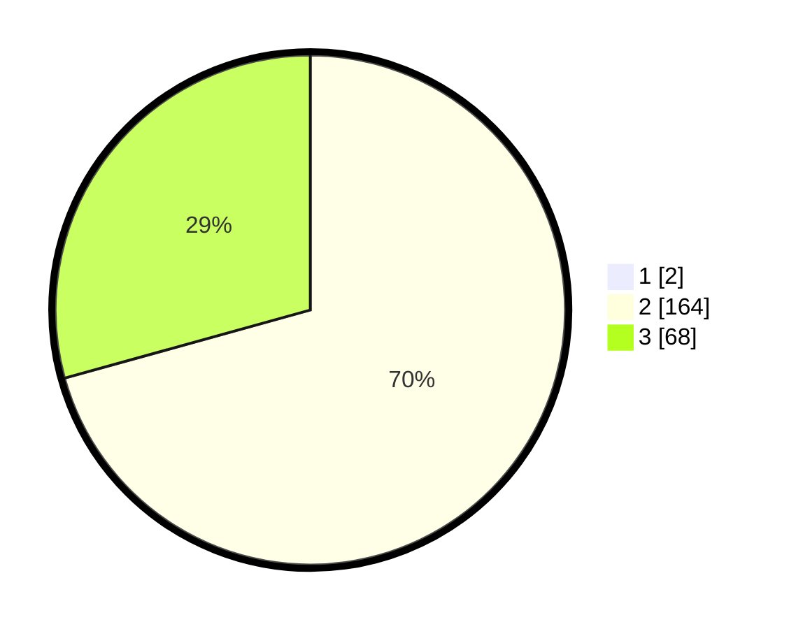

# Hasil

## Grafik

## Tabel

| No. | Nama Paslon    | Suara | Suara (raw) | Persentase |
|:--- |:-------------- | -----:| -----------:| ----------:|
| 1   | ANIES MUHAIMIN | 2     | [2][p-1]    | 0,85       |
| 2   | PRABOWO GIBRAN | 164   | [164][p-2]  | 70,09      |
| 3   | GANJAR MAHFUD  | 68    | [68][p-3]   | 29,06      |

[p-1]: https://github.com/gigit-pemilu/pemilu-2024-51-bali/blob/main/pilpres/hitung-suara/sub/51-bali/sub/01-jembrana/sub/01-negara/sub/2005-berangbang/sub/001-tps/sub/paslon-1.txt
[p-2]: https://github.com/gigit-pemilu/pemilu-2024-51-bali/blob/main/pilpres/hitung-suara/sub/51-bali/sub/01-jembrana/sub/01-negara/sub/2005-berangbang/sub/001-tps/sub/paslon-2.txt
[p-3]: https://github.com/gigit-pemilu/pemilu-2024-51-bali/blob/main/pilpres/hitung-suara/sub/51-bali/sub/01-jembrana/sub/01-negara/sub/2005-berangbang/sub/001-tps/sub/paslon-3.txt

## Foto C Plano

https://sirekap-obj-formc.kpu.go.id/f303/pemilu/ppwp/51/01/01/20/05/5101012005001-20240215-105601--16c2cbfa-17c7-4f8e-b867-5e2461b42f41.jpg

https://sirekap-obj-formc.kpu.go.id/f303/pemilu/ppwp/51/01/01/20/05/5101012005001-20240215-105802--db3b7825-1e67-4437-8144-07754ee0059e.jpg

https://sirekap-obj-formc.kpu.go.id/f303/pemilu/ppwp/51/01/01/20/05/5101012005001-20240215-110206--edb2c50b-1dd3-4782-b468-306e42485537.jpg

## Metadata

| Key        | Value               |
| ---------- | ------------------- |
| Time Stamp | 2024-02-16 06:30:27 |

## DATA PEMILIH TETAP

Jumlah pemilih dalam DPT: **296**.
 * L: **151**.
 * P: **145**.

## DATA PENGGUNA HAK PILIH

Jumlah pengguna hak pilih dalam DPT: **232**.
 * L: **115**.
 * P: **117**.

Jumlah pengguna hak pilih dalam DPTb: **0**.
 * L: **0**.
 * P: **0**.

Jumlah pengguna hak pilih dalam DPK: **5**.
 * L: **4**.
 * P: **1**.

Jumlah pengguna hak pilih: **237**.
 * L: **119**.
 * P: **118**.

## JUMLAH SUARA SAH DAN TIDAK SAH

JUMLAH SELURUH SUARA SAH: **234**.

JUMLAH SUARA TIDAK SAH: **3**.

JUMLAH SELURUH SUARA SAH DAN SUARA TIDAK SAH: **237**.

