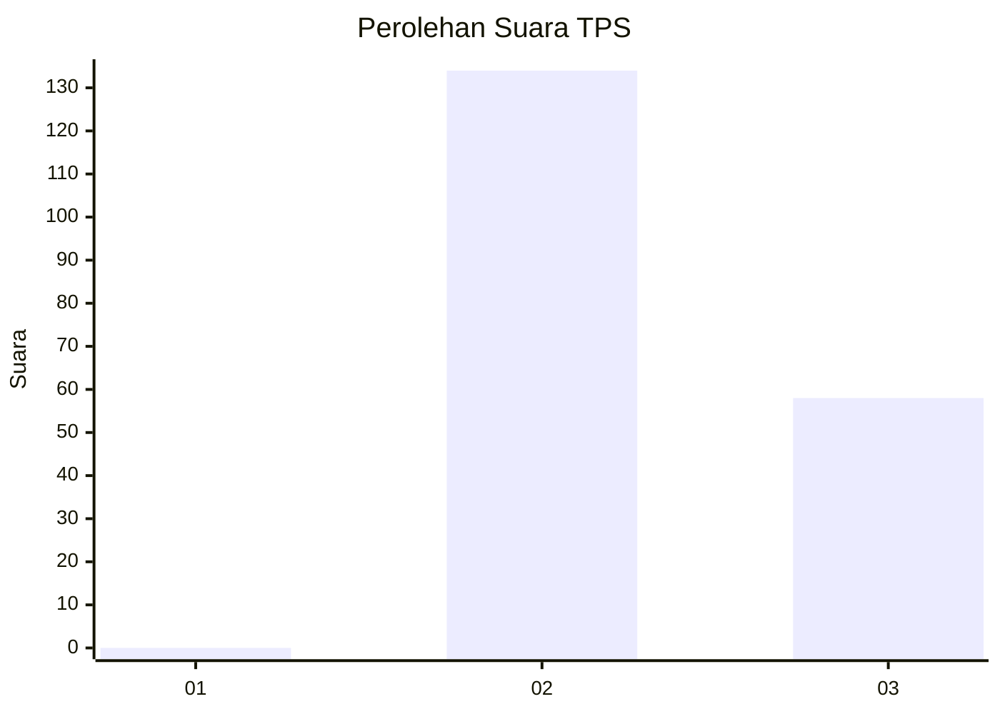
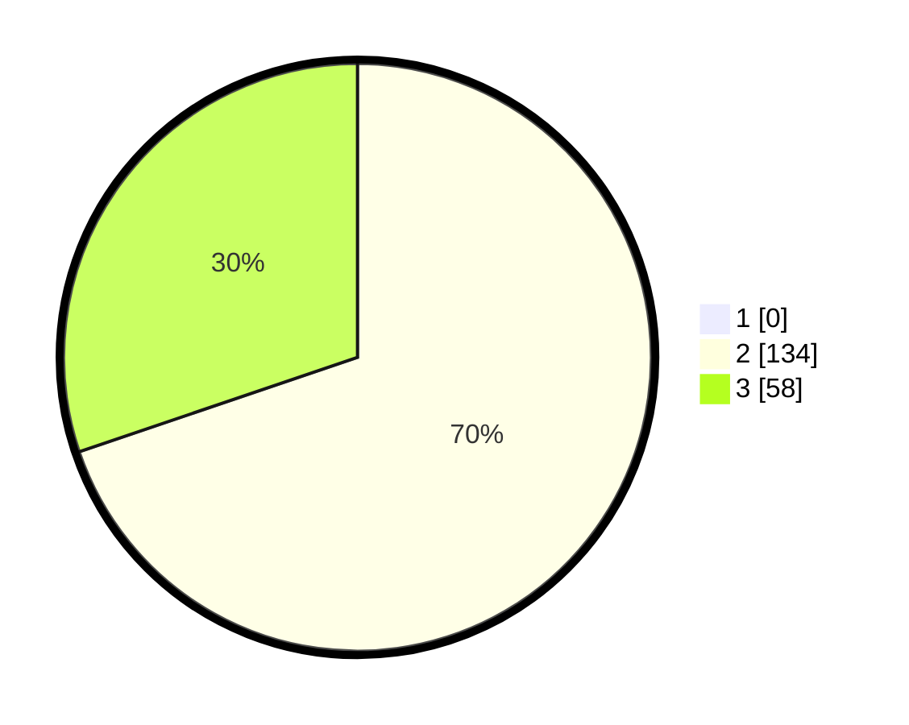

# Hasil

## Grafik

## Tabel

| No. | Nama Paslon    | Suara | Suara (raw) | Persentase |
|:--- |:-------------- | -----:| -----------:| ----------:|
| 1   | ANIES MUHAIMIN | 0     | [0][p-1]    | 0,00       |
| 2   | PRABOWO GIBRAN | 134   | [134][p-2]  | 69,79      |
| 3   | GANJAR MAHFUD  | 58    | [58][p-3]   | 30,21      |

[p-1]: https://github.com/gigit-pemilu/pemilu-2024-51-bali/blob/main/pilpres/hitung-suara/sub/51-bali/sub/01-jembrana/sub/01-negara/sub/2005-berangbang/sub/007-tps/sub/paslon-1.txt
[p-2]: https://github.com/gigit-pemilu/pemilu-2024-51-bali/blob/main/pilpres/hitung-suara/sub/51-bali/sub/01-jembrana/sub/01-negara/sub/2005-berangbang/sub/007-tps/sub/paslon-2.txt
[p-3]: https://github.com/gigit-pemilu/pemilu-2024-51-bali/blob/main/pilpres/hitung-suara/sub/51-bali/sub/01-jembrana/sub/01-negara/sub/2005-berangbang/sub/007-tps/sub/paslon-3.txt

## Foto C Plano

https://sirekap-obj-formc.kpu.go.id/a88d/pemilu/ppwp/51/01/01/20/05/5101012005007-20240214-131735--4940cd83-bc8f-4b2c-981b-82c239fe9def.jpg

https://sirekap-obj-formc.kpu.go.id/a88d/pemilu/ppwp/51/01/01/20/05/5101012005007-20240214-132240--a0c5f197-7c94-4fdc-8a60-104b4639ab0d.jpg

https://sirekap-obj-formc.kpu.go.id/a88d/pemilu/ppwp/51/01/01/20/05/5101012005007-20240214-132356--e0f92f56-9ce2-4370-a304-43bcd9ee7524.jpg

## Metadata

| Key        | Value               |
| ---------- | ------------------- |
| Time Stamp | 2024-02-14 21:46:01 |

## DATA PEMILIH TETAP

Jumlah pemilih dalam DPT: **234**.
 * L: **114**.
 * P: **120**.

## DATA PENGGUNA HAK PILIH

Jumlah pengguna hak pilih dalam DPT: **234**.
 * L: **114**.
 * P: **120**.

Jumlah pengguna hak pilih dalam DPTb: **0**.
 * L: **0**.
 * P: **0**.

Jumlah pengguna hak pilih dalam DPK: **0**.
 * L: **0**.
 * P: **0**.

Jumlah pengguna hak pilih: **234**.
 * L: **114**.
 * P: **120**.

## JUMLAH SUARA SAH DAN TIDAK SAH

JUMLAH SELURUH SUARA SAH: **192**.

JUMLAH SUARA TIDAK SAH: **0**.

JUMLAH SELURUH SUARA SAH DAN SUARA TIDAK SAH: **192**.

