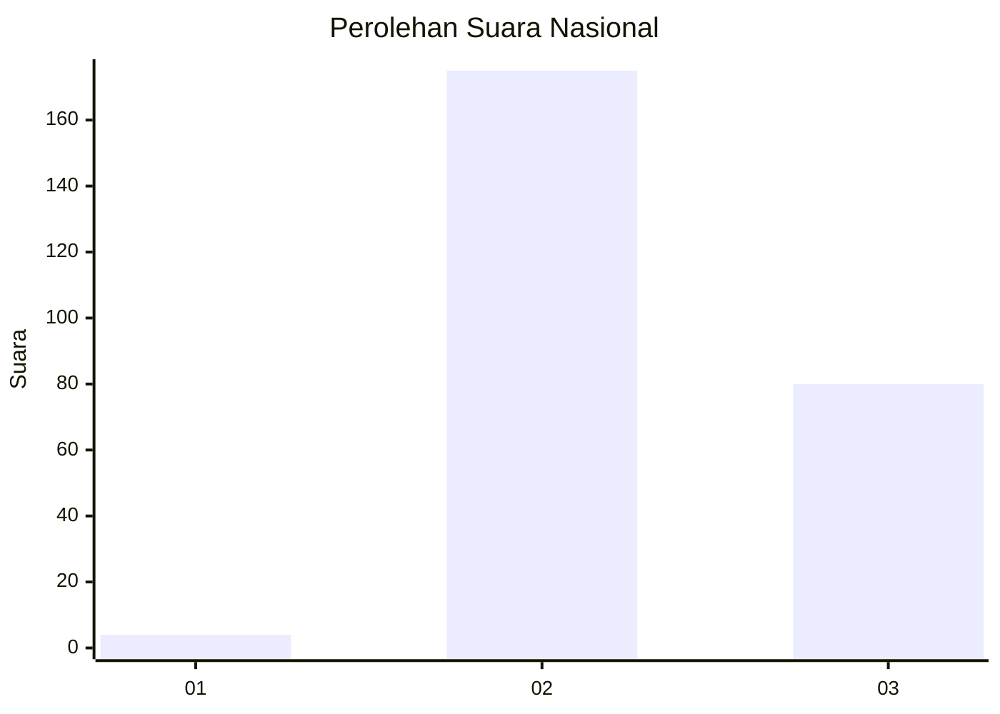
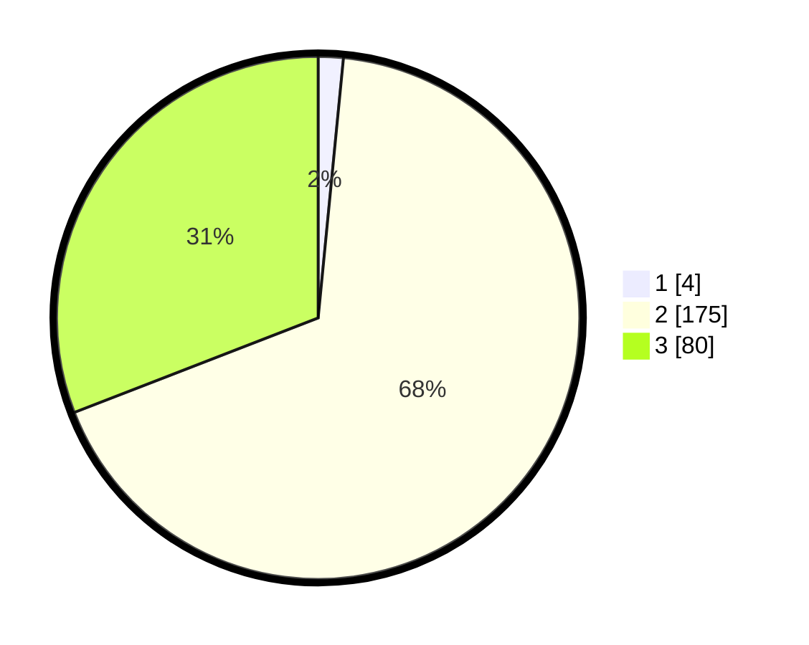

# Hasil

## Grafik

## Tabel

| No. | Nama Paslon    | Suara | Suara (raw) | Persentase |
|:--- |:-------------- | -----:| -----------:| ----------:|
| 1   | ANIES MUHAIMIN | 4     | [4][p-1]    | 1,54       |
| 2   | PRABOWO GIBRAN | 175   | [175][p-2]  | 67,57      |
| 3   | GANJAR MAHFUD  | 80    | [80][p-3]   | 30,89      |

[p-1]: https://github.com/gigit-pemilu/pemilu-2024/blob/main/pilpres/hitung-suara/sub/51-bali/sub/01-jembrana/sub/01-negara/sub/2005-berangbang/sub/019-tps/sub/paslon-1.txt
[p-2]: https://github.com/gigit-pemilu/pemilu-2024/blob/main/pilpres/hitung-suara/sub/51-bali/sub/01-jembrana/sub/01-negara/sub/2005-berangbang/sub/019-tps/sub/paslon-2.txt
[p-3]: https://github.com/gigit-pemilu/pemilu-2024/blob/main/pilpres/hitung-suara/sub/51-bali/sub/01-jembrana/sub/01-negara/sub/2005-berangbang/sub/019-tps/sub/paslon-3.txt

## Foto C Plano

https://sirekap-obj-formc.kpu.go.id/0fbe/pemilu/ppwp/51/01/01/20/05/5101012005019-20240215-011735--74cf2d70-24f9-4199-8ec2-9046b440ccfe.jpg

https://sirekap-obj-formc.kpu.go.id/0fbe/pemilu/ppwp/51/01/01/20/05/5101012005019-20240215-011847--c44ef391-8b72-4b9a-9d5b-b789fb3d82ff.jpg

https://sirekap-obj-formc.kpu.go.id/0fbe/pemilu/ppwp/51/01/01/20/05/5101012005019-20240215-012045--8145b4c2-7ebd-4969-aefa-367cd5471e8a.jpg

## Metadata

| Key        | Value               |
| ---------- | ------------------- |
| Time Stamp | 2024-02-15 15:00:29 |

## DATA PEMILIH TETAP

Jumlah pemilih dalam DPT: **296**.
 * L: **156**.
 * P: **140**.

## DATA PENGGUNA HAK PILIH

Jumlah pengguna hak pilih dalam DPT: **264**.
 * L: **139**.
 * P: **125**.

Jumlah pengguna hak pilih dalam DPTb: **0**.
 * L: **0**.
 * P: **0**.

Jumlah pengguna hak pilih dalam DPK: **0**.
 * L: **0**.
 * P: **0**.

Jumlah pengguna hak pilih: **264**.
 * L: **139**.
 * P: **125**.

## JUMLAH SUARA SAH DAN TIDAK SAH

JUMLAH SELURUH SUARA SAH: **259**.

JUMLAH SUARA TIDAK SAH: **5**.

JUMLAH SELURUH SUARA SAH DAN SUARA TIDAK SAH: **264**.

