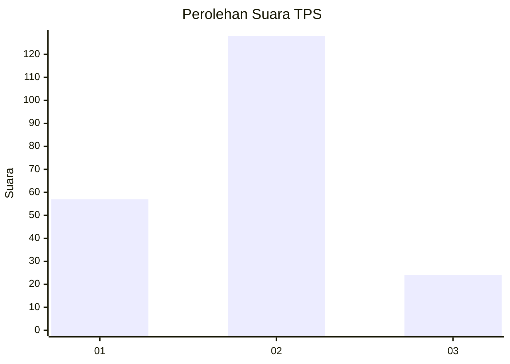
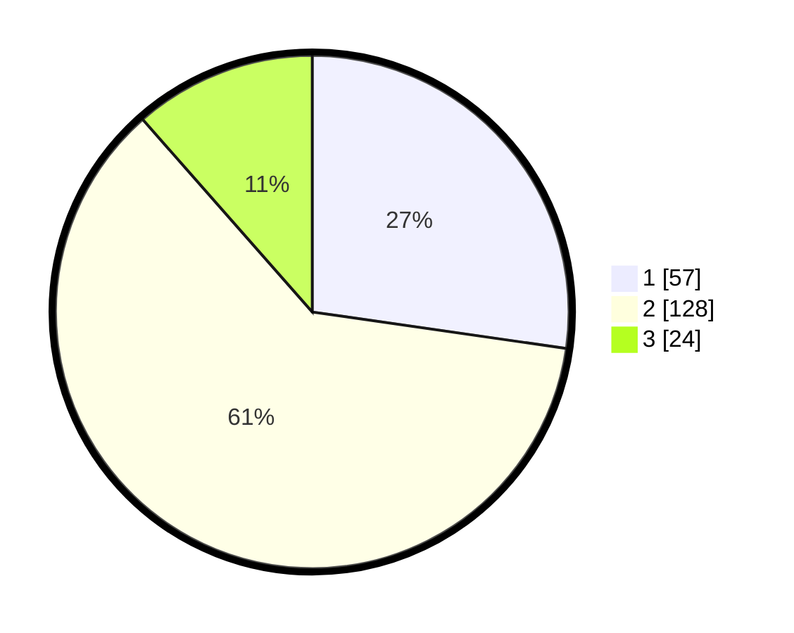

# Hasil

## Grafik

## Tabel

| No. | Nama Paslon    | Suara | Suara (raw) | Persentase |
|:--- |:-------------- | -----:| -----------:| ----------:|
| 1   | ANIES MUHAIMIN | 57    | [57][p-1]   | 27,27      |
| 2   | PRABOWO GIBRAN | 128   | [128][p-2]  | 61,24      |
| 3   | GANJAR MAHFUD  | 24    | [24][p-3]   | 11,48      |

[p-1]: https://github.com/gigit-pemilu/pemilu-2024-51-bali/blob/main/pilpres/hitung-suara/sub/51-bali/sub/01-jembrana/sub/01-negara/sub/2009-tegal-badeng-timur/sub/008-tps/sub/paslon-1.txt
[p-2]: https://github.com/gigit-pemilu/pemilu-2024-51-bali/blob/main/pilpres/hitung-suara/sub/51-bali/sub/01-jembrana/sub/01-negara/sub/2009-tegal-badeng-timur/sub/008-tps/sub/paslon-2.txt
[p-3]: https://github.com/gigit-pemilu/pemilu-2024-51-bali/blob/main/pilpres/hitung-suara/sub/51-bali/sub/01-jembrana/sub/01-negara/sub/2009-tegal-badeng-timur/sub/008-tps/sub/paslon-3.txt

## Foto C Plano

https://sirekap-obj-formc.kpu.go.id/c1b2/pemilu/ppwp/51/01/01/20/09/5101012009008-20240215-073232--10df63f6-434e-4320-9dcb-eaf90f9e0c8d.jpg

https://sirekap-obj-formc.kpu.go.id/c1b2/pemilu/ppwp/51/01/01/20/09/5101012009008-20240215-073238--5af639f7-750f-413e-a8a7-0920bebdc0ef.jpg

https://sirekap-obj-formc.kpu.go.id/c1b2/pemilu/ppwp/51/01/01/20/09/5101012009008-20240215-073244--5ea311d4-af2f-4c6e-a1e1-614cd2e07cdb.jpg

## Metadata

| Key        | Value               |
| ---------- | ------------------- |
| Time Stamp | 2024-02-16 06:00:27 |

## DATA PEMILIH TETAP

Jumlah pemilih dalam DPT: **288**.
 * L: **140**.
 * P: **148**.

## DATA PENGGUNA HAK PILIH

Jumlah pengguna hak pilih dalam DPT: **213**.
 * L: **97**.
 * P: **116**.

Jumlah pengguna hak pilih dalam DPTb: **0**.
 * L: **0**.
 * P: **0**.

Jumlah pengguna hak pilih dalam DPK: **4**.
 * L: **2**.
 * P: **2**.

Jumlah pengguna hak pilih: **217**.
 * L: **99**.
 * P: **118**.

## JUMLAH SUARA SAH DAN TIDAK SAH

JUMLAH SELURUH SUARA SAH: **209**.

JUMLAH SUARA TIDAK SAH: **8**.

JUMLAH SELURUH SUARA SAH DAN SUARA TIDAK SAH: **217**.

