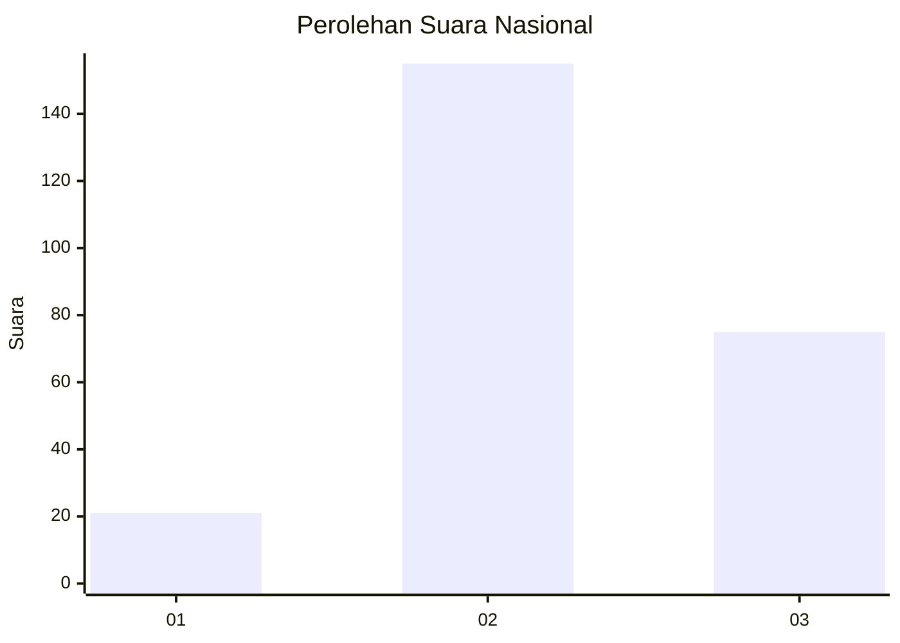
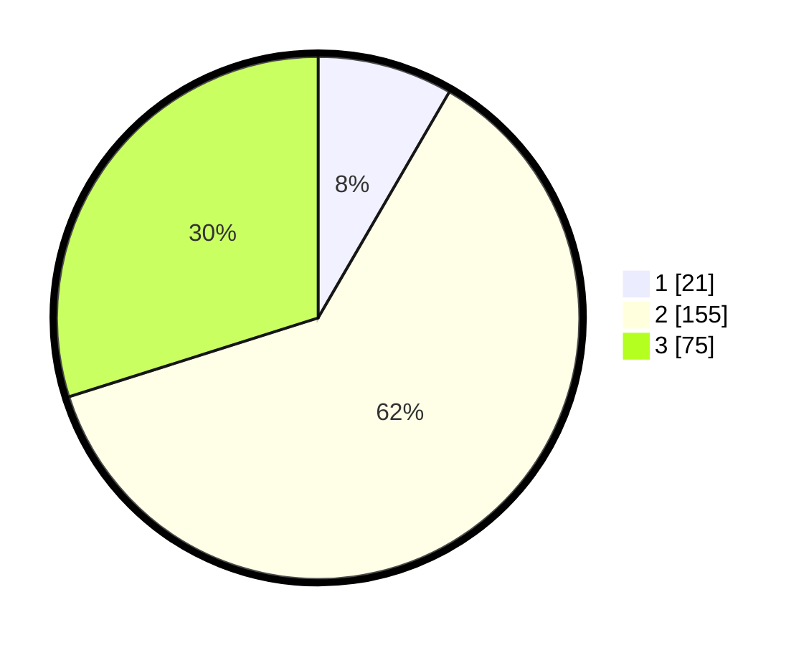

# Hasil

## Grafik

## Tabel

| No. | Nama Paslon    | Suara | Suara (raw) | Persentase |
|:--- |:-------------- | -----:| -----------:| ----------:|
| 1   | ANIES MUHAIMIN | 21    | [21][p-1]   | 8,37       |
| 2   | PRABOWO GIBRAN | 155   | [155][p-2]  | 61,75      |
| 3   | GANJAR MAHFUD  | 75    | [75][p-3]   | 29,88      |

[p-1]: https://github.com/gigit-pemilu/pemilu-2024/blob/main/pilpres/hitung-suara/sub/51-bali/sub/01-jembrana/sub/01-negara/sub/2010-tegal-badeng-barat/sub/001-tps/sub/paslon-1.txt
[p-2]: https://github.com/gigit-pemilu/pemilu-2024/blob/main/pilpres/hitung-suara/sub/51-bali/sub/01-jembrana/sub/01-negara/sub/2010-tegal-badeng-barat/sub/001-tps/sub/paslon-2.txt
[p-3]: https://github.com/gigit-pemilu/pemilu-2024/blob/main/pilpres/hitung-suara/sub/51-bali/sub/01-jembrana/sub/01-negara/sub/2010-tegal-badeng-barat/sub/001-tps/sub/paslon-3.txt

## Foto C Plano

https://sirekap-obj-formc.kpu.go.id/9bbc/pemilu/ppwp/51/01/01/20/10/5101012010001-20240214-214043--5cf689ad-01c8-4d4c-8877-943fe307169a.jpg

https://sirekap-obj-formc.kpu.go.id/9bbc/pemilu/ppwp/51/01/01/20/10/5101012010001-20240214-214133--9709e257-e0a3-4fc0-84ac-3c8b5cf4ed18.jpg

https://sirekap-obj-formc.kpu.go.id/9bbc/pemilu/ppwp/51/01/01/20/10/5101012010001-20240214-214140--ae88b2ce-3edc-4122-bacb-99aa83b5b908.jpg

## Metadata

| Key        | Value               |
| ---------- | ------------------- |
| Time Stamp | 2024-02-15 15:30:25 |

## DATA PEMILIH TETAP

Jumlah pemilih dalam DPT: **291**.
 * L: **146**.
 * P: **145**.

## DATA PENGGUNA HAK PILIH

Jumlah pengguna hak pilih dalam DPT: **245**.
 * L: **121**.
 * P: **124**.

Jumlah pengguna hak pilih dalam DPTb: **10**.
 * L: **4**.
 * P: **6**.

Jumlah pengguna hak pilih dalam DPK: **4**.
 * L: **1**.
 * P: **3**.

Jumlah pengguna hak pilih: **259**.
 * L: **126**.
 * P: **133**.

## JUMLAH SUARA SAH DAN TIDAK SAH

JUMLAH SELURUH SUARA SAH: **251**.

JUMLAH SUARA TIDAK SAH: **8**.

JUMLAH SELURUH SUARA SAH DAN SUARA TIDAK SAH: **259**.

