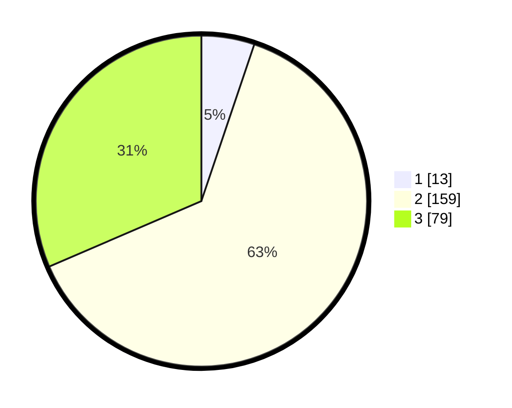

# Hasil

## Grafik

## Tabel

| No. | Nama Paslon    | Suara | Suara (raw) | Persentase |
|:--- |:-------------- | -----:| -----------:| ----------:|
| 1   | ANIES MUHAIMIN | 13    | [13][p-1]   | 5,18       |
| 2   | PRABOWO GIBRAN | 159   | [159][p-2]  | 63,35      |
| 3   | GANJAR MAHFUD  | 79    | [79][p-3]   | 31,47      |

[p-1]: https://github.com/gigit-pemilu/pemilu-2024-51-bali/blob/main/pilpres/hitung-suara/sub/51-bali/sub/01-jembrana/sub/01-negara/sub/2010-tegal-badeng-barat/sub/002-tps/sub/paslon-1.txt
[p-2]: https://github.com/gigit-pemilu/pemilu-2024-51-bali/blob/main/pilpres/hitung-suara/sub/51-bali/sub/01-jembrana/sub/01-negara/sub/2010-tegal-badeng-barat/sub/002-tps/sub/paslon-2.txt
[p-3]: https://github.com/gigit-pemilu/pemilu-2024-51-bali/blob/main/pilpres/hitung-suara/sub/51-bali/sub/01-jembrana/sub/01-negara/sub/2010-tegal-badeng-barat/sub/002-tps/sub/paslon-3.txt

## Foto C Plano

https://sirekap-obj-formc.kpu.go.id/4cf0/pemilu/ppwp/51/01/01/20/10/5101012010002-20240214-141103--2292092c-ab3d-4705-8984-ca3d82f45c5a.jpg

https://sirekap-obj-formc.kpu.go.id/4cf0/pemilu/ppwp/51/01/01/20/10/5101012010002-20240214-141058--c999e6a2-4322-42f8-9414-492e21ca83a4.jpg

https://sirekap-obj-formc.kpu.go.id/4cf0/pemilu/ppwp/51/01/01/20/10/5101012010002-20240214-141040--f8619a9e-e3c9-415e-9789-3c01e7186b0f.jpg

## Metadata

| Key        | Value               |
| ---------- | ------------------- |
| Time Stamp | 2024-02-14 21:46:01 |

## DATA PEMILIH TETAP

Jumlah pemilih dalam DPT: **293**.
 * L: **155**.
 * P: **138**.

## DATA PENGGUNA HAK PILIH

Jumlah pengguna hak pilih dalam DPT: **240**.
 * L: **129**.
 * P: **111**.

Jumlah pengguna hak pilih dalam DPTb: **10**.
 * L: **5**.
 * P: **5**.

Jumlah pengguna hak pilih dalam DPK: **3**.
 * L: **1**.
 * P: **2**.

Jumlah pengguna hak pilih: **253**.
 * L: **135**.
 * P: **118**.

## JUMLAH SUARA SAH DAN TIDAK SAH

JUMLAH SELURUH SUARA SAH: **251**.

JUMLAH SUARA TIDAK SAH: **2**.

JUMLAH SELURUH SUARA SAH DAN SUARA TIDAK SAH: **253**.

