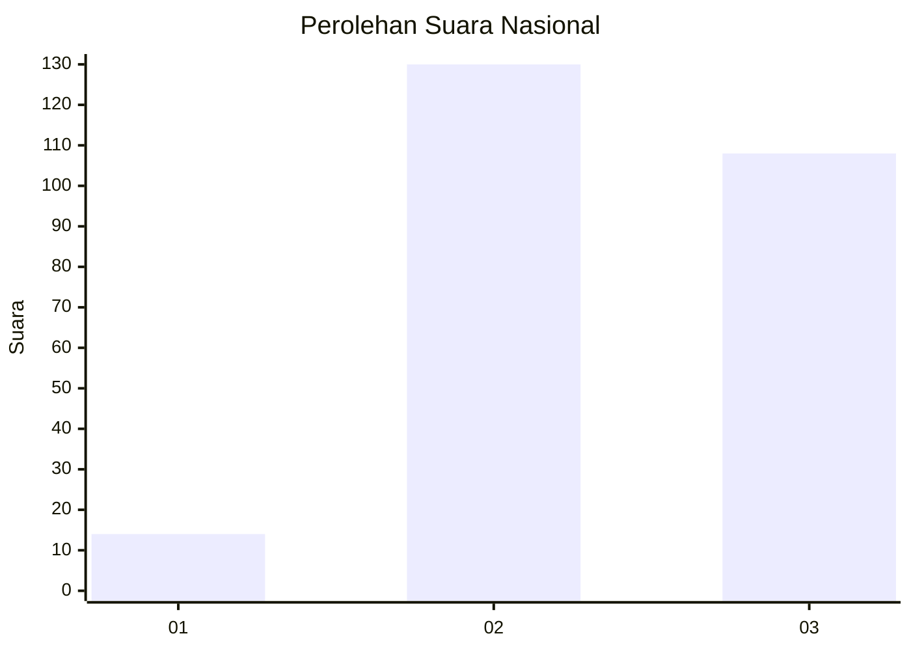
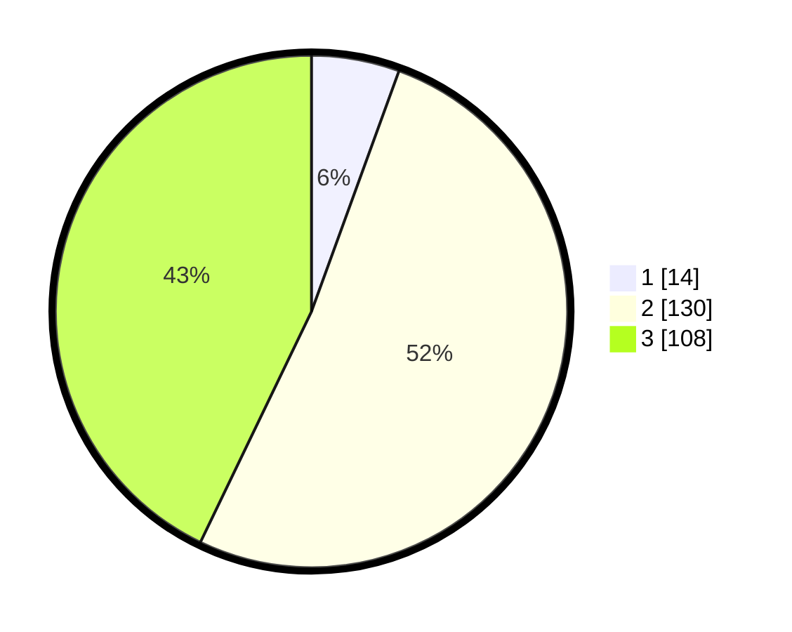

# Hasil

## Grafik

## Tabel

| No. | Nama Paslon    | Suara | Suara (raw) | Persentase |
|:--- |:-------------- | -----:| -----------:| ----------:|
| 1   | ANIES MUHAIMIN | 14    | [14][p-1]   | 5,56       |
| 2   | PRABOWO GIBRAN | 130   | [130][p-2]  | 51,59      |
| 3   | GANJAR MAHFUD  | 108   | [108][p-3]  | 42,86      |

[p-1]: https://github.com/gigit-pemilu/pemilu-2024/blob/main/pilpres/hitung-suara/sub/51-bali/sub/01-jembrana/sub/01-negara/sub/2010-tegal-badeng-barat/sub/005-tps/sub/paslon-1.txt
[p-2]: https://github.com/gigit-pemilu/pemilu-2024/blob/main/pilpres/hitung-suara/sub/51-bali/sub/01-jembrana/sub/01-negara/sub/2010-tegal-badeng-barat/sub/005-tps/sub/paslon-2.txt
[p-3]: https://github.com/gigit-pemilu/pemilu-2024/blob/main/pilpres/hitung-suara/sub/51-bali/sub/01-jembrana/sub/01-negara/sub/2010-tegal-badeng-barat/sub/005-tps/sub/paslon-3.txt

## Foto C Plano

https://sirekap-obj-formc.kpu.go.id/1856/pemilu/ppwp/51/01/01/20/10/5101012010005-20240214-130825--c9eab3ba-0bed-4f05-a96e-91de193847bf.jpg

https://sirekap-obj-formc.kpu.go.id/1856/pemilu/ppwp/51/01/01/20/10/5101012010005-20240214-130848--84116af4-32c8-46cb-8bc7-e8e85f4110ef.jpg

https://sirekap-obj-formc.kpu.go.id/1856/pemilu/ppwp/51/01/01/20/10/5101012010005-20240214-130919--7e9def21-5cb5-4100-b0fb-4a86bb4e1d10.jpg

## Metadata

| Key        | Value               |
| ---------- | ------------------- |
| Time Stamp | 2024-02-14 21:46:01 |

