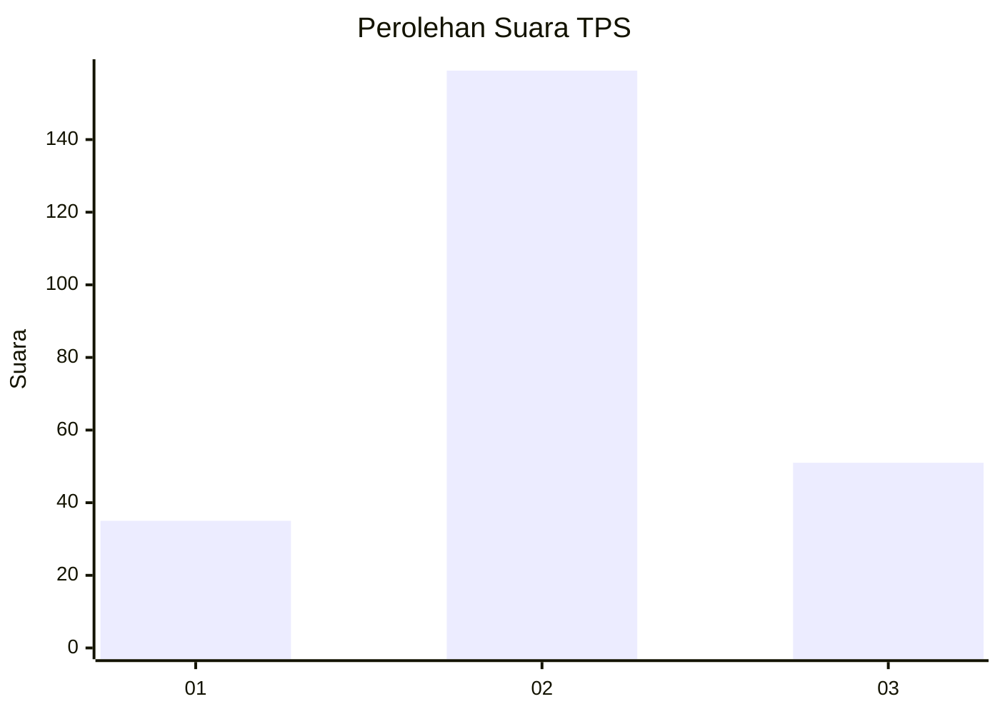
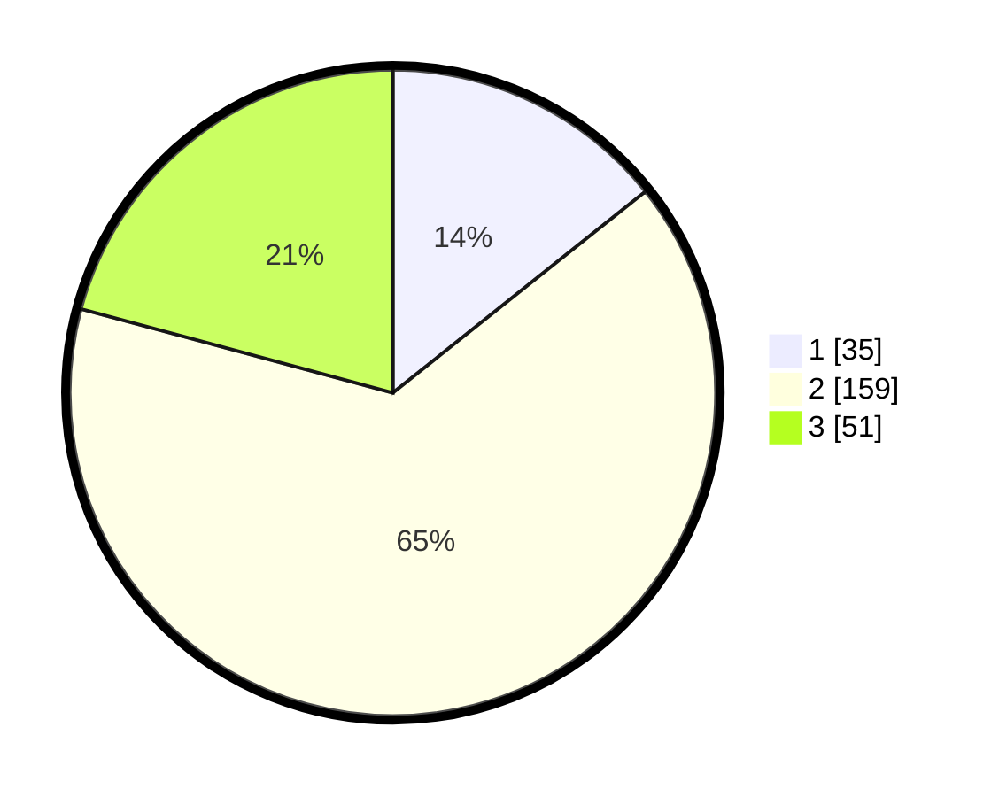

# Hasil

## Grafik

## Tabel

| No. | Nama Paslon    | Suara | Suara (raw) | Persentase |
|:--- |:-------------- | -----:| -----------:| ----------:|
| 1   | ANIES MUHAIMIN | 35    | [35][p-1]   | 14,29      |
| 2   | PRABOWO GIBRAN | 159   | [159][p-2]  | 64,90      |
| 3   | GANJAR MAHFUD  | 51    | [51][p-3]   | 20,82      |

[p-1]: https://github.com/gigit-pemilu/pemilu-2024-51-bali/blob/main/pilpres/hitung-suara/sub/51-bali/sub/01-jembrana/sub/01-negara/sub/2010-tegal-badeng-barat/sub/009-tps/sub/paslon-1.txt
[p-2]: https://github.com/gigit-pemilu/pemilu-2024-51-bali/blob/main/pilpres/hitung-suara/sub/51-bali/sub/01-jembrana/sub/01-negara/sub/2010-tegal-badeng-barat/sub/009-tps/sub/paslon-2.txt
[p-3]: https://github.com/gigit-pemilu/pemilu-2024-51-bali/blob/main/pilpres/hitung-suara/sub/51-bali/sub/01-jembrana/sub/01-negara/sub/2010-tegal-badeng-barat/sub/009-tps/sub/paslon-3.txt

## Foto C Plano

https://sirekap-obj-formc.kpu.go.id/06ea/pemilu/ppwp/51/01/01/20/10/5101012010009-20240216-010516--923517cc-41f2-491c-80f1-8e84a5937792.jpg

https://sirekap-obj-formc.kpu.go.id/06ea/pemilu/ppwp/51/01/01/20/10/5101012010009-20240216-010521--5222a040-89f6-4413-ab6a-fd939dac13f8.jpg

https://sirekap-obj-formc.kpu.go.id/06ea/pemilu/ppwp/51/01/01/20/10/5101012010009-20240216-010519--46abe9ae-d6e2-4295-ac2e-6c7421e979c9.jpg

## Metadata

| Key        | Value               |
| ---------- | ------------------- |
| Time Stamp | 2024-02-16 08:00:28 |

## DATA PEMILIH TETAP

Jumlah pemilih dalam DPT: **286**.
 * L: **141**.
 * P: **145**.

## DATA PENGGUNA HAK PILIH

Jumlah pengguna hak pilih dalam DPT: **244**.
 * L: **123**.
 * P: **121**.

Jumlah pengguna hak pilih dalam DPTb: **0**.
 * L: **0**.
 * P: **0**.

Jumlah pengguna hak pilih dalam DPK: **3**.
 * L: **1**.
 * P: **2**.

Jumlah pengguna hak pilih: **247**.
 * L: **124**.
 * P: **123**.

## JUMLAH SUARA SAH DAN TIDAK SAH

JUMLAH SELURUH SUARA SAH: **245**.

JUMLAH SUARA TIDAK SAH: **2**.

JUMLAH SELURUH SUARA SAH DAN SUARA TIDAK SAH: **247**.

