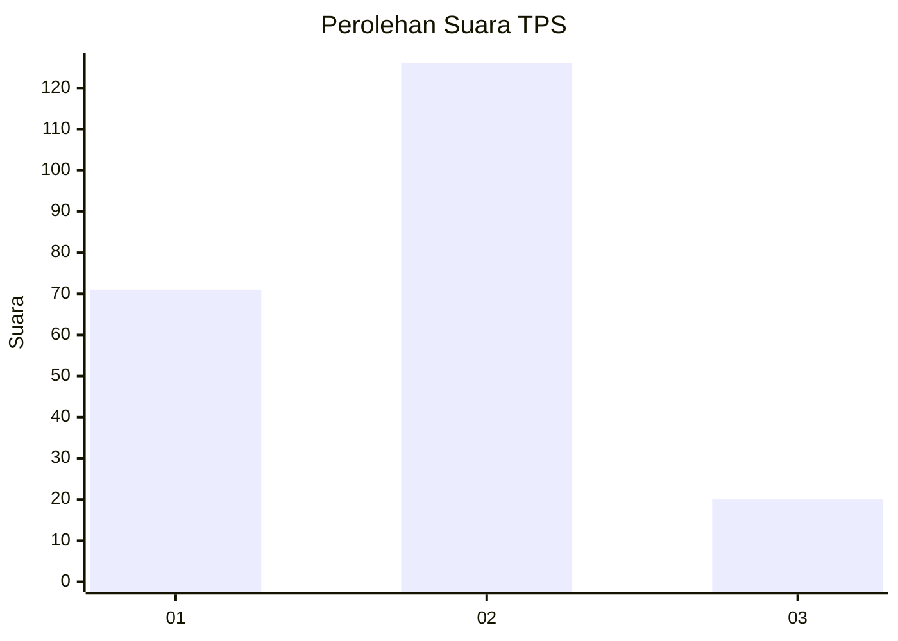
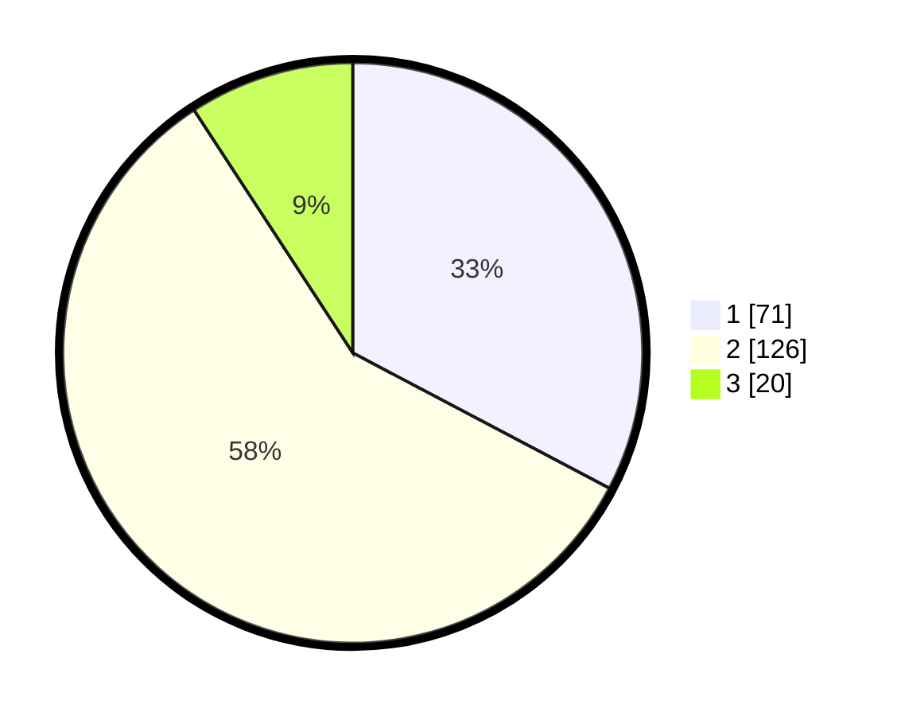

# Hasil

## Grafik

## Tabel

| No. | Nama Paslon    | Suara | Suara (raw) | Persentase |
|:--- |:-------------- | -----:| -----------:| ----------:|
| 1   | ANIES MUHAIMIN | 71    | [71][p-1]   | 32,72      |
| 2   | PRABOWO GIBRAN | 126   | [126][p-2]  | 58,06      |
| 3   | GANJAR MAHFUD  | 20    | [20][p-3]   | 9,22       |

[p-1]: https://github.com/gigit-pemilu/pemilu-2024-51-bali/blob/main/pilpres/hitung-suara/sub/51-bali/sub/01-jembrana/sub/01-negara/sub/2011-pengambengan/sub/001-tps/sub/paslon-1.txt
[p-2]: https://github.com/gigit-pemilu/pemilu-2024-51-bali/blob/main/pilpres/hitung-suara/sub/51-bali/sub/01-jembrana/sub/01-negara/sub/2011-pengambengan/sub/001-tps/sub/paslon-2.txt
[p-3]: https://github.com/gigit-pemilu/pemilu-2024-51-bali/blob/main/pilpres/hitung-suara/sub/51-bali/sub/01-jembrana/sub/01-negara/sub/2011-pengambengan/sub/001-tps/sub/paslon-3.txt

## Foto C Plano

https://sirekap-obj-formc.kpu.go.id/2bfa/pemilu/ppwp/51/01/01/20/11/5101012011001-20240214-194516--d67ba344-3a42-415a-bed7-c80067d92626.jpg

https://sirekap-obj-formc.kpu.go.id/2bfa/pemilu/ppwp/51/01/01/20/11/5101012011001-20240214-194535--1acc1eae-8642-4e92-80b5-a4b68216b58a.jpg

https://sirekap-obj-formc.kpu.go.id/2bfa/pemilu/ppwp/51/01/01/20/11/5101012011001-20240214-194557--ce89c671-0ce9-4961-bac1-b2ef2031e20f.jpg

## Metadata

| Key        | Value               |
| ---------- | ------------------- |
| Time Stamp | 2024-02-15 00:41:44 |

## DATA PEMILIH TETAP

Jumlah pemilih dalam DPT: **284**.
 * L: **147**.
 * P: **137**.

## DATA PENGGUNA HAK PILIH

Jumlah pengguna hak pilih dalam DPT: **236**.
 * L: **123**.
 * P: **113**.

Jumlah pengguna hak pilih dalam DPTb: **0**.
 * L: **0**.
 * P: **0**.

Jumlah pengguna hak pilih dalam DPK: **1**.
 * L: **0**.
 * P: **1**.

Jumlah pengguna hak pilih: **237**.
 * L: **123**.
 * P: **114**.

## JUMLAH SUARA SAH DAN TIDAK SAH

JUMLAH SELURUH SUARA SAH: **217**.

JUMLAH SUARA TIDAK SAH: **20**.

JUMLAH SELURUH SUARA SAH DAN SUARA TIDAK SAH: **237**.

