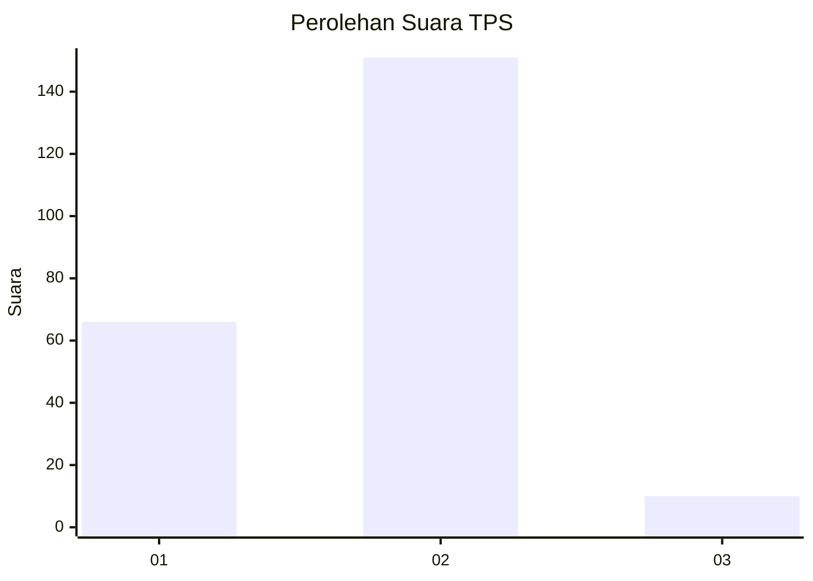
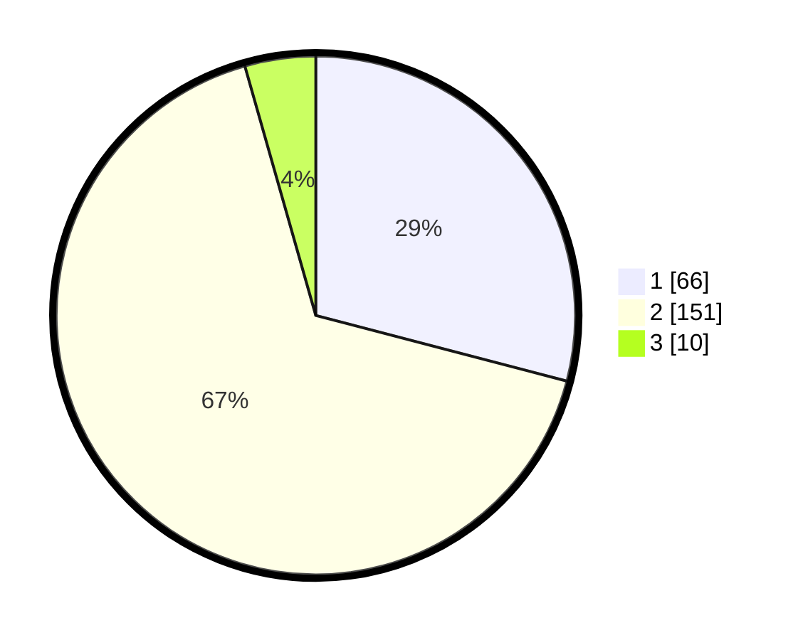

# Hasil

## Grafik

## Tabel

| No. | Nama Paslon    | Suara | Suara (raw) | Persentase |
|:--- |:-------------- | -----:| -----------:| ----------:|
| 1   | ANIES MUHAIMIN | 66    | [66][p-1]   | 29,07      |
| 2   | PRABOWO GIBRAN | 151   | [151][p-2]  | 66,52      |
| 3   | GANJAR MAHFUD  | 10    | [10][p-3]   | 4,41       |

[p-1]: https://github.com/gigit-pemilu/pemilu-2024-51-bali/blob/main/pilpres/hitung-suara/sub/51-bali/sub/01-jembrana/sub/01-negara/sub/2011-pengambengan/sub/004-tps/sub/paslon-1.txt
[p-2]: https://github.com/gigit-pemilu/pemilu-2024-51-bali/blob/main/pilpres/hitung-suara/sub/51-bali/sub/01-jembrana/sub/01-negara/sub/2011-pengambengan/sub/004-tps/sub/paslon-2.txt
[p-3]: https://github.com/gigit-pemilu/pemilu-2024-51-bali/blob/main/pilpres/hitung-suara/sub/51-bali/sub/01-jembrana/sub/01-negara/sub/2011-pengambengan/sub/004-tps/sub/paslon-3.txt

## Foto C Plano

https://sirekap-obj-formc.kpu.go.id/0212/pemilu/ppwp/51/01/01/20/11/5101012011004-20240214-155045--00535601-136f-4573-b2a6-60f4e6de160a.jpg

https://sirekap-obj-formc.kpu.go.id/0212/pemilu/ppwp/51/01/01/20/11/5101012011004-20240214-155028--241dabb9-e82b-4c45-880a-0406ffa821b0.jpg

https://sirekap-obj-formc.kpu.go.id/0212/pemilu/ppwp/51/01/01/20/11/5101012011004-20240214-155106--7ed26e7d-a69f-4a40-a61d-643ce8a8e976.jpg

## Metadata

| Key        | Value               |
| ---------- | ------------------- |
| Time Stamp | 2024-02-14 21:46:01 |

## DATA PEMILIH TETAP

Jumlah pemilih dalam DPT: **274**.
 * L: **146**.
 * P: **128**.

## DATA PENGGUNA HAK PILIH

Jumlah pengguna hak pilih dalam DPT: **234**.
 * L: **124**.
 * P: **110**.

Jumlah pengguna hak pilih dalam DPTb: **1**.
 * L: **0**.
 * P: **1**.

Jumlah pengguna hak pilih dalam DPK: **5**.
 * L: **3**.
 * P: **2**.

Jumlah pengguna hak pilih: **240**.
 * L: **127**.
 * P: **113**.

## JUMLAH SUARA SAH DAN TIDAK SAH

JUMLAH SELURUH SUARA SAH: **227**.

JUMLAH SUARA TIDAK SAH: **13**.

JUMLAH SELURUH SUARA SAH DAN SUARA TIDAK SAH: **240**.

