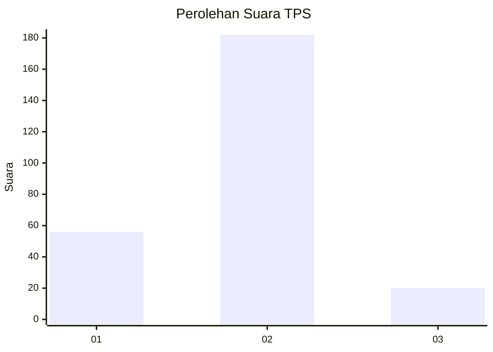
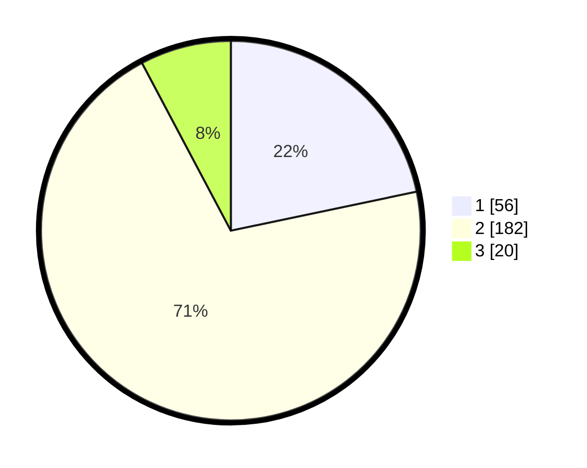

# Hasil

## Grafik

## Tabel

| No. | Nama Paslon    | Suara | Suara (raw) | Persentase |
|:--- |:-------------- | -----:| -----------:| ----------:|
| 1   | ANIES MUHAIMIN | 56    | [56][p-1]   | 21,71      |
| 2   | PRABOWO GIBRAN | 182   | [182][p-2]  | 70,54      |
| 3   | GANJAR MAHFUD  | 20    | [20][p-3]   | 7,75       |

[p-1]: https://github.com/gigit-pemilu/pemilu-2024-51-bali/blob/main/pilpres/hitung-suara/sub/51-bali/sub/01-jembrana/sub/01-negara/sub/2011-pengambengan/sub/007-tps/sub/paslon-1.txt
[p-2]: https://github.com/gigit-pemilu/pemilu-2024-51-bali/blob/main/pilpres/hitung-suara/sub/51-bali/sub/01-jembrana/sub/01-negara/sub/2011-pengambengan/sub/007-tps/sub/paslon-2.txt
[p-3]: https://github.com/gigit-pemilu/pemilu-2024-51-bali/blob/main/pilpres/hitung-suara/sub/51-bali/sub/01-jembrana/sub/01-negara/sub/2011-pengambengan/sub/007-tps/sub/paslon-3.txt

## Foto C Plano

https://sirekap-obj-formc.kpu.go.id/9c4a/pemilu/ppwp/51/01/01/20/11/5101012011007-20240214-155133--95a5ea4f-8c4a-494f-9b30-2d24f4a0635d.jpg

https://sirekap-obj-formc.kpu.go.id/9c4a/pemilu/ppwp/51/01/01/20/11/5101012011007-20240214-155016--f17f683a-139d-4cc1-9ebb-4420348330a6.jpg

https://sirekap-obj-formc.kpu.go.id/9c4a/pemilu/ppwp/51/01/01/20/11/5101012011007-20240214-155319--5c6f64c8-8a45-459a-8e12-fc590268c083.jpg

## Metadata

| Key        | Value               |
| ---------- | ------------------- |
| Time Stamp | 2024-02-14 21:46:01 |

## DATA PEMILIH TETAP

Jumlah pemilih dalam DPT: **290**.
 * L: **134**.
 * P: **156**.

## DATA PENGGUNA HAK PILIH

Jumlah pengguna hak pilih dalam DPT: **259**.
 * L: **117**.
 * P: **142**.

Jumlah pengguna hak pilih dalam DPTb: **2**.
 * L: **1**.
 * P: **1**.

Jumlah pengguna hak pilih dalam DPK: **1**.
 * L: **0**.
 * P: **1**.

Jumlah pengguna hak pilih: **262**.
 * L: **118**.
 * P: **144**.

## JUMLAH SUARA SAH DAN TIDAK SAH

JUMLAH SELURUH SUARA SAH: **258**.

JUMLAH SUARA TIDAK SAH: **4**.

JUMLAH SELURUH SUARA SAH DAN SUARA TIDAK SAH: **262**.

