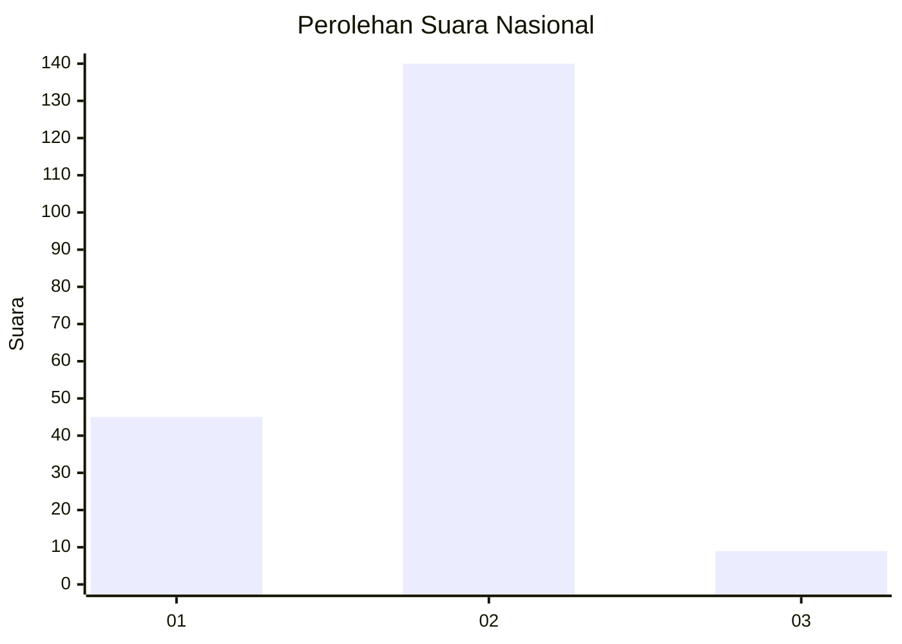
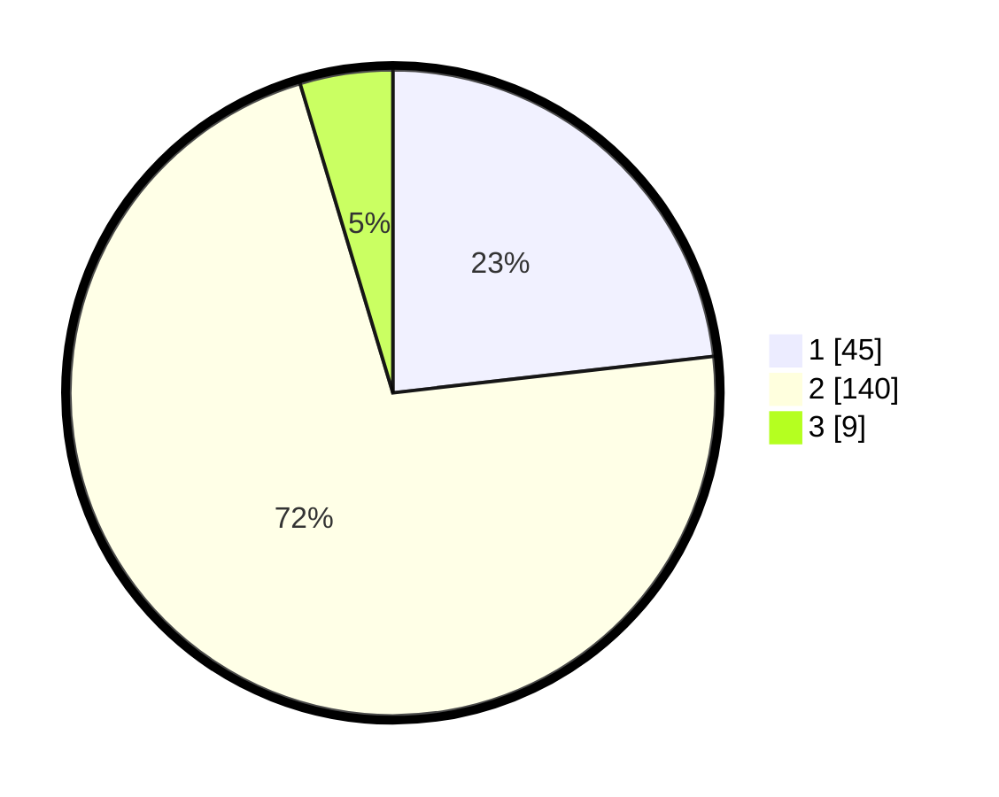

# Hasil

## Grafik

## Tabel

| No. | Nama Paslon    | Suara | Suara (raw) | Persentase |
|:--- |:-------------- | -----:| -----------:| ----------:|
| 1   | ANIES MUHAIMIN | 45    | [45][p-1]   | 23,20      |
| 2   | PRABOWO GIBRAN | 140   | [140][p-2]  | 72,16      |
| 3   | GANJAR MAHFUD  | 9     | [9][p-3]    | 4,64       |

[p-1]: https://github.com/gigit-pemilu/pemilu-2024/blob/main/pilpres/hitung-suara/sub/51-bali/sub/01-jembrana/sub/01-negara/sub/2011-pengambengan/sub/009-tps/sub/paslon-1.txt
[p-2]: https://github.com/gigit-pemilu/pemilu-2024/blob/main/pilpres/hitung-suara/sub/51-bali/sub/01-jembrana/sub/01-negara/sub/2011-pengambengan/sub/009-tps/sub/paslon-2.txt
[p-3]: https://github.com/gigit-pemilu/pemilu-2024/blob/main/pilpres/hitung-suara/sub/51-bali/sub/01-jembrana/sub/01-negara/sub/2011-pengambengan/sub/009-tps/sub/paslon-3.txt

## Foto C Plano

https://sirekap-obj-formc.kpu.go.id/d508/pemilu/ppwp/51/01/01/20/11/5101012011009-20240214-155042--2b40a5d8-50b9-4501-8015-ac081bec93b3.jpg

https://sirekap-obj-formc.kpu.go.id/d508/pemilu/ppwp/51/01/01/20/11/5101012011009-20240214-155709--bb337bd3-d5b5-4f38-8e31-64ac74787fc8.jpg

## Metadata

| Key        | Value               |
| ---------- | ------------------- |
| Time Stamp | 2024-02-24 22:31:28 |

