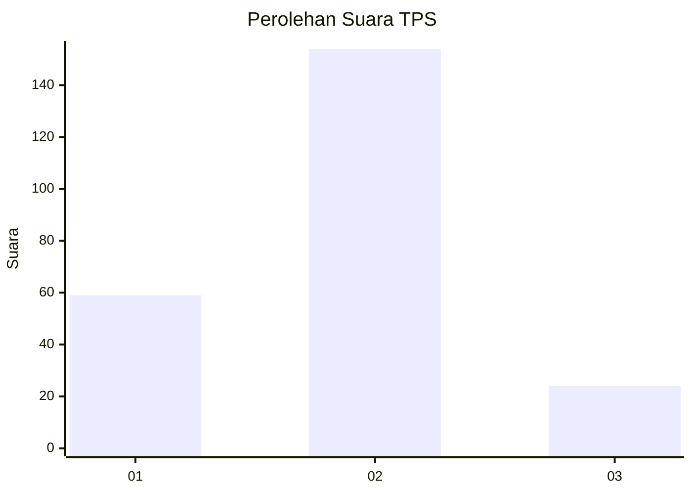

# Hasil

## Grafik

## Tabel

| No. | Nama Paslon    | Suara | Suara (raw) | Persentase |
|:--- |:-------------- | -----:| -----------:| ----------:|
| 1   | ANIES MUHAIMIN | 59    | [59][p-1]   | 24,89      |
| 2   | PRABOWO GIBRAN | 154   | [154][p-2]  | 64,98      |
| 3   | GANJAR MAHFUD  | 24    | [24][p-3]   | 10,13      |

[p-1]: https://github.com/gigit-pemilu/pemilu-2024-51-bali/blob/main/pilpres/hitung-suara/sub/51-bali/sub/01-jembrana/sub/01-negara/sub/2011-pengambengan/sub/010-tps/sub/paslon-1.txt
[p-2]: https://github.com/gigit-pemilu/pemilu-2024-51-bali/blob/main/pilpres/hitung-suara/sub/51-bali/sub/01-jembrana/sub/01-negara/sub/2011-pengambengan/sub/010-tps/sub/paslon-2.txt
[p-3]: https://github.com/gigit-pemilu/pemilu-2024-51-bali/blob/main/pilpres/hitung-suara/sub/51-bali/sub/01-jembrana/sub/01-negara/sub/2011-pengambengan/sub/010-tps/sub/paslon-3.txt

## Foto C Plano

https://sirekap-obj-formc.kpu.go.id/e092/pemilu/ppwp/51/01/01/20/11/5101012011010-20240214-231114--876c177f-529c-4b54-ae46-b67c17367b97.jpg

https://sirekap-obj-formc.kpu.go.id/e092/pemilu/ppwp/51/01/01/20/11/5101012011010-20240214-231655--1d5502a5-b829-4147-9e50-1e8dce136f2f.jpg

https://sirekap-obj-formc.kpu.go.id/e092/pemilu/ppwp/51/01/01/20/11/5101012011010-20240214-231829--3802ec0d-c012-4940-940d-b325d78e8fb9.jpg

## Metadata

| Key        | Value               |
| ---------- | ------------------- |
| Time Stamp | 2024-02-15 15:00:29 |

## DATA PEMILIH TETAP

Jumlah pemilih dalam DPT: **296**.
 * L: **149**.
 * P: **147**.

## DATA PENGGUNA HAK PILIH

Jumlah pengguna hak pilih dalam DPT: **255**.
 * L: **129**.
 * P: **126**.

Jumlah pengguna hak pilih dalam DPTb: **0**.
 * L: **0**.
 * P: **0**.

Jumlah pengguna hak pilih dalam DPK: **0**.
 * L: **0**.
 * P: **0**.

Jumlah pengguna hak pilih: **255**.
 * L: **129**.
 * P: **126**.

## JUMLAH SUARA SAH DAN TIDAK SAH

JUMLAH SELURUH SUARA SAH: **237**.

JUMLAH SUARA TIDAK SAH: **18**.

JUMLAH SELURUH SUARA SAH DAN SUARA TIDAK SAH: **255**.

