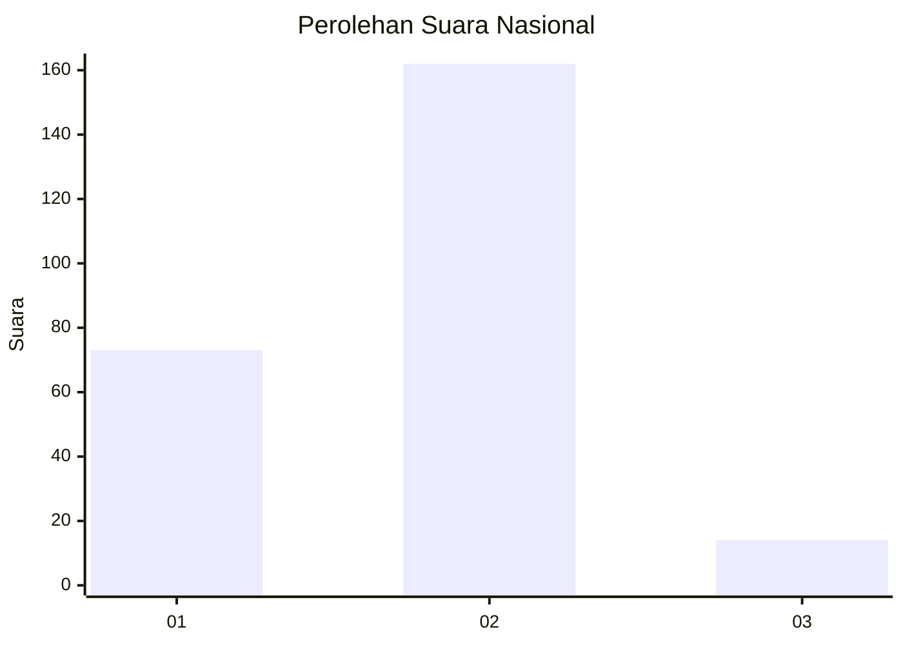
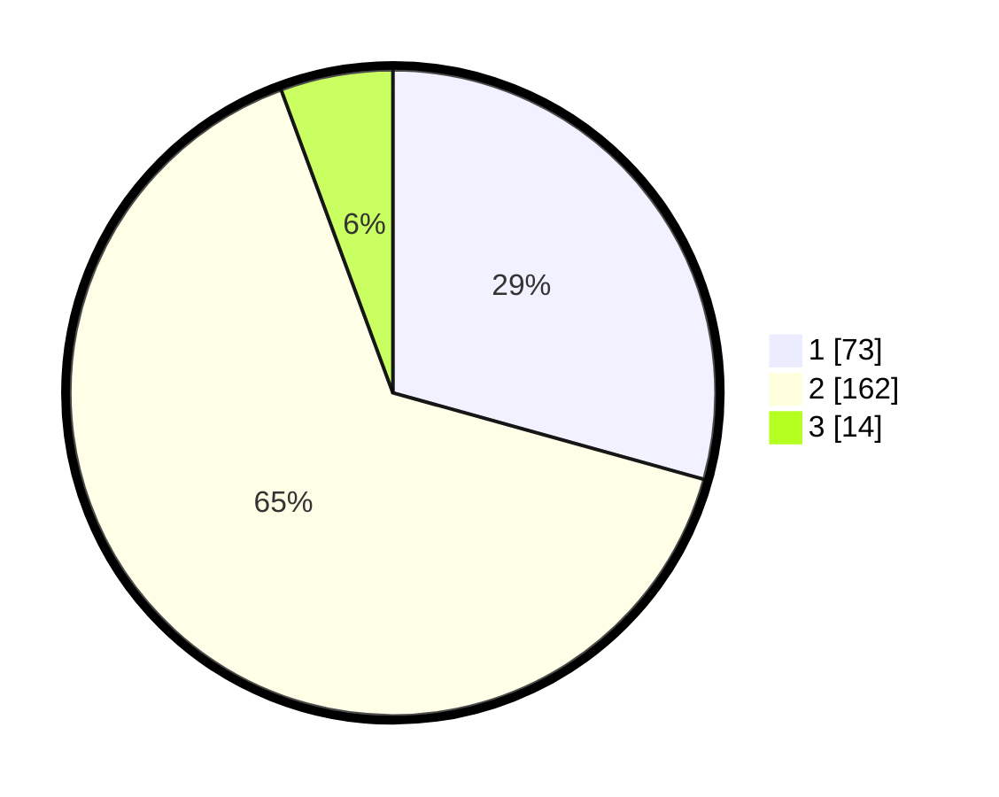

# Hasil

## Grafik

## Tabel

| No. | Nama Paslon    | Suara | Suara (raw) | Persentase |
|:--- |:-------------- | -----:| -----------:| ----------:|
| 1   | ANIES MUHAIMIN | 73    | [73][p-1]   | 29,32      |
| 2   | PRABOWO GIBRAN | 162   | [162][p-2]  | 65,06      |
| 3   | GANJAR MAHFUD  | 14    | [14][p-3]   | 5,62       |

[p-1]: https://github.com/gigit-pemilu/pemilu-2024/blob/main/pilpres/hitung-suara/sub/51-bali/sub/01-jembrana/sub/01-negara/sub/2011-pengambengan/sub/011-tps/sub/paslon-1.txt
[p-2]: https://github.com/gigit-pemilu/pemilu-2024/blob/main/pilpres/hitung-suara/sub/51-bali/sub/01-jembrana/sub/01-negara/sub/2011-pengambengan/sub/011-tps/sub/paslon-2.txt
[p-3]: https://github.com/gigit-pemilu/pemilu-2024/blob/main/pilpres/hitung-suara/sub/51-bali/sub/01-jembrana/sub/01-negara/sub/2011-pengambengan/sub/011-tps/sub/paslon-3.txt

## Foto C Plano

https://sirekap-obj-formc.kpu.go.id/29d3/pemilu/ppwp/51/01/01/20/11/5101012011011-20240214-185026--d615fd2d-b43b-4cb1-894d-45a0d3d4e8f3.jpg

https://sirekap-obj-formc.kpu.go.id/29d3/pemilu/ppwp/51/01/01/20/11/5101012011011-20240214-185233--ec7dbb74-625e-461d-8715-96786c677b4e.jpg

https://sirekap-obj-formc.kpu.go.id/29d3/pemilu/ppwp/51/01/01/20/11/5101012011011-20240214-185348--d67f9d5b-2e17-4748-93c9-5adf532aec01.jpg

## Metadata

| Key        | Value               |
| ---------- | ------------------- |
| Time Stamp | 2024-02-14 21:46:01 |

## DATA PEMILIH TETAP

Jumlah pemilih dalam DPT: **294**.
 * L: **146**.
 * P: **148**.

## DATA PENGGUNA HAK PILIH

Jumlah pengguna hak pilih dalam DPT: **261**.
 * L: **127**.
 * P: **134**.

Jumlah pengguna hak pilih dalam DPTb: **0**.
 * L: **0**.
 * P: **0**.

Jumlah pengguna hak pilih dalam DPK: **3**.
 * L: **2**.
 * P: **1**.

Jumlah pengguna hak pilih: **264**.
 * L: **129**.
 * P: **135**.

## JUMLAH SUARA SAH DAN TIDAK SAH

JUMLAH SELURUH SUARA SAH: **250**.

JUMLAH SUARA TIDAK SAH: **14**.

JUMLAH SELURUH SUARA SAH DAN SUARA TIDAK SAH: **264**.

