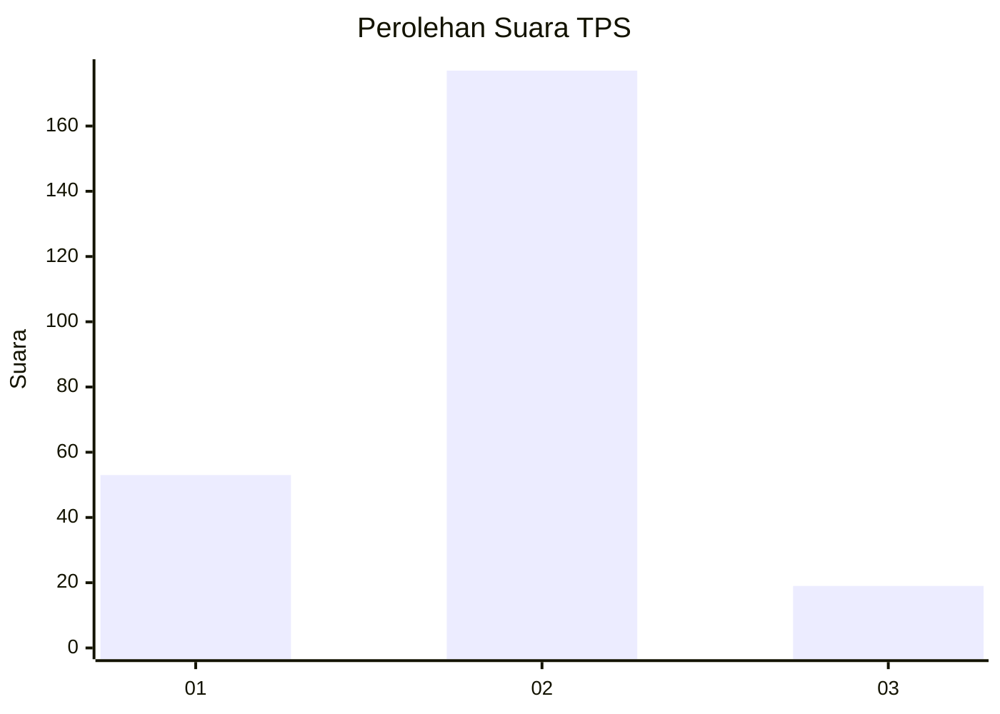
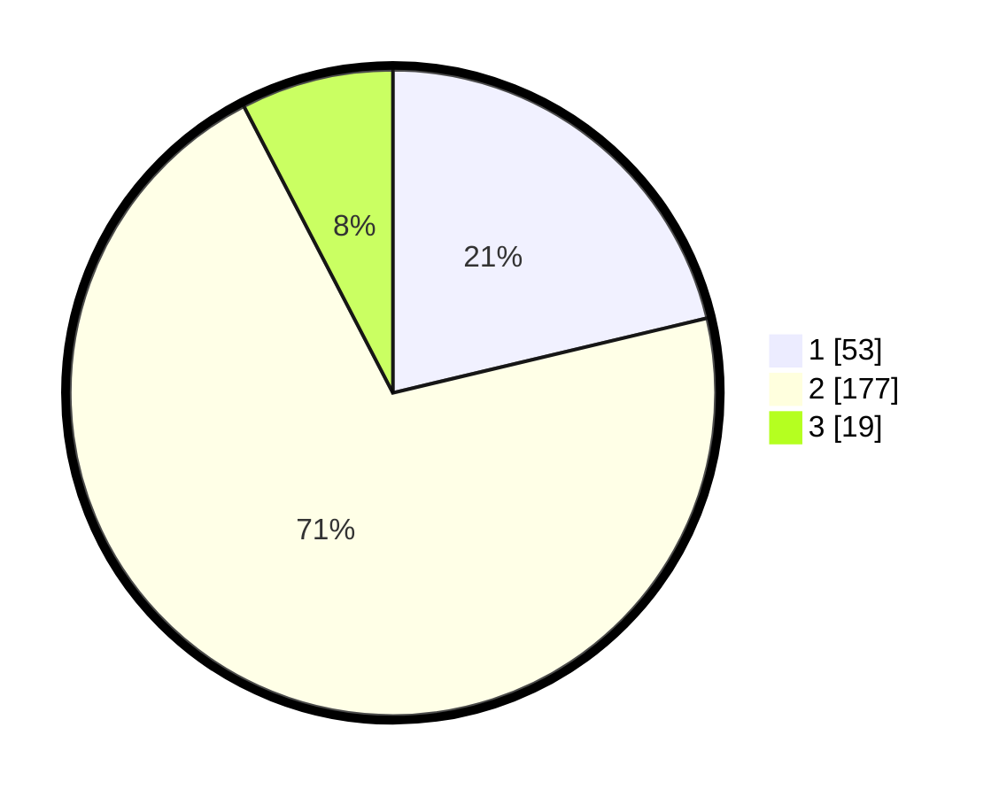

# Hasil

## Grafik

## Tabel

| No. | Nama Paslon    | Suara | Suara (raw) | Persentase |
|:--- |:-------------- | -----:| -----------:| ----------:|
| 1   | ANIES MUHAIMIN | 53    | [53][p-1]   | 21,29      |
| 2   | PRABOWO GIBRAN | 177   | [177][p-2]  | 71,08      |
| 3   | GANJAR MAHFUD  | 19    | [19][p-3]   | 7,63       |

[p-1]: https://github.com/gigit-pemilu/pemilu-2024-51-bali/blob/main/pilpres/hitung-suara/sub/51-bali/sub/01-jembrana/sub/01-negara/sub/2011-pengambengan/sub/013-tps/sub/paslon-1.txt
[p-2]: https://github.com/gigit-pemilu/pemilu-2024-51-bali/blob/main/pilpres/hitung-suara/sub/51-bali/sub/01-jembrana/sub/01-negara/sub/2011-pengambengan/sub/013-tps/sub/paslon-2.txt
[p-3]: https://github.com/gigit-pemilu/pemilu-2024-51-bali/blob/main/pilpres/hitung-suara/sub/51-bali/sub/01-jembrana/sub/01-negara/sub/2011-pengambengan/sub/013-tps/sub/paslon-3.txt

## Foto C Plano

https://sirekap-obj-formc.kpu.go.id/8fec/pemilu/ppwp/51/01/01/20/11/5101012011013-20240214-132337--7bb26bd2-33dd-4a3c-93c9-19f2cc593508.jpg

https://sirekap-obj-formc.kpu.go.id/8fec/pemilu/ppwp/51/01/01/20/11/5101012011013-20240214-132455--1666b750-6eb3-45e6-9df4-3318bdb7932f.jpg

https://sirekap-obj-formc.kpu.go.id/8fec/pemilu/ppwp/51/01/01/20/11/5101012011013-20240214-132600--c3133e81-6bb7-416b-b3b6-7155841d9ca2.jpg

## Metadata

| Key        | Value               |
| ---------- | ------------------- |
| Time Stamp | 2024-02-14 21:46:01 |

## DATA PEMILIH TETAP

Jumlah pemilih dalam DPT: **299**.
 * L: **143**.
 * P: **156**.

## DATA PENGGUNA HAK PILIH

Jumlah pengguna hak pilih dalam DPT: **268**.
 * L: **127**.
 * P: **141**.

Jumlah pengguna hak pilih dalam DPTb: **0**.
 * L: **0**.
 * P: **0**.

Jumlah pengguna hak pilih dalam DPK: **1**.
 * L: **1**.
 * P: **0**.

Jumlah pengguna hak pilih: **269**.
 * L: **128**.
 * P: **141**.

## JUMLAH SUARA SAH DAN TIDAK SAH

JUMLAH SELURUH SUARA SAH: **249**.

JUMLAH SUARA TIDAK SAH: **20**.

JUMLAH SELURUH SUARA SAH DAN SUARA TIDAK SAH: **269**.

