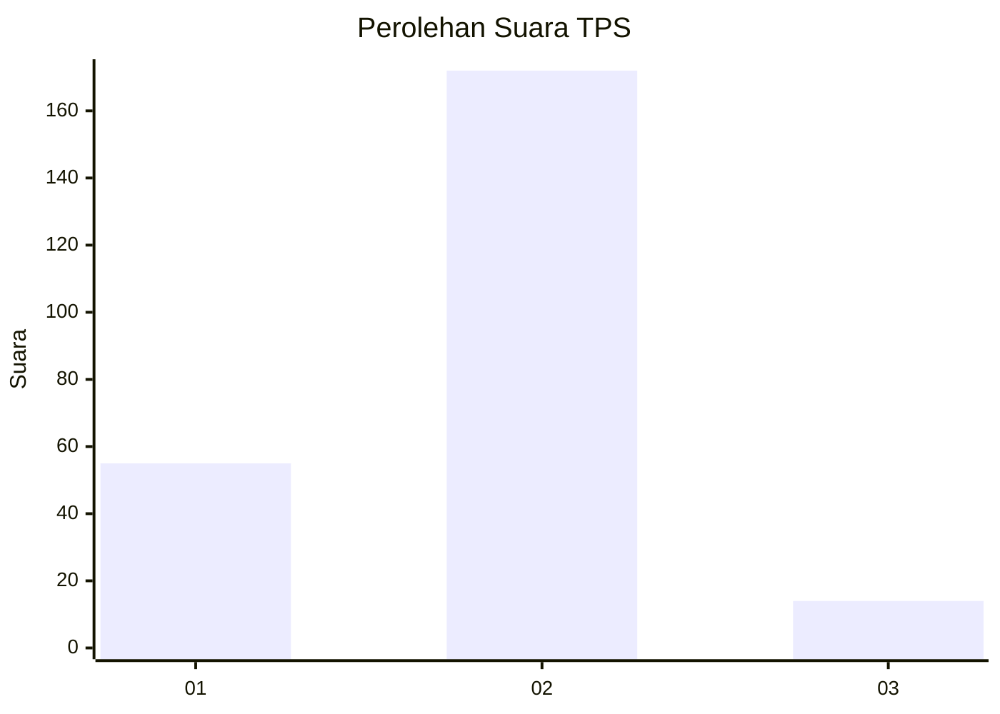
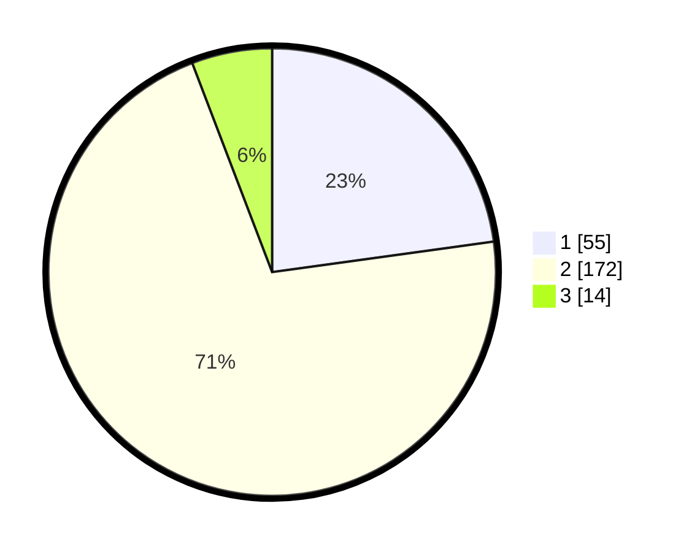

# Hasil

## Grafik

## Tabel

| No. | Nama Paslon    | Suara | Suara (raw) | Persentase |
|:--- |:-------------- | -----:| -----------:| ----------:|
| 1   | ANIES MUHAIMIN | 55    | [55][p-1]   | 22,82      |
| 2   | PRABOWO GIBRAN | 172   | [172][p-2]  | 71,37      |
| 3   | GANJAR MAHFUD  | 14    | [14][p-3]   | 5,81       |

[p-1]: https://github.com/gigit-pemilu/pemilu-2024-51-bali/blob/main/pilpres/hitung-suara/sub/51-bali/sub/01-jembrana/sub/01-negara/sub/2011-pengambengan/sub/014-tps/sub/paslon-1.txt
[p-2]: https://github.com/gigit-pemilu/pemilu-2024-51-bali/blob/main/pilpres/hitung-suara/sub/51-bali/sub/01-jembrana/sub/01-negara/sub/2011-pengambengan/sub/014-tps/sub/paslon-2.txt
[p-3]: https://github.com/gigit-pemilu/pemilu-2024-51-bali/blob/main/pilpres/hitung-suara/sub/51-bali/sub/01-jembrana/sub/01-negara/sub/2011-pengambengan/sub/014-tps/sub/paslon-3.txt

## Foto C Plano

https://sirekap-obj-formc.kpu.go.id/e841/pemilu/ppwp/51/01/01/20/11/5101012011014-20240215-003152--026c3d89-3cee-435c-9d79-7a30eb01a8f6.jpg

https://sirekap-obj-formc.kpu.go.id/e841/pemilu/ppwp/51/01/01/20/11/5101012011014-20240215-003425--941e282a-344a-463f-bc8c-b2205ff47e3c.jpg

https://sirekap-obj-formc.kpu.go.id/e841/pemilu/ppwp/51/01/01/20/11/5101012011014-20240215-003628--b2c4f076-a1e5-4463-a226-dd136c7c65b7.jpg

## Metadata

| Key        | Value               |
| ---------- | ------------------- |
| Time Stamp | 2024-02-15 15:30:25 |

