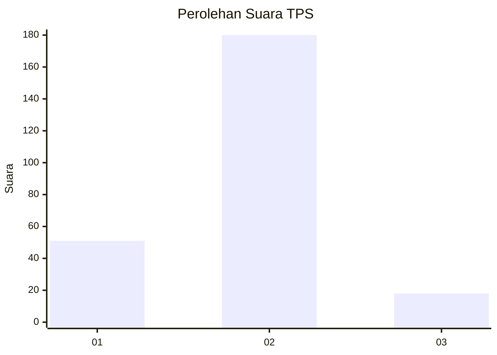
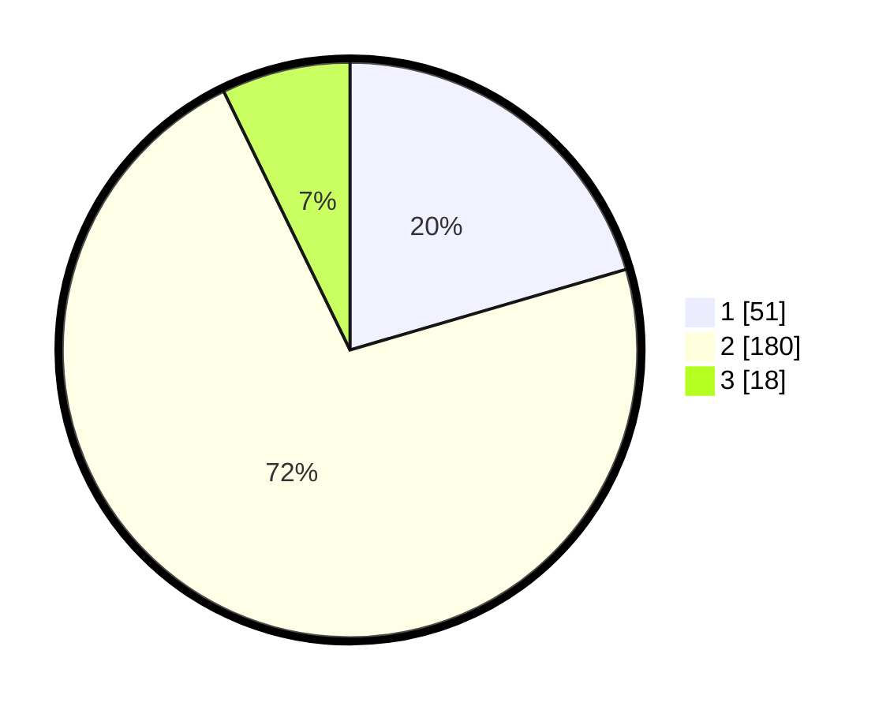

# Hasil

## Grafik

## Tabel

| No. | Nama Paslon    | Suara | Suara (raw) | Persentase |
|:--- |:-------------- | -----:| -----------:| ----------:|
| 1   | ANIES MUHAIMIN | 51    | [51][p-1]   | 20,48      |
| 2   | PRABOWO GIBRAN | 180   | [180][p-2]  | 72,29      |
| 3   | GANJAR MAHFUD  | 18    | [18][p-3]   | 7,23       |

[p-1]: https://github.com/gigit-pemilu/pemilu-2024-51-bali/blob/main/pilpres/hitung-suara/sub/51-bali/sub/01-jembrana/sub/01-negara/sub/2011-pengambengan/sub/015-tps/sub/paslon-1.txt
[p-2]: https://github.com/gigit-pemilu/pemilu-2024-51-bali/blob/main/pilpres/hitung-suara/sub/51-bali/sub/01-jembrana/sub/01-negara/sub/2011-pengambengan/sub/015-tps/sub/paslon-2.txt
[p-3]: https://github.com/gigit-pemilu/pemilu-2024-51-bali/blob/main/pilpres/hitung-suara/sub/51-bali/sub/01-jembrana/sub/01-negara/sub/2011-pengambengan/sub/015-tps/sub/paslon-3.txt

## Foto C Plano

https://sirekap-obj-formc.kpu.go.id/cc1b/pemilu/ppwp/51/01/01/20/11/5101012011015-20240214-132737--771b5bff-2c72-4c3c-a339-e0dfe738c10c.jpg

https://sirekap-obj-formc.kpu.go.id/cc1b/pemilu/ppwp/51/01/01/20/11/5101012011015-20240214-132212--c48aabcf-923e-451f-83ce-505371d14d96.jpg

https://sirekap-obj-formc.kpu.go.id/cc1b/pemilu/ppwp/51/01/01/20/11/5101012011015-20240214-132828--677fdd8d-779d-4dbb-a3f8-f6c33d0c9f59.jpg

## Metadata

| Key        | Value               |
| ---------- | ------------------- |
| Time Stamp | 2024-02-14 21:46:01 |

## DATA PEMILIH TETAP

Jumlah pemilih dalam DPT: **294**.
 * L: **145**.
 * P: **149**.

## DATA PENGGUNA HAK PILIH

Jumlah pengguna hak pilih dalam DPT: **255**.
 * L: **124**.
 * P: **131**.

Jumlah pengguna hak pilih dalam DPTb: **0**.
 * L: **0**.
 * P: **0**.

Jumlah pengguna hak pilih dalam DPK: **1**.
 * L: **1**.
 * P: **0**.

Jumlah pengguna hak pilih: **256**.
 * L: **0**.
 * P: **0**.

## JUMLAH SUARA SAH DAN TIDAK SAH

JUMLAH SELURUH SUARA SAH: **249**.

JUMLAH SUARA TIDAK SAH: **7**.

JUMLAH SELURUH SUARA SAH DAN SUARA TIDAK SAH: **256**.

