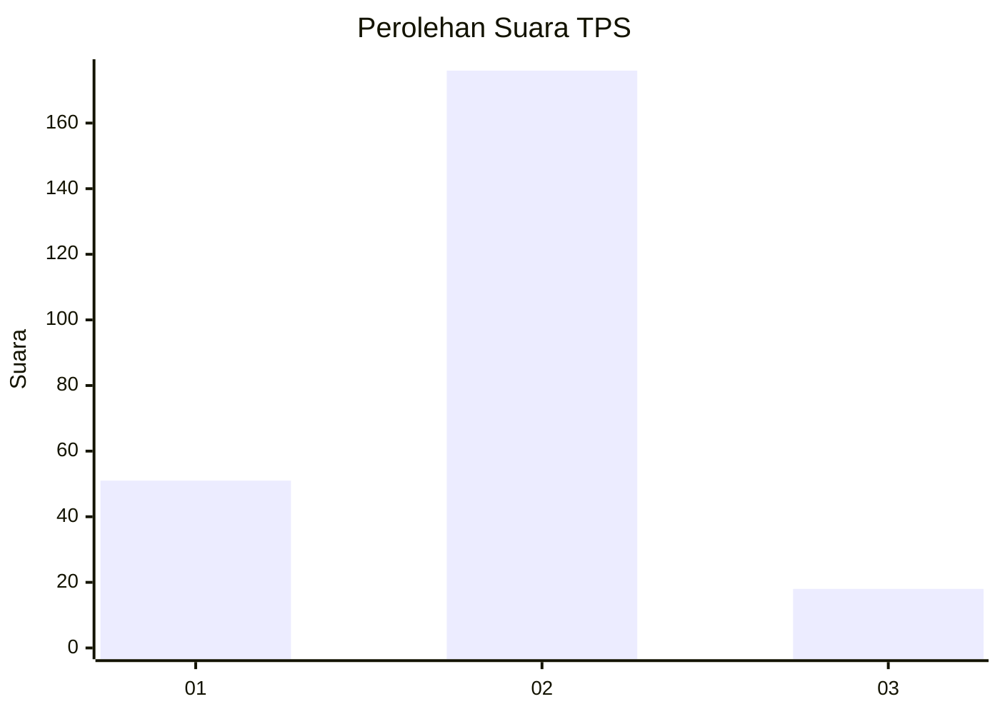
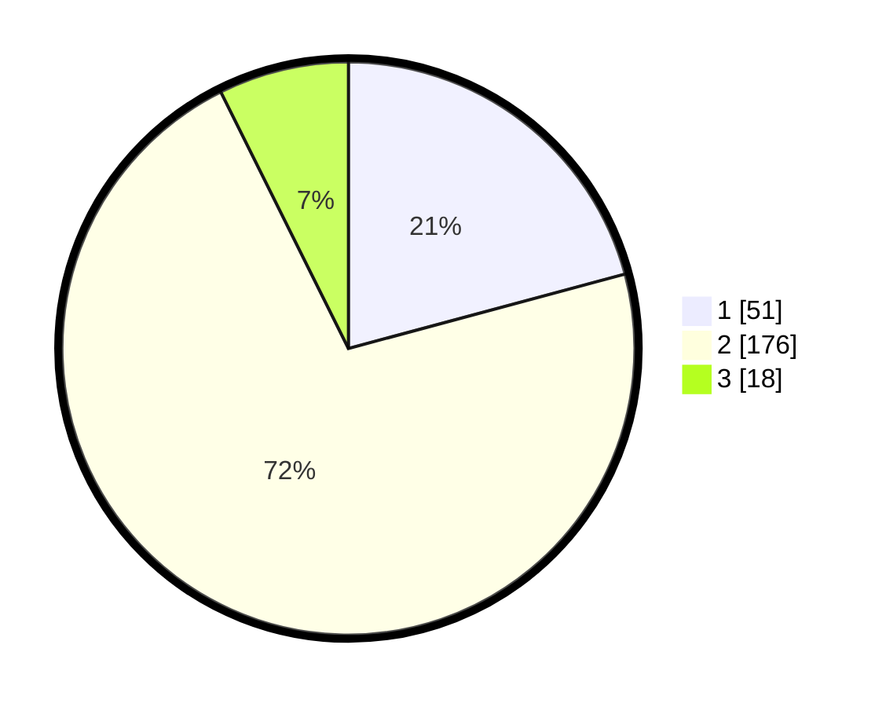

# Hasil

## Grafik

## Tabel

| No. | Nama Paslon    | Suara | Suara (raw) | Persentase |
|:--- |:-------------- | -----:| -----------:| ----------:|
| 1   | ANIES MUHAIMIN | 51    | [51][p-1]   | 20,82      |
| 2   | PRABOWO GIBRAN | 176   | [176][p-2]  | 71,84      |
| 3   | GANJAR MAHFUD  | 18    | [18][p-3]   | 7,35       |

[p-1]: https://github.com/gigit-pemilu/pemilu-2024-51-bali/blob/main/pilpres/hitung-suara/sub/51-bali/sub/01-jembrana/sub/01-negara/sub/2011-pengambengan/sub/019-tps/sub/paslon-1.txt
[p-2]: https://github.com/gigit-pemilu/pemilu-2024-51-bali/blob/main/pilpres/hitung-suara/sub/51-bali/sub/01-jembrana/sub/01-negara/sub/2011-pengambengan/sub/019-tps/sub/paslon-2.txt
[p-3]: https://github.com/gigit-pemilu/pemilu-2024-51-bali/blob/main/pilpres/hitung-suara/sub/51-bali/sub/01-jembrana/sub/01-negara/sub/2011-pengambengan/sub/019-tps/sub/paslon-3.txt

## Foto C Plano

https://sirekap-obj-formc.kpu.go.id/d0e3/pemilu/ppwp/51/01/01/20/11/5101012011019-20240214-205327--bf398e6d-00fa-4172-aeb9-4e221dc25e80.jpg

https://sirekap-obj-formc.kpu.go.id/d0e3/pemilu/ppwp/51/01/01/20/11/5101012011019-20240214-205422--1a517f29-50d2-499f-b81f-045bb0e31c37.jpg

## Metadata

| Key        | Value               |
| ---------- | ------------------- |
| Time Stamp | 2024-02-15 15:00:29 |

