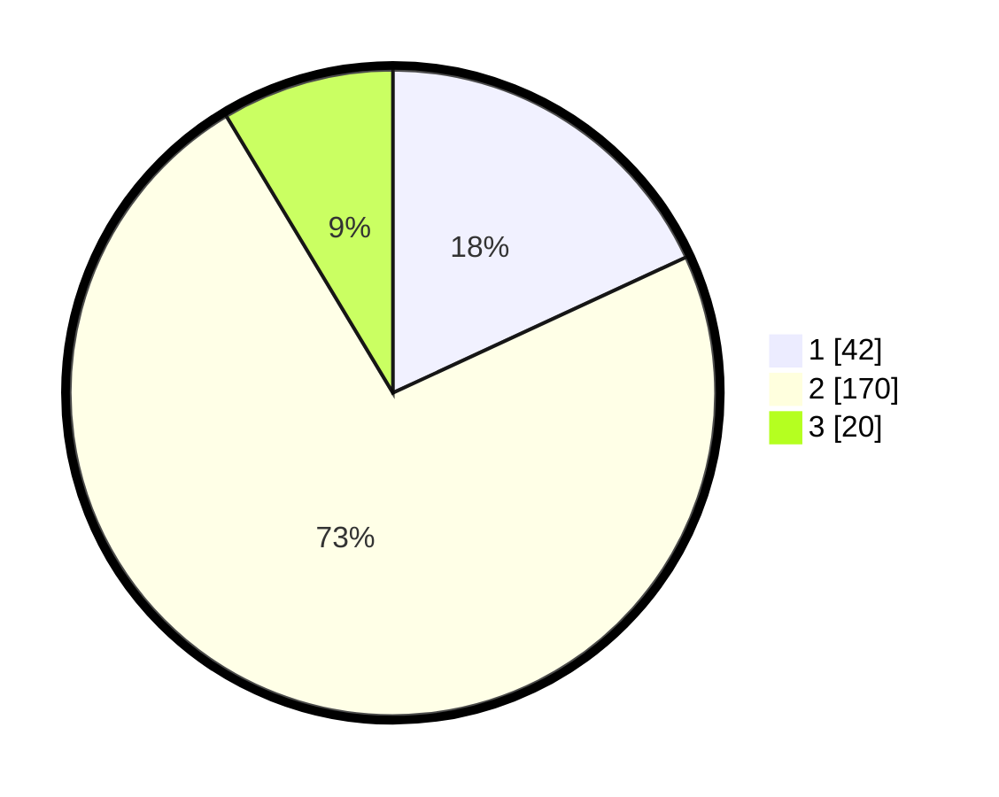

# Hasil

## Grafik

## Tabel

| No. | Nama Paslon    | Suara | Suara (raw) | Persentase |
|:--- |:-------------- | -----:| -----------:| ----------:|
| 1   | ANIES MUHAIMIN | 42    | [42][p-1]   | 18,10      |
| 2   | PRABOWO GIBRAN | 170   | [170][p-2]  | 73,28      |
| 3   | GANJAR MAHFUD  | 20    | [20][p-3]   | 8,62       |

[p-1]: https://github.com/gigit-pemilu/pemilu-2024/blob/main/pilpres/hitung-suara/sub/51-bali/sub/01-jembrana/sub/01-negara/sub/2011-pengambengan/sub/021-tps/sub/paslon-1.txt
[p-2]: https://github.com/gigit-pemilu/pemilu-2024/blob/main/pilpres/hitung-suara/sub/51-bali/sub/01-jembrana/sub/01-negara/sub/2011-pengambengan/sub/021-tps/sub/paslon-2.txt
[p-3]: https://github.com/gigit-pemilu/pemilu-2024/blob/main/pilpres/hitung-suara/sub/51-bali/sub/01-jembrana/sub/01-negara/sub/2011-pengambengan/sub/021-tps/sub/paslon-3.txt

## Foto C Plano

https://sirekap-obj-formc.kpu.go.id/b838/pemilu/ppwp/51/01/01/20/11/5101012011021-20240214-141154--7c841609-9cff-4992-8bcd-c61632770f3e.jpg

https://sirekap-obj-formc.kpu.go.id/b838/pemilu/ppwp/51/01/01/20/11/5101012011021-20240214-141857--1dc2a539-5f56-4188-bfbd-a95286252627.jpg

https://sirekap-obj-formc.kpu.go.id/b838/pemilu/ppwp/51/01/01/20/11/5101012011021-20240214-155010--852a8d63-8690-45d3-9126-470edd946021.jpg

## Metadata

| Key        | Value               |
| ---------- | ------------------- |
| Time Stamp | 2024-02-14 21:46:01 |

## DATA PEMILIH TETAP

Jumlah pemilih dalam DPT: **297**.
 * L: **145**.
 * P: **152**.

## DATA PENGGUNA HAK PILIH

Jumlah pengguna hak pilih dalam DPT: **239**.
 * L: **118**.
 * P: **121**.

Jumlah pengguna hak pilih dalam DPTb: **2**.
 * L: **1**.
 * P: **1**.

Jumlah pengguna hak pilih dalam DPK: **2**.
 * L: **1**.
 * P: **1**.

Jumlah pengguna hak pilih: **243**.
 * L: **120**.
 * P: **123**.

## JUMLAH SUARA SAH DAN TIDAK SAH

JUMLAH SELURUH SUARA SAH: **232**.

JUMLAH SUARA TIDAK SAH: **11**.

JUMLAH SELURUH SUARA SAH DAN SUARA TIDAK SAH: **243**.

