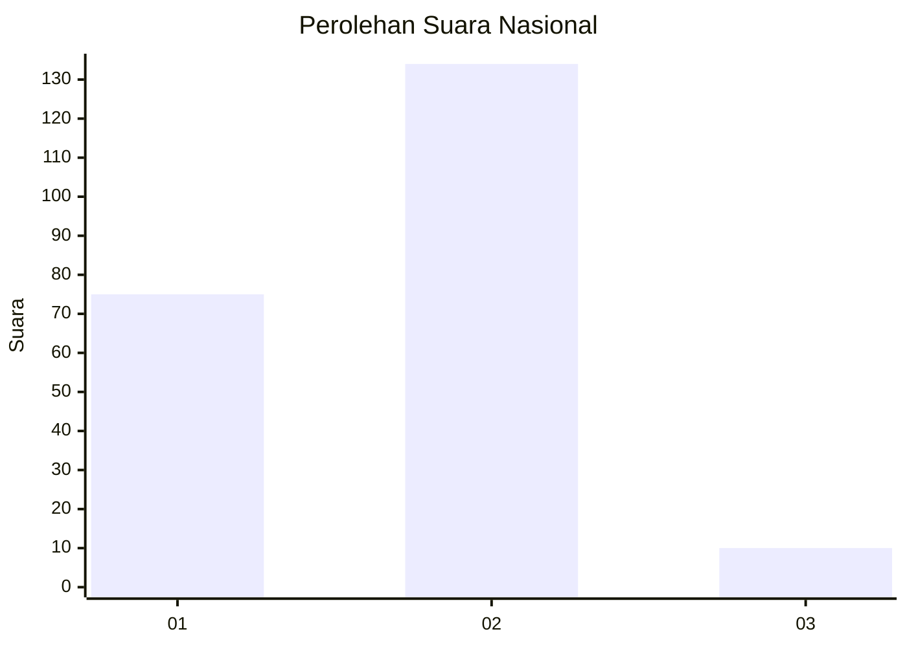
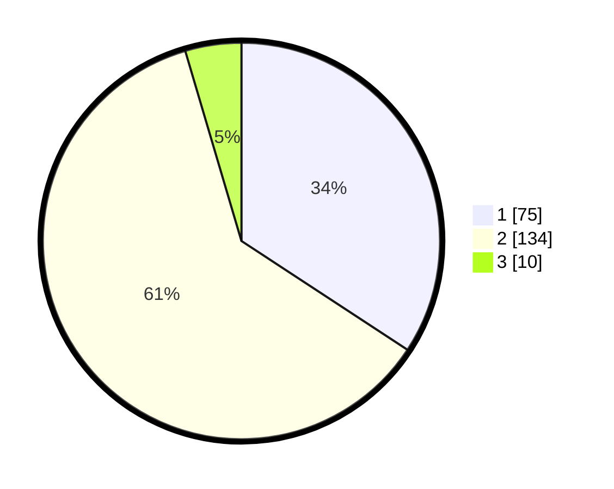

# Hasil

## Grafik

## Tabel

| No. | Nama Paslon    | Suara | Suara (raw) | Persentase |
|:--- |:-------------- | -----:| -----------:| ----------:|
| 1   | ANIES MUHAIMIN | 75    | [75][p-1]   | 34,25      |
| 2   | PRABOWO GIBRAN | 134   | [134][p-2]  | 61,19      |
| 3   | GANJAR MAHFUD  | 10    | [10][p-3]   | 4,57       |

[p-1]: https://github.com/gigit-pemilu/pemilu-2024/blob/main/pilpres/hitung-suara/sub/51-bali/sub/01-jembrana/sub/01-negara/sub/2011-pengambengan/sub/026-tps/sub/paslon-1.txt
[p-2]: https://github.com/gigit-pemilu/pemilu-2024/blob/main/pilpres/hitung-suara/sub/51-bali/sub/01-jembrana/sub/01-negara/sub/2011-pengambengan/sub/026-tps/sub/paslon-2.txt
[p-3]: https://github.com/gigit-pemilu/pemilu-2024/blob/main/pilpres/hitung-suara/sub/51-bali/sub/01-jembrana/sub/01-negara/sub/2011-pengambengan/sub/026-tps/sub/paslon-3.txt

## Foto C Plano

https://sirekap-obj-formc.kpu.go.id/22d4/pemilu/ppwp/51/01/01/20/11/5101012011026-20240214-155133--8167b2cf-befc-40b3-8204-79d0eebc0de4.jpg

https://sirekap-obj-formc.kpu.go.id/22d4/pemilu/ppwp/51/01/01/20/11/5101012011026-20240214-155319--b30e6681-1f30-4c64-98e5-f48af6a2b980.jpg

https://sirekap-obj-formc.kpu.go.id/22d4/pemilu/ppwp/51/01/01/20/11/5101012011026-20240215-063759--6a6aaf1b-5144-4b1a-85c8-f01b5c38d76e.jpg

## Metadata

| Key        | Value               |
| ---------- | ------------------- |
| Time Stamp | 2024-02-15 15:00:29 |

