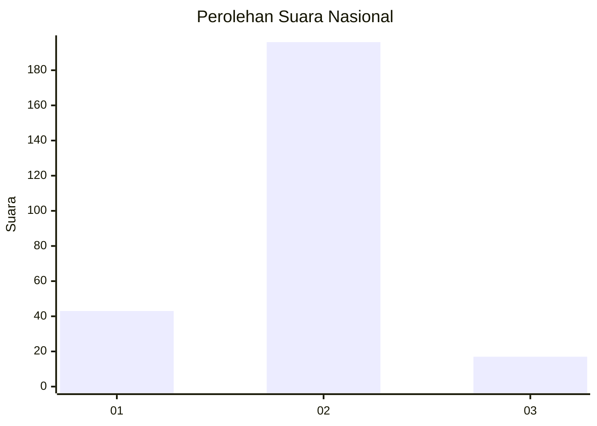
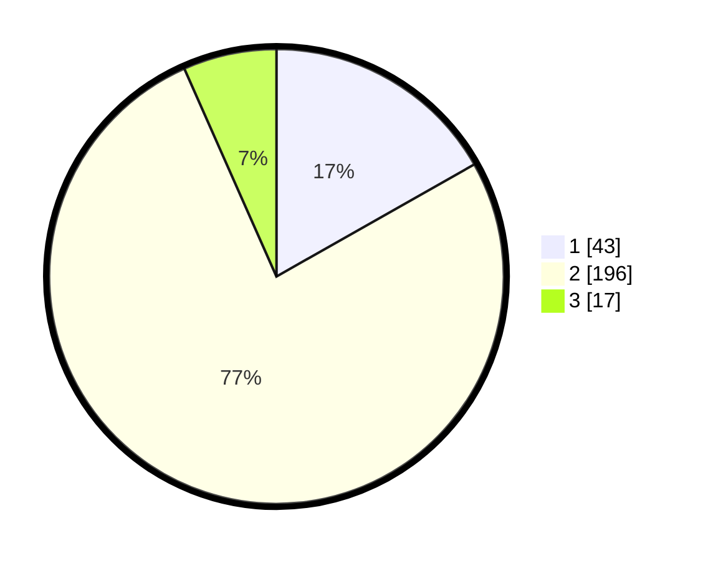

# Hasil

## Grafik

## Tabel

| No. | Nama Paslon    | Suara | Suara (raw) | Persentase |
|:--- |:-------------- | -----:| -----------:| ----------:|
| 1   | ANIES MUHAIMIN | 43    | [43][p-1]   | 16,80      |
| 2   | PRABOWO GIBRAN | 196   | [196][p-2]  | 76,56      |
| 3   | GANJAR MAHFUD  | 17    | [17][p-3]   | 6,64       |

[p-1]: https://github.com/gigit-pemilu/pemilu-2024/blob/main/pilpres/hitung-suara/sub/51-bali/sub/01-jembrana/sub/01-negara/sub/2011-pengambengan/sub/032-tps/sub/paslon-1.txt
[p-2]: https://github.com/gigit-pemilu/pemilu-2024/blob/main/pilpres/hitung-suara/sub/51-bali/sub/01-jembrana/sub/01-negara/sub/2011-pengambengan/sub/032-tps/sub/paslon-2.txt
[p-3]: https://github.com/gigit-pemilu/pemilu-2024/blob/main/pilpres/hitung-suara/sub/51-bali/sub/01-jembrana/sub/01-negara/sub/2011-pengambengan/sub/032-tps/sub/paslon-3.txt

## Foto C Plano

https://sirekap-obj-formc.kpu.go.id/f47d/pemilu/ppwp/51/01/01/20/11/5101012011032-20240214-141849--9a35edb6-1649-4afc-8bb5-35c69e0d9433.jpg

https://sirekap-obj-formc.kpu.go.id/f47d/pemilu/ppwp/51/01/01/20/11/5101012011032-20240214-141933--bb77ceea-ea27-4466-856b-456d6c598049.jpg

https://sirekap-obj-formc.kpu.go.id/f47d/pemilu/ppwp/51/01/01/20/11/5101012011032-20240215-134501--2b33bab2-ad72-497b-ac71-f415a2fdd913.jpg

## Metadata

| Key        | Value               |
| ---------- | ------------------- |
| Time Stamp | 2024-02-15 15:00:29 |

## DATA PEMILIH TETAP

Jumlah pemilih dalam DPT: **295**.
 * L: **149**.
 * P: **146**.

## DATA PENGGUNA HAK PILIH

Jumlah pengguna hak pilih dalam DPT: **267**.
 * L: **133**.
 * P: **134**.

Jumlah pengguna hak pilih dalam DPTb: **0**.
 * L: **0**.
 * P: **0**.

Jumlah pengguna hak pilih dalam DPK: **0**.
 * L: **0**.
 * P: **0**.

Jumlah pengguna hak pilih: **3**.
 * L: **0**.
 * P: **3**.

## JUMLAH SUARA SAH DAN TIDAK SAH

JUMLAH SELURUH SUARA SAH: **256**.

JUMLAH SUARA TIDAK SAH: **14**.

JUMLAH SELURUH SUARA SAH DAN SUARA TIDAK SAH: **270**.

