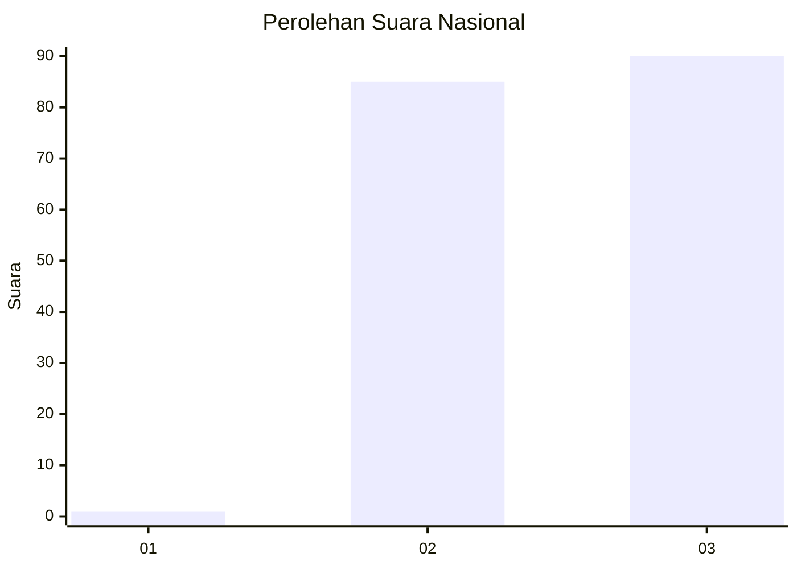
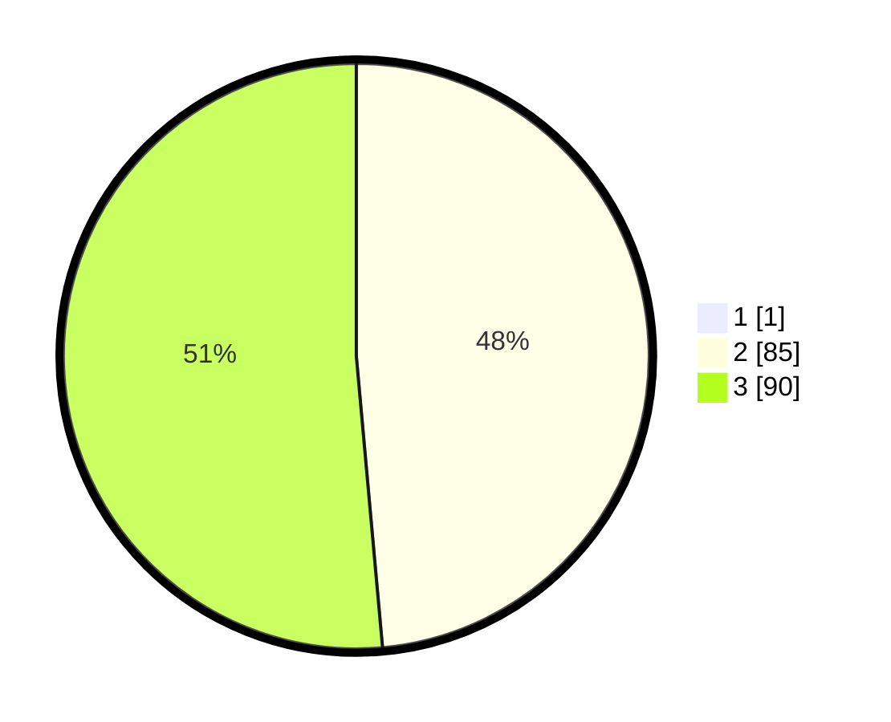

# Hasil

## Grafik

## Tabel

| No. | Nama Paslon    | Suara | Suara (raw) | Persentase |
|:--- |:-------------- | -----:| -----------:| ----------:|
| 1   | ANIES MUHAIMIN | 1     | [1][p-1]    | 0,57       |
| 2   | PRABOWO GIBRAN | 85    | [85][p-2]   | 48,30      |
| 3   | GANJAR MAHFUD  | 90    | [90][p-3]   | 51,14      |

[p-1]: https://github.com/gigit-pemilu/pemilu-2024/blob/main/pilpres/hitung-suara/sub/51-bali/sub/01-jembrana/sub/02-mendoyo/sub/1006-tegalcangkring/sub/002-tps/sub/paslon-1.txt
[p-2]: https://github.com/gigit-pemilu/pemilu-2024/blob/main/pilpres/hitung-suara/sub/51-bali/sub/01-jembrana/sub/02-mendoyo/sub/1006-tegalcangkring/sub/002-tps/sub/paslon-2.txt
[p-3]: https://github.com/gigit-pemilu/pemilu-2024/blob/main/pilpres/hitung-suara/sub/51-bali/sub/01-jembrana/sub/02-mendoyo/sub/1006-tegalcangkring/sub/002-tps/sub/paslon-3.txt

## Foto C Plano

https://sirekap-obj-formc.kpu.go.id/ab01/pemilu/ppwp/51/01/02/10/06/5101021006002-20240215-013031--a02d17c9-2e1d-42f7-ae90-1929d733efe5.jpg

https://sirekap-obj-formc.kpu.go.id/ab01/pemilu/ppwp/51/01/02/10/06/5101021006002-20240215-013256--f95e07aa-fbf5-4c93-9e31-98a86f044f27.jpg

https://sirekap-obj-formc.kpu.go.id/ab01/pemilu/ppwp/51/01/02/10/06/5101021006002-20240215-013327--61441ea2-6425-41a8-b255-36e1927a6233.jpg

## Metadata

| Key        | Value               |
| ---------- | ------------------- |
| Time Stamp | 2024-02-16 08:00:28 |

## DATA PEMILIH TETAP

Jumlah pemilih dalam DPT: **232**.
 * L: **115**.
 * P: **117**.

## DATA PENGGUNA HAK PILIH

Jumlah pengguna hak pilih dalam DPT: **177**.
 * L: **87**.
 * P: **90**.

Jumlah pengguna hak pilih dalam DPTb: **0**.
 * L: **0**.
 * P: **0**.

Jumlah pengguna hak pilih dalam DPK: **0**.
 * L: **0**.
 * P: **0**.

Jumlah pengguna hak pilih: **177**.
 * L: **87**.
 * P: **90**.

## JUMLAH SUARA SAH DAN TIDAK SAH

JUMLAH SELURUH SUARA SAH: **176**.

JUMLAH SUARA TIDAK SAH: **1**.

JUMLAH SELURUH SUARA SAH DAN SUARA TIDAK SAH: **177**.

