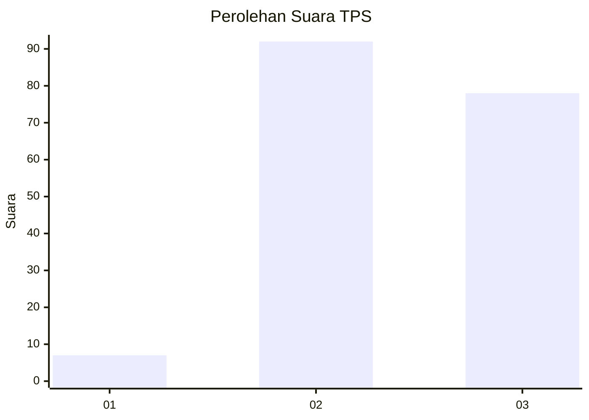
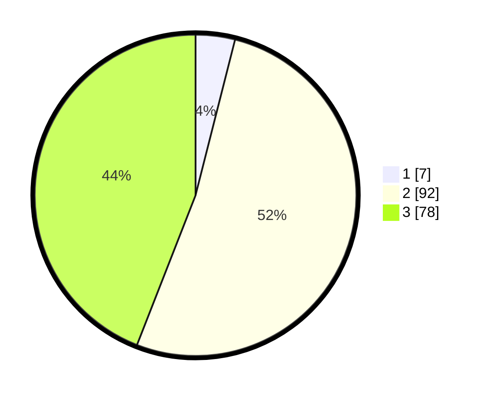

# Hasil

## Grafik

## Tabel

| No. | Nama Paslon    | Suara | Suara (raw) | Persentase |
|:--- |:-------------- | -----:| -----------:| ----------:|
| 1   | ANIES MUHAIMIN | 7     | [7][p-1]    | 3,95       |
| 2   | PRABOWO GIBRAN | 92    | [92][p-2]   | 51,98      |
| 3   | GANJAR MAHFUD  | 78    | [78][p-3]   | 44,07      |

[p-1]: https://github.com/gigit-pemilu/pemilu-2024-51-bali/blob/main/pilpres/hitung-suara/sub/51-bali/sub/01-jembrana/sub/02-mendoyo/sub/1006-tegalcangkring/sub/003-tps/sub/paslon-1.txt
[p-2]: https://github.com/gigit-pemilu/pemilu-2024-51-bali/blob/main/pilpres/hitung-suara/sub/51-bali/sub/01-jembrana/sub/02-mendoyo/sub/1006-tegalcangkring/sub/003-tps/sub/paslon-2.txt
[p-3]: https://github.com/gigit-pemilu/pemilu-2024-51-bali/blob/main/pilpres/hitung-suara/sub/51-bali/sub/01-jembrana/sub/02-mendoyo/sub/1006-tegalcangkring/sub/003-tps/sub/paslon-3.txt

## Foto C Plano

https://sirekap-obj-formc.kpu.go.id/7aec/pemilu/ppwp/51/01/02/10/06/5101021006003-20240214-235326--3add9573-d640-4328-974d-6cfe0bc101f0.jpg

https://sirekap-obj-formc.kpu.go.id/7aec/pemilu/ppwp/51/01/02/10/06/5101021006003-20240214-235746--20ed7ed7-3d24-4592-b44c-47f2aa02a01e.jpg

https://sirekap-obj-formc.kpu.go.id/7aec/pemilu/ppwp/51/01/02/10/06/5101021006003-20240214-235905--569a4423-b6a9-4a81-b619-ea13810c4141.jpg

## Metadata

| Key        | Value               |
| ---------- | ------------------- |
| Time Stamp | 2024-02-15 15:00:29 |

## DATA PEMILIH TETAP

Jumlah pemilih dalam DPT: **245**.
 * L: **118**.
 * P: **127**.

## DATA PENGGUNA HAK PILIH

Jumlah pengguna hak pilih dalam DPT: **185**.
 * L: **90**.
 * P: **95**.

Jumlah pengguna hak pilih dalam DPTb: **0**.
 * L: **0**.
 * P: **0**.

Jumlah pengguna hak pilih dalam DPK: **0**.
 * L: **0**.
 * P: **0**.

Jumlah pengguna hak pilih: **185**.
 * L: **90**.
 * P: **95**.

## JUMLAH SUARA SAH DAN TIDAK SAH

JUMLAH SELURUH SUARA SAH: **177**.

JUMLAH SUARA TIDAK SAH: **8**.

JUMLAH SELURUH SUARA SAH DAN SUARA TIDAK SAH: **185**.

