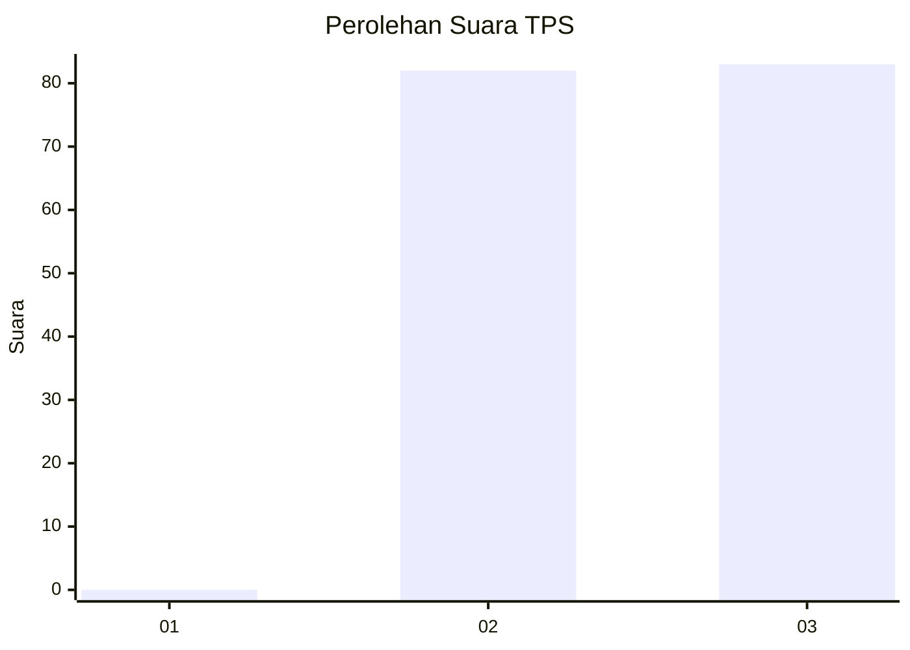
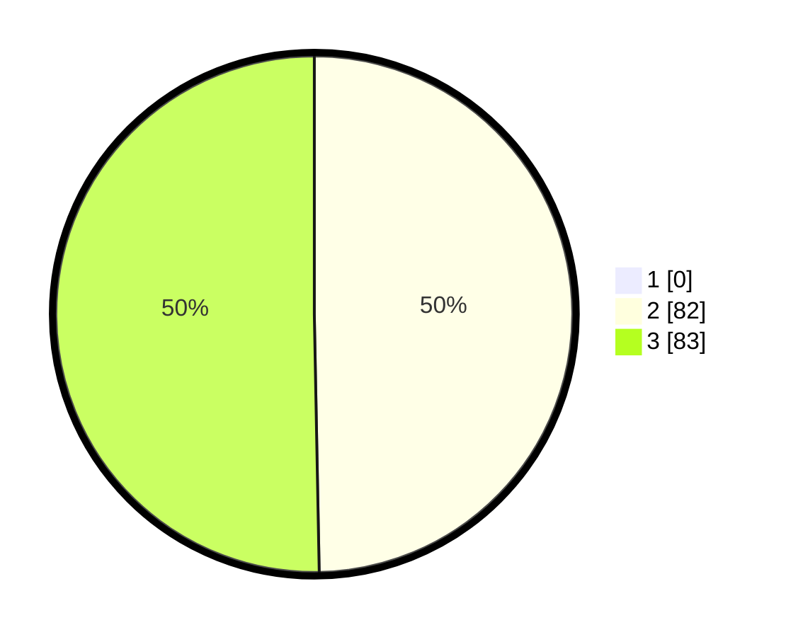

# Hasil

## Grafik

## Tabel

| No. | Nama Paslon    | Suara | Suara (raw) | Persentase |
|:--- |:-------------- | -----:| -----------:| ----------:|
| 1   | ANIES MUHAIMIN | 0     | [0][p-1]    | 0,00       |
| 2   | PRABOWO GIBRAN | 82    | [82][p-2]   | 49,70      |
| 3   | GANJAR MAHFUD  | 83    | [83][p-3]   | 50,30      |

[p-1]: https://github.com/gigit-pemilu/pemilu-2024-51-bali/blob/main/pilpres/hitung-suara/sub/51-bali/sub/01-jembrana/sub/02-mendoyo/sub/1006-tegalcangkring/sub/004-tps/sub/paslon-1.txt
[p-2]: https://github.com/gigit-pemilu/pemilu-2024-51-bali/blob/main/pilpres/hitung-suara/sub/51-bali/sub/01-jembrana/sub/02-mendoyo/sub/1006-tegalcangkring/sub/004-tps/sub/paslon-2.txt
[p-3]: https://github.com/gigit-pemilu/pemilu-2024-51-bali/blob/main/pilpres/hitung-suara/sub/51-bali/sub/01-jembrana/sub/02-mendoyo/sub/1006-tegalcangkring/sub/004-tps/sub/paslon-3.txt

## Foto C Plano

https://sirekap-obj-formc.kpu.go.id/4c4b/pemilu/ppwp/51/01/02/10/06/5101021006004-20240214-141625--b3fc768b-3021-497f-9012-d8672dcc9d8f.jpg

https://sirekap-obj-formc.kpu.go.id/4c4b/pemilu/ppwp/51/01/02/10/06/5101021006004-20240214-141658--23c2a38b-daab-4f12-9122-e5e4de13cda2.jpg

https://sirekap-obj-formc.kpu.go.id/4c4b/pemilu/ppwp/51/01/02/10/06/5101021006004-20240214-141720--9dbfa4a0-7b37-4acd-8930-f4018ba2184c.jpg

## Metadata

| Key        | Value               |
| ---------- | ------------------- |
| Time Stamp | 2024-02-15 15:00:29 |

## DATA PEMILIH TETAP

Jumlah pemilih dalam DPT: **203**.
 * L: **101**.
 * P: **102**.

## DATA PENGGUNA HAK PILIH

Jumlah pengguna hak pilih dalam DPT: **165**.
 * L: **80**.
 * P: **85**.

Jumlah pengguna hak pilih dalam DPTb: **0**.
 * L: **0**.
 * P: **0**.

Jumlah pengguna hak pilih dalam DPK: **1**.
 * L: **0**.
 * P: **1**.

Jumlah pengguna hak pilih: **166**.
 * L: **80**.
 * P: **86**.

## JUMLAH SUARA SAH DAN TIDAK SAH

JUMLAH SELURUH SUARA SAH: **165**.

JUMLAH SUARA TIDAK SAH: **1**.

JUMLAH SELURUH SUARA SAH DAN SUARA TIDAK SAH: **166**.

