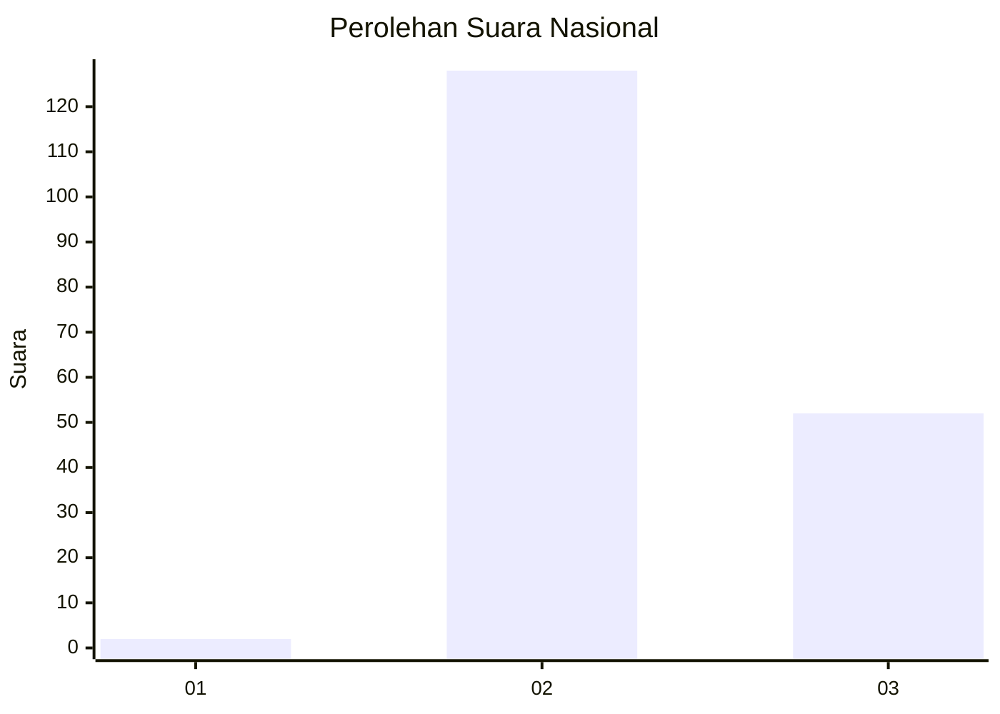

# Hasil

## Grafik

## Tabel

| No. | Nama Paslon    | Suara | Suara (raw) | Persentase |
|:--- |:-------------- | -----:| -----------:| ----------:|
| 1   | ANIES MUHAIMIN | 2     | [2][p-1]    | 1,10       |
| 2   | PRABOWO GIBRAN | 128   | [128][p-2]  | 70,33      |
| 3   | GANJAR MAHFUD  | 52    | [52][p-3]   | 28,57      |

[p-1]: https://github.com/gigit-pemilu/pemilu-2024/blob/main/pilpres/hitung-suara/sub/51-bali/sub/01-jembrana/sub/02-mendoyo/sub/1006-tegalcangkring/sub/008-tps/sub/paslon-1.txt
[p-2]: https://github.com/gigit-pemilu/pemilu-2024/blob/main/pilpres/hitung-suara/sub/51-bali/sub/01-jembrana/sub/02-mendoyo/sub/1006-tegalcangkring/sub/008-tps/sub/paslon-2.txt
[p-3]: https://github.com/gigit-pemilu/pemilu-2024/blob/main/pilpres/hitung-suara/sub/51-bali/sub/01-jembrana/sub/02-mendoyo/sub/1006-tegalcangkring/sub/008-tps/sub/paslon-3.txt

## Foto C Plano

https://sirekap-obj-formc.kpu.go.id/aa71/pemilu/ppwp/51/01/02/10/06/5101021006008-20240214-141204--ec98a9a1-5c81-4fb7-b4b4-d91ff4defa1f.jpg

https://sirekap-obj-formc.kpu.go.id/aa71/pemilu/ppwp/51/01/02/10/06/5101021006008-20240214-141210--b37b0dd2-d4f5-4f30-8f1a-5fc7767281a0.jpg

https://sirekap-obj-formc.kpu.go.id/aa71/pemilu/ppwp/51/01/02/10/06/5101021006008-20240214-162232--0642a014-b9b9-4c65-9811-1cb0d93bba91.jpg

## Metadata

| Key        | Value               |
| ---------- | ------------------- |
| Time Stamp | 2024-02-14 21:46:01 |

## DATA PEMILIH TETAP

Jumlah pemilih dalam DPT: **245**.
 * L: **122**.
 * P: **123**.

## DATA PENGGUNA HAK PILIH

Jumlah pengguna hak pilih dalam DPT: **184**.
 * L: **99**.
 * P: **85**.

Jumlah pengguna hak pilih dalam DPTb: **0**.
 * L: **0**.
 * P: **0**.

Jumlah pengguna hak pilih dalam DPK: **0**.
 * L: **0**.
 * P: **0**.

Jumlah pengguna hak pilih: **184**.
 * L: **99**.
 * P: **85**.

## JUMLAH SUARA SAH DAN TIDAK SAH

JUMLAH SELURUH SUARA SAH: **182**.

JUMLAH SUARA TIDAK SAH: **2**.

JUMLAH SELURUH SUARA SAH DAN SUARA TIDAK SAH: **184**.

