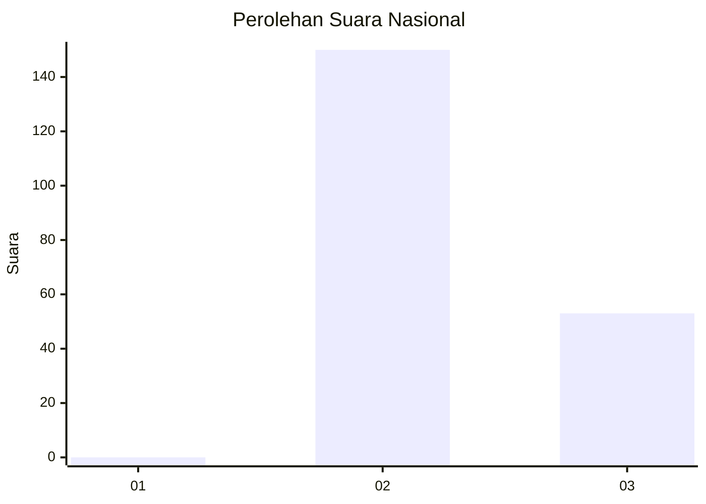
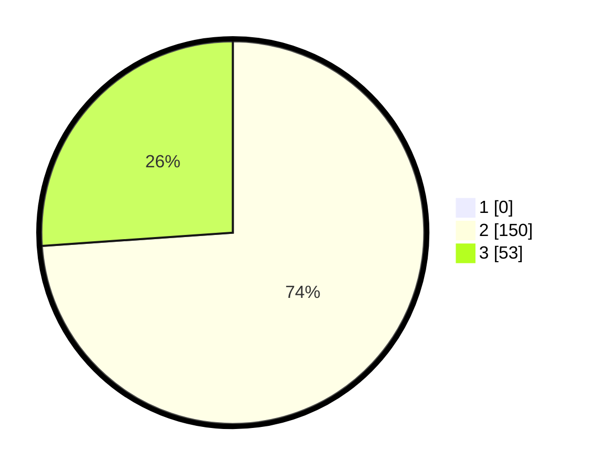

# Hasil

## Grafik

## Tabel

| No. | Nama Paslon    | Suara | Suara (raw) | Persentase |
|:--- |:-------------- | -----:| -----------:| ----------:|
| 1   | ANIES MUHAIMIN | 0     | [0][p-1]    | 0,00       |
| 2   | PRABOWO GIBRAN | 150   | [150][p-2]  | 73,89      |
| 3   | GANJAR MAHFUD  | 53    | [53][p-3]   | 26,11      |

[p-1]: https://github.com/gigit-pemilu/pemilu-2024/blob/main/pilpres/hitung-suara/sub/51-bali/sub/01-jembrana/sub/02-mendoyo/sub/1006-tegalcangkring/sub/009-tps/sub/paslon-1.txt
[p-2]: https://github.com/gigit-pemilu/pemilu-2024/blob/main/pilpres/hitung-suara/sub/51-bali/sub/01-jembrana/sub/02-mendoyo/sub/1006-tegalcangkring/sub/009-tps/sub/paslon-2.txt
[p-3]: https://github.com/gigit-pemilu/pemilu-2024/blob/main/pilpres/hitung-suara/sub/51-bali/sub/01-jembrana/sub/02-mendoyo/sub/1006-tegalcangkring/sub/009-tps/sub/paslon-3.txt

## Foto C Plano

https://sirekap-obj-formc.kpu.go.id/aa9e/pemilu/ppwp/51/01/02/10/06/5101021006009-20240214-205841--e80f7cd0-05c6-4740-9ba9-356b5599cb7a.jpg

https://sirekap-obj-formc.kpu.go.id/aa9e/pemilu/ppwp/51/01/02/10/06/5101021006009-20240214-205944--9d430982-9373-4068-acdd-55da8d92df60.jpg

https://sirekap-obj-formc.kpu.go.id/aa9e/pemilu/ppwp/51/01/02/10/06/5101021006009-20240214-210028--8a2a3bf7-749e-420b-a9b5-74ba6a973efd.jpg

## Metadata

| Key        | Value               |
| ---------- | ------------------- |
| Time Stamp | 2024-02-15 15:00:29 |

## DATA PEMILIH TETAP

Jumlah pemilih dalam DPT: **265**.
 * L: **125**.
 * P: **140**.

## DATA PENGGUNA HAK PILIH

Jumlah pengguna hak pilih dalam DPT: **203**.
 * L: **95**.
 * P: **108**.

Jumlah pengguna hak pilih dalam DPTb: **0**.
 * L: **0**.
 * P: **0**.

Jumlah pengguna hak pilih dalam DPK: **0**.
 * L: **0**.
 * P: **0**.

Jumlah pengguna hak pilih: **203**.
 * L: **95**.
 * P: **108**.

## JUMLAH SUARA SAH DAN TIDAK SAH

JUMLAH SELURUH SUARA SAH: **203**.

JUMLAH SUARA TIDAK SAH: **0**.

JUMLAH SELURUH SUARA SAH DAN SUARA TIDAK SAH: **203**.

