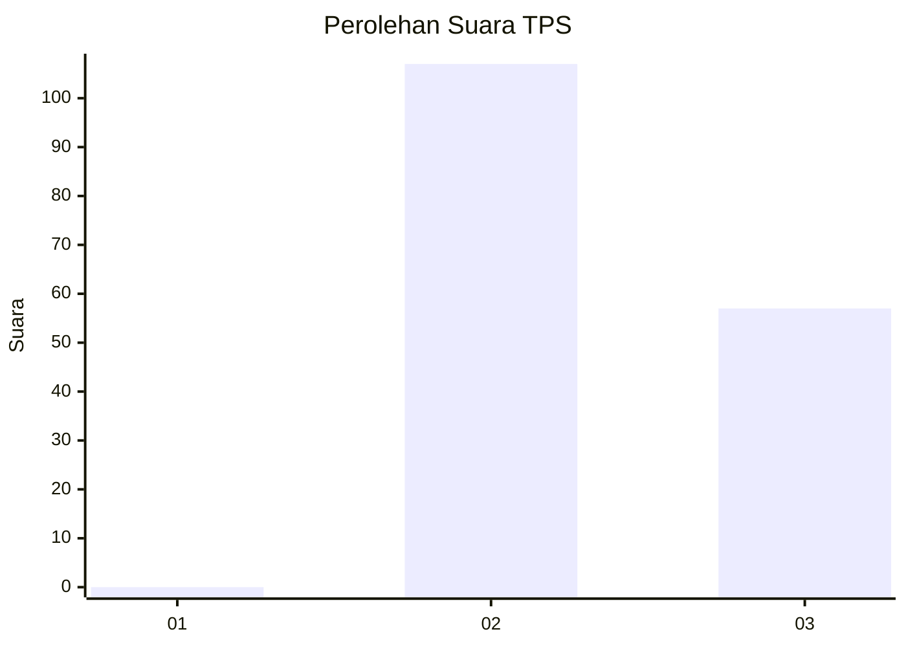
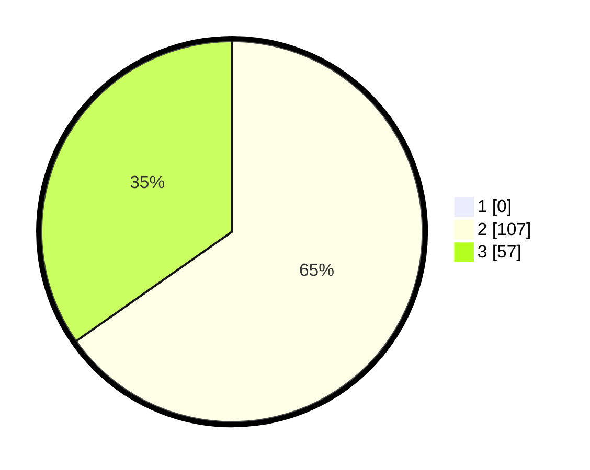

# Hasil

## Grafik

## Tabel

| No. | Nama Paslon    | Suara | Suara (raw) | Persentase |
|:--- |:-------------- | -----:| -----------:| ----------:|
| 1   | ANIES MUHAIMIN | 0     | [0][p-1]    | 0,00       |
| 2   | PRABOWO GIBRAN | 107   | [107][p-2]  | 65,24      |
| 3   | GANJAR MAHFUD  | 57    | [57][p-3]   | 34,76      |

[p-1]: https://github.com/gigit-pemilu/pemilu-2024-51-bali/blob/main/pilpres/hitung-suara/sub/51-bali/sub/01-jembrana/sub/02-mendoyo/sub/1006-tegalcangkring/sub/015-tps/sub/paslon-1.txt
[p-2]: https://github.com/gigit-pemilu/pemilu-2024-51-bali/blob/main/pilpres/hitung-suara/sub/51-bali/sub/01-jembrana/sub/02-mendoyo/sub/1006-tegalcangkring/sub/015-tps/sub/paslon-2.txt
[p-3]: https://github.com/gigit-pemilu/pemilu-2024-51-bali/blob/main/pilpres/hitung-suara/sub/51-bali/sub/01-jembrana/sub/02-mendoyo/sub/1006-tegalcangkring/sub/015-tps/sub/paslon-3.txt

## Foto C Plano

https://sirekap-obj-formc.kpu.go.id/450d/pemilu/ppwp/51/01/02/10/06/5101021006015-20240214-215040--23b0ab41-a33c-4771-8444-35a2d72249b8.jpg

https://sirekap-obj-formc.kpu.go.id/450d/pemilu/ppwp/51/01/02/10/06/5101021006015-20240214-215259--18613d5a-adf1-4193-8097-5da7a0b55adf.jpg

https://sirekap-obj-formc.kpu.go.id/450d/pemilu/ppwp/51/01/02/10/06/5101021006015-20240214-215418--6591ca17-5b2e-4e19-8c9b-e41fc815e7ae.jpg

## Metadata

| Key        | Value               |
| ---------- | ------------------- |
| Time Stamp | 2024-02-15 15:00:29 |

