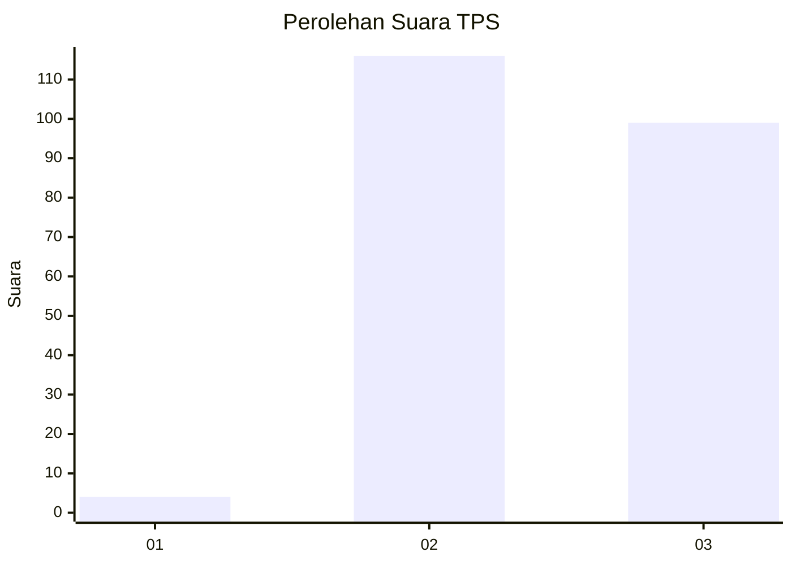
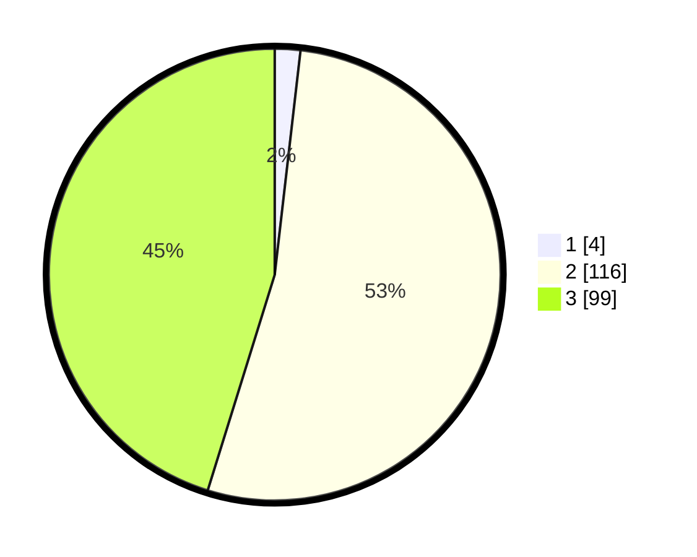

# Hasil

## Grafik

## Tabel

| No. | Nama Paslon    | Suara | Suara (raw) | Persentase |
|:--- |:-------------- | -----:| -----------:| ----------:|
| 1   | ANIES MUHAIMIN | 4     | [4][p-1]    | 1,83       |
| 2   | PRABOWO GIBRAN | 116   | [116][p-2]  | 52,97      |
| 3   | GANJAR MAHFUD  | 99    | [99][p-3]   | 45,21      |

[p-1]: https://github.com/gigit-pemilu/pemilu-2024-51-bali/blob/main/pilpres/hitung-suara/sub/51-bali/sub/01-jembrana/sub/02-mendoyo/sub/2001-mendoyo-dauh-tukad/sub/006-tps/sub/paslon-1.txt
[p-2]: https://github.com/gigit-pemilu/pemilu-2024-51-bali/blob/main/pilpres/hitung-suara/sub/51-bali/sub/01-jembrana/sub/02-mendoyo/sub/2001-mendoyo-dauh-tukad/sub/006-tps/sub/paslon-2.txt
[p-3]: https://github.com/gigit-pemilu/pemilu-2024-51-bali/blob/main/pilpres/hitung-suara/sub/51-bali/sub/01-jembrana/sub/02-mendoyo/sub/2001-mendoyo-dauh-tukad/sub/006-tps/sub/paslon-3.txt

## Foto C Plano

https://sirekap-obj-formc.kpu.go.id/b32d/pemilu/ppwp/51/01/02/20/01/5101022001006-20240214-141042--95ca5643-d442-468b-94a0-af26f7a4fa03.jpg

https://sirekap-obj-formc.kpu.go.id/b32d/pemilu/ppwp/51/01/02/20/01/5101022001006-20240214-141036--c78890b9-3250-4ed9-ab20-e076538f8187.jpg

https://sirekap-obj-formc.kpu.go.id/b32d/pemilu/ppwp/51/01/02/20/01/5101022001006-20240214-223730--63f0dd75-f380-4ba0-84f9-8adba0f8f3a5.jpg

## Metadata

| Key        | Value               |
| ---------- | ------------------- |
| Time Stamp | 2024-02-15 01:47:43 |

