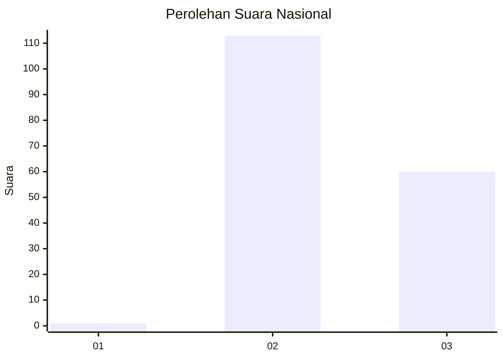
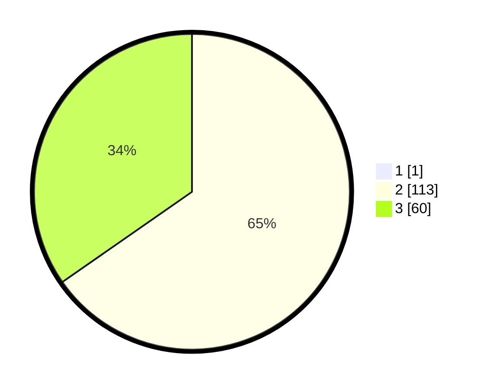

# Hasil

## Grafik

## Tabel

| No. | Nama Paslon    | Suara | Suara (raw) | Persentase |
|:--- |:-------------- | -----:| -----------:| ----------:|
| 1   | ANIES MUHAIMIN | 1     | [1][p-1]    | 0,57       |
| 2   | PRABOWO GIBRAN | 113   | [113][p-2]  | 64,94      |
| 3   | GANJAR MAHFUD  | 60    | [60][p-3]   | 34,48      |

[p-1]: https://github.com/gigit-pemilu/pemilu-2024/blob/main/pilpres/hitung-suara/sub/51-bali/sub/01-jembrana/sub/02-mendoyo/sub/2001-mendoyo-dauh-tukad/sub/009-tps/sub/paslon-1.txt
[p-2]: https://github.com/gigit-pemilu/pemilu-2024/blob/main/pilpres/hitung-suara/sub/51-bali/sub/01-jembrana/sub/02-mendoyo/sub/2001-mendoyo-dauh-tukad/sub/009-tps/sub/paslon-2.txt
[p-3]: https://github.com/gigit-pemilu/pemilu-2024/blob/main/pilpres/hitung-suara/sub/51-bali/sub/01-jembrana/sub/02-mendoyo/sub/2001-mendoyo-dauh-tukad/sub/009-tps/sub/paslon-3.txt

## Foto C Plano

https://sirekap-obj-formc.kpu.go.id/0747/pemilu/ppwp/51/01/02/20/01/5101022001009-20240214-141554--51edfcd5-b6ea-44e0-ad4f-26348beff28a.jpg

https://sirekap-obj-formc.kpu.go.id/0747/pemilu/ppwp/51/01/02/20/01/5101022001009-20240214-141713--ebbec96a-62ef-4333-9e2a-826c2256e6b0.jpg

https://sirekap-obj-formc.kpu.go.id/0747/pemilu/ppwp/51/01/02/20/01/5101022001009-20240214-141831--0fc81471-27f7-4690-aa7a-5668d91d53f8.jpg

## Metadata

| Key        | Value               |
| ---------- | ------------------- |
| Time Stamp | 2024-02-14 21:46:01 |

## DATA PEMILIH TETAP

Jumlah pemilih dalam DPT: **229**.
 * L: **118**.
 * P: **111**.

## DATA PENGGUNA HAK PILIH

Jumlah pengguna hak pilih dalam DPT: **175**.
 * L: **97**.
 * P: **78**.

Jumlah pengguna hak pilih dalam DPTb: **0**.
 * L: **0**.
 * P: **0**.

Jumlah pengguna hak pilih dalam DPK: **1**.
 * L: **0**.
 * P: **1**.

Jumlah pengguna hak pilih: **176**.
 * L: **97**.
 * P: **79**.

## JUMLAH SUARA SAH DAN TIDAK SAH

JUMLAH SELURUH SUARA SAH: **174**.

JUMLAH SUARA TIDAK SAH: **2**.

JUMLAH SELURUH SUARA SAH DAN SUARA TIDAK SAH: **176**.

