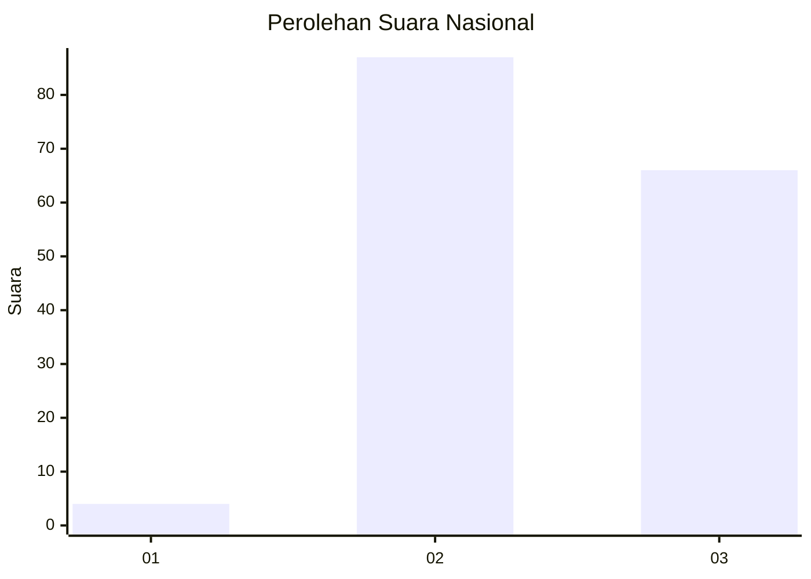
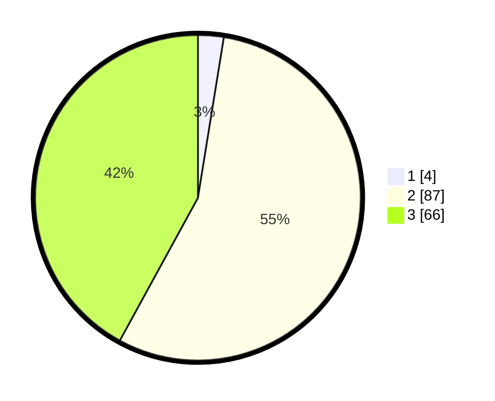

# Hasil

## Grafik

## Tabel

| No. | Nama Paslon    | Suara | Suara (raw) | Persentase |
|:--- |:-------------- | -----:| -----------:| ----------:|
| 1   | ANIES MUHAIMIN | 4     | [4][p-1]    | 2,55       |
| 2   | PRABOWO GIBRAN | 87    | [87][p-2]   | 55,41      |
| 3   | GANJAR MAHFUD  | 66    | [66][p-3]   | 42,04      |

[p-1]: https://github.com/gigit-pemilu/pemilu-2024/blob/main/pilpres/hitung-suara/sub/51-bali/sub/01-jembrana/sub/02-mendoyo/sub/2002-pohsanten/sub/002-tps/sub/paslon-1.txt
[p-2]: https://github.com/gigit-pemilu/pemilu-2024/blob/main/pilpres/hitung-suara/sub/51-bali/sub/01-jembrana/sub/02-mendoyo/sub/2002-pohsanten/sub/002-tps/sub/paslon-2.txt
[p-3]: https://github.com/gigit-pemilu/pemilu-2024/blob/main/pilpres/hitung-suara/sub/51-bali/sub/01-jembrana/sub/02-mendoyo/sub/2002-pohsanten/sub/002-tps/sub/paslon-3.txt

## Foto C Plano

https://sirekap-obj-formc.kpu.go.id/1cee/pemilu/ppwp/51/01/02/20/02/5101022002002-20240214-130140--9e27d5b7-7324-4683-b5e3-10b39f2616ae.jpg

https://sirekap-obj-formc.kpu.go.id/1cee/pemilu/ppwp/51/01/02/20/02/5101022002002-20240214-130402--4395e011-5930-45cf-98dd-50fb82ba8011.jpg

https://sirekap-obj-formc.kpu.go.id/1cee/pemilu/ppwp/51/01/02/20/02/5101022002002-20240214-130622--e82cae13-acc3-4779-83d9-a4f3ca207f16.jpg

## Metadata

| Key        | Value               |
| ---------- | ------------------- |
| Time Stamp | 2024-02-14 21:46:01 |

## DATA PEMILIH TETAP

Jumlah pemilih dalam DPT: **210**.
 * L: **100**.
 * P: **110**.

## DATA PENGGUNA HAK PILIH

Jumlah pengguna hak pilih dalam DPT: **158**.
 * L: **68**.
 * P: **90**.

Jumlah pengguna hak pilih dalam DPTb: **0**.
 * L: **0**.
 * P: **0**.

Jumlah pengguna hak pilih dalam DPK: **1**.
 * L: **1**.
 * P: **0**.

Jumlah pengguna hak pilih: **159**.
 * L: **69**.
 * P: **90**.

## JUMLAH SUARA SAH DAN TIDAK SAH

JUMLAH SELURUH SUARA SAH: **157**.

JUMLAH SUARA TIDAK SAH: **2**.

JUMLAH SELURUH SUARA SAH DAN SUARA TIDAK SAH: **159**.

