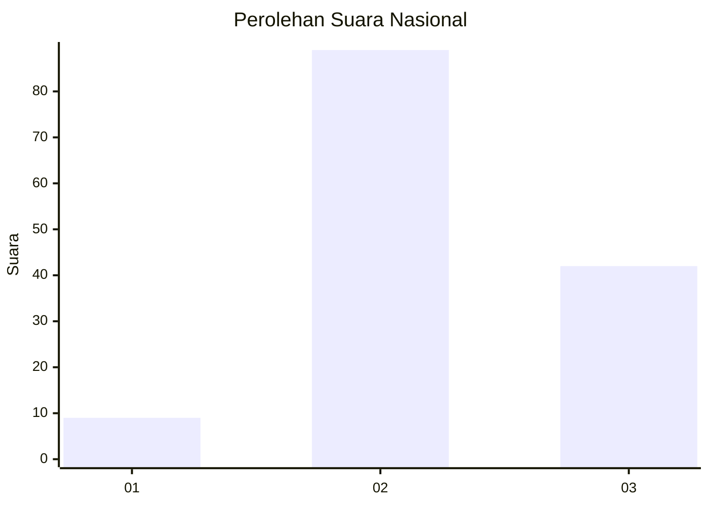
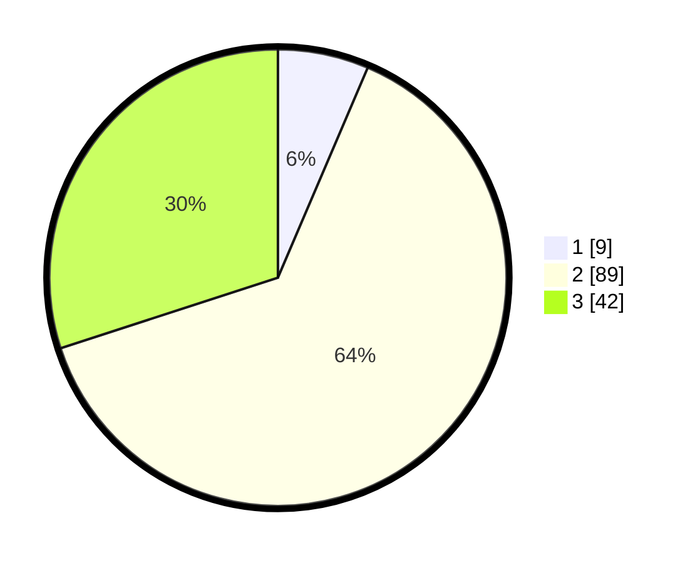

# Hasil

## Grafik

## Tabel

| No. | Nama Paslon    | Suara | Suara (raw) | Persentase |
|:--- |:-------------- | -----:| -----------:| ----------:|
| 1   | ANIES MUHAIMIN | 9     | [9][p-1]    | 6,43       |
| 2   | PRABOWO GIBRAN | 89    | [89][p-2]   | 63,57      |
| 3   | GANJAR MAHFUD  | 42    | [42][p-3]   | 30,00      |

[p-1]: https://github.com/gigit-pemilu/pemilu-2024/blob/main/pilpres/hitung-suara/sub/51-bali/sub/01-jembrana/sub/02-mendoyo/sub/2002-pohsanten/sub/003-tps/sub/paslon-1.txt
[p-2]: https://github.com/gigit-pemilu/pemilu-2024/blob/main/pilpres/hitung-suara/sub/51-bali/sub/01-jembrana/sub/02-mendoyo/sub/2002-pohsanten/sub/003-tps/sub/paslon-2.txt
[p-3]: https://github.com/gigit-pemilu/pemilu-2024/blob/main/pilpres/hitung-suara/sub/51-bali/sub/01-jembrana/sub/02-mendoyo/sub/2002-pohsanten/sub/003-tps/sub/paslon-3.txt

## Foto C Plano

https://sirekap-obj-formc.kpu.go.id/85ca/pemilu/ppwp/51/01/02/20/02/5101022002003-20240214-132012--241b18d6-eb26-4202-a1da-ab7081418fa4.jpg

https://sirekap-obj-formc.kpu.go.id/85ca/pemilu/ppwp/51/01/02/20/02/5101022002003-20240214-132133--558fc632-4b63-4ef0-a628-8538a189859c.jpg

https://sirekap-obj-formc.kpu.go.id/85ca/pemilu/ppwp/51/01/02/20/02/5101022002003-20240214-132414--c3664ce5-fca4-4581-b92a-a97d9b5616b9.jpg

## Metadata

| Key        | Value               |
| ---------- | ------------------- |
| Time Stamp | 2024-02-14 21:46:01 |

## DATA PEMILIH TETAP

Jumlah pemilih dalam DPT: **198**.
 * L: **103**.
 * P: **95**.

## DATA PENGGUNA HAK PILIH

Jumlah pengguna hak pilih dalam DPT: **145**.
 * L: **74**.
 * P: **71**.

Jumlah pengguna hak pilih dalam DPTb: **0**.
 * L: **0**.
 * P: **0**.

Jumlah pengguna hak pilih dalam DPK: **1**.
 * L: **0**.
 * P: **1**.

Jumlah pengguna hak pilih: **146**.
 * L: **74**.
 * P: **72**.

## JUMLAH SUARA SAH DAN TIDAK SAH

JUMLAH SELURUH SUARA SAH: **140**.

JUMLAH SUARA TIDAK SAH: **6**.

JUMLAH SELURUH SUARA SAH DAN SUARA TIDAK SAH: **146**.

