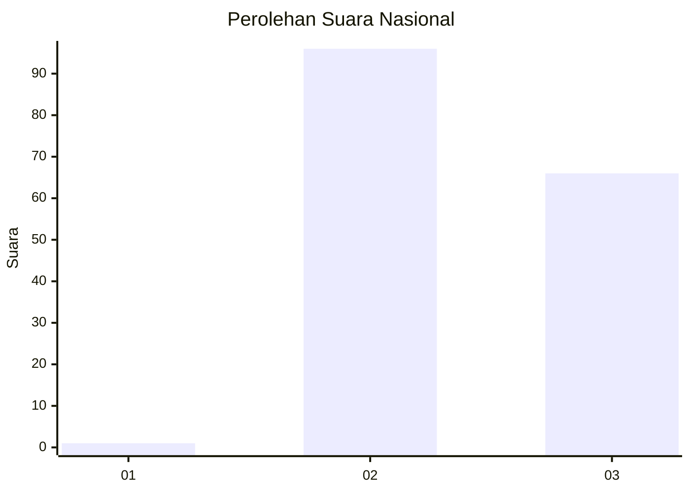
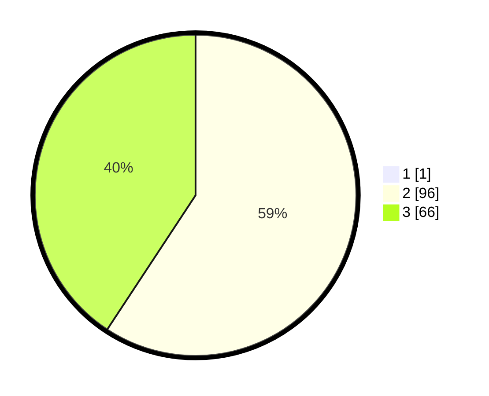

# Hasil

## Grafik

## Tabel

| No. | Nama Paslon    | Suara | Suara (raw) | Persentase |
|:--- |:-------------- | -----:| -----------:| ----------:|
| 1   | ANIES MUHAIMIN | 1     | [1][p-1]    | 0,61       |
| 2   | PRABOWO GIBRAN | 96    | [96][p-2]   | 58,90      |
| 3   | GANJAR MAHFUD  | 66    | [66][p-3]   | 40,49      |

[p-1]: https://github.com/gigit-pemilu/pemilu-2024/blob/main/pilpres/hitung-suara/sub/51-bali/sub/01-jembrana/sub/02-mendoyo/sub/2002-pohsanten/sub/004-tps/sub/paslon-1.txt
[p-2]: https://github.com/gigit-pemilu/pemilu-2024/blob/main/pilpres/hitung-suara/sub/51-bali/sub/01-jembrana/sub/02-mendoyo/sub/2002-pohsanten/sub/004-tps/sub/paslon-2.txt
[p-3]: https://github.com/gigit-pemilu/pemilu-2024/blob/main/pilpres/hitung-suara/sub/51-bali/sub/01-jembrana/sub/02-mendoyo/sub/2002-pohsanten/sub/004-tps/sub/paslon-3.txt

## Foto C Plano

https://sirekap-obj-formc.kpu.go.id/38f9/pemilu/ppwp/51/01/02/20/02/5101022002004-20240214-141257--ccedf3cd-2f96-4e55-bd46-1a410dfcb0ed.jpg

https://sirekap-obj-formc.kpu.go.id/38f9/pemilu/ppwp/51/01/02/20/02/5101022002004-20240214-141050--01783e8e-aee4-4e54-8d68-8267b736f64d.jpg

https://sirekap-obj-formc.kpu.go.id/38f9/pemilu/ppwp/51/01/02/20/02/5101022002004-20240214-141422--a44f34d7-bb7f-43a7-87d6-dda39e34cdb9.jpg

## Metadata

| Key        | Value               |
| ---------- | ------------------- |
| Time Stamp | 2024-02-14 21:46:01 |

