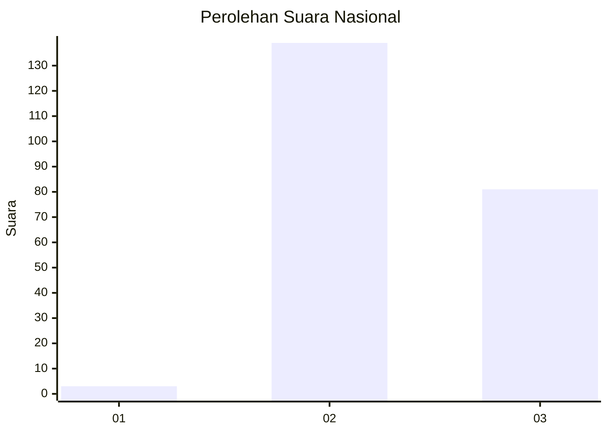
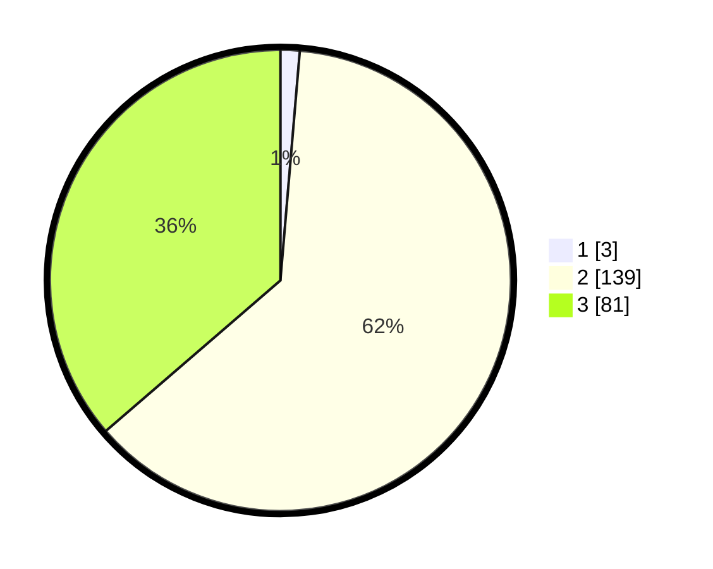

# Hasil

## Grafik

## Tabel

| No. | Nama Paslon    | Suara | Suara (raw) | Persentase |
|:--- |:-------------- | -----:| -----------:| ----------:|
| 1   | ANIES MUHAIMIN | 3     | [3][p-1]    | 1,35       |
| 2   | PRABOWO GIBRAN | 139   | [139][p-2]  | 62,33      |
| 3   | GANJAR MAHFUD  | 81    | [81][p-3]   | 36,32      |

[p-1]: https://github.com/gigit-pemilu/pemilu-2024/blob/main/pilpres/hitung-suara/sub/51-bali/sub/01-jembrana/sub/02-mendoyo/sub/2002-pohsanten/sub/013-tps/sub/paslon-1.txt
[p-2]: https://github.com/gigit-pemilu/pemilu-2024/blob/main/pilpres/hitung-suara/sub/51-bali/sub/01-jembrana/sub/02-mendoyo/sub/2002-pohsanten/sub/013-tps/sub/paslon-2.txt
[p-3]: https://github.com/gigit-pemilu/pemilu-2024/blob/main/pilpres/hitung-suara/sub/51-bali/sub/01-jembrana/sub/02-mendoyo/sub/2002-pohsanten/sub/013-tps/sub/paslon-3.txt

## Foto C Plano

https://sirekap-obj-formc.kpu.go.id/b61f/pemilu/ppwp/51/01/02/20/02/5101022002013-20240214-141251--40ba707e-1196-4462-8516-b680271057d1.jpg

https://sirekap-obj-formc.kpu.go.id/b61f/pemilu/ppwp/51/01/02/20/02/5101022002013-20240214-141446--4fe0c720-e8c4-4715-b0dd-021c0a660d98.jpg

https://sirekap-obj-formc.kpu.go.id/b61f/pemilu/ppwp/51/01/02/20/02/5101022002013-20240214-141555--13bcd4dc-02d8-48d8-9e2f-1847951220b8.jpg

## Metadata

| Key        | Value               |
| ---------- | ------------------- |
| Time Stamp | 2024-02-14 21:46:01 |

## DATA PEMILIH TETAP

Jumlah pemilih dalam DPT: **280**.
 * L: **134**.
 * P: **146**.

## DATA PENGGUNA HAK PILIH

Jumlah pengguna hak pilih dalam DPT: **225**.
 * L: **110**.
 * P: **115**.

Jumlah pengguna hak pilih dalam DPTb: **0**.
 * L: **0**.
 * P: **0**.

Jumlah pengguna hak pilih dalam DPK: **0**.
 * L: **0**.
 * P: **0**.

Jumlah pengguna hak pilih: **225**.
 * L: **110**.
 * P: **115**.

## JUMLAH SUARA SAH DAN TIDAK SAH

JUMLAH SELURUH SUARA SAH: **223**.

JUMLAH SUARA TIDAK SAH: **2**.

JUMLAH SELURUH SUARA SAH DAN SUARA TIDAK SAH: **225**.

