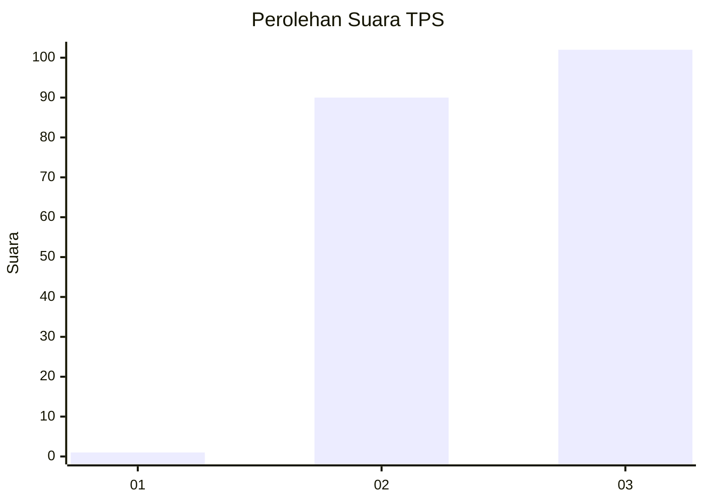
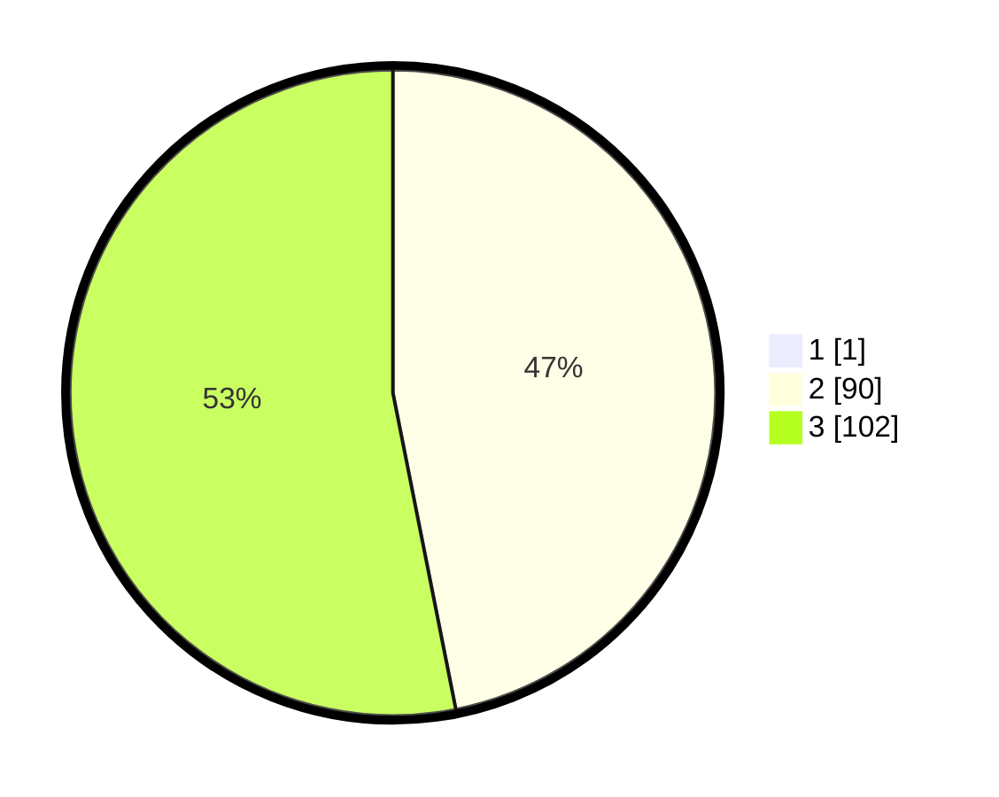

# Hasil

## Grafik

## Tabel

| No. | Nama Paslon    | Suara | Suara (raw) | Persentase |
|:--- |:-------------- | -----:| -----------:| ----------:|
| 1   | ANIES MUHAIMIN | 1     | [1][p-1]    | 0,52       |
| 2   | PRABOWO GIBRAN | 90    | [90][p-2]   | 46,63      |
| 3   | GANJAR MAHFUD  | 102   | [102][p-3]  | 52,85      |

[p-1]: https://github.com/gigit-pemilu/pemilu-2024-51-bali/blob/main/pilpres/hitung-suara/sub/51-bali/sub/01-jembrana/sub/02-mendoyo/sub/2002-pohsanten/sub/022-tps/sub/paslon-1.txt
[p-2]: https://github.com/gigit-pemilu/pemilu-2024-51-bali/blob/main/pilpres/hitung-suara/sub/51-bali/sub/01-jembrana/sub/02-mendoyo/sub/2002-pohsanten/sub/022-tps/sub/paslon-2.txt
[p-3]: https://github.com/gigit-pemilu/pemilu-2024-51-bali/blob/main/pilpres/hitung-suara/sub/51-bali/sub/01-jembrana/sub/02-mendoyo/sub/2002-pohsanten/sub/022-tps/sub/paslon-3.txt

## Foto C Plano

https://sirekap-obj-formc.kpu.go.id/9dec/pemilu/ppwp/51/01/02/20/02/5101022002022-20240214-132059--6a3bd32f-13d8-497d-a78e-258aff9e3f9e.jpg

https://sirekap-obj-formc.kpu.go.id/9dec/pemilu/ppwp/51/01/02/20/02/5101022002022-20240214-132223--d2107e8c-1d29-4fa0-82e0-00e75ad49af2.jpg

https://sirekap-obj-formc.kpu.go.id/9dec/pemilu/ppwp/51/01/02/20/02/5101022002022-20240214-132341--6c548b4a-2be8-45df-9e3c-c34c4d87f560.jpg

## Metadata

| Key        | Value               |
| ---------- | ------------------- |
| Time Stamp | 2024-02-14 21:46:01 |

## DATA PEMILIH TETAP

Jumlah pemilih dalam DPT: **230**.
 * L: **115**.
 * P: **115**.

## DATA PENGGUNA HAK PILIH

Jumlah pengguna hak pilih dalam DPT: **195**.
 * L: **96**.
 * P: **99**.

Jumlah pengguna hak pilih dalam DPTb: **0**.
 * L: **0**.
 * P: **0**.

Jumlah pengguna hak pilih dalam DPK: **2**.
 * L: **1**.
 * P: **1**.

Jumlah pengguna hak pilih: **197**.
 * L: **97**.
 * P: **100**.

## JUMLAH SUARA SAH DAN TIDAK SAH

JUMLAH SELURUH SUARA SAH: **193**.

JUMLAH SUARA TIDAK SAH: **4**.

JUMLAH SELURUH SUARA SAH DAN SUARA TIDAK SAH: **197**.

