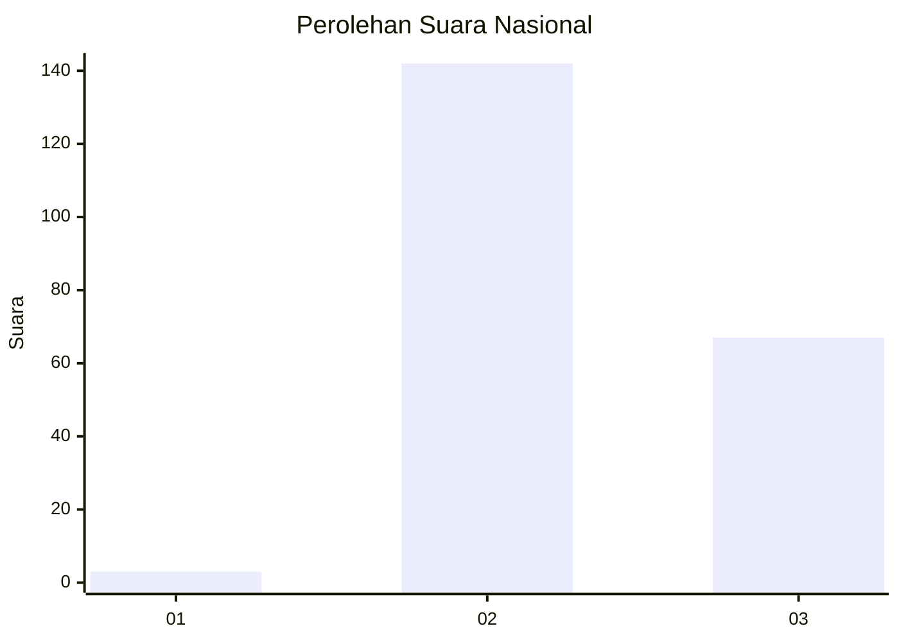
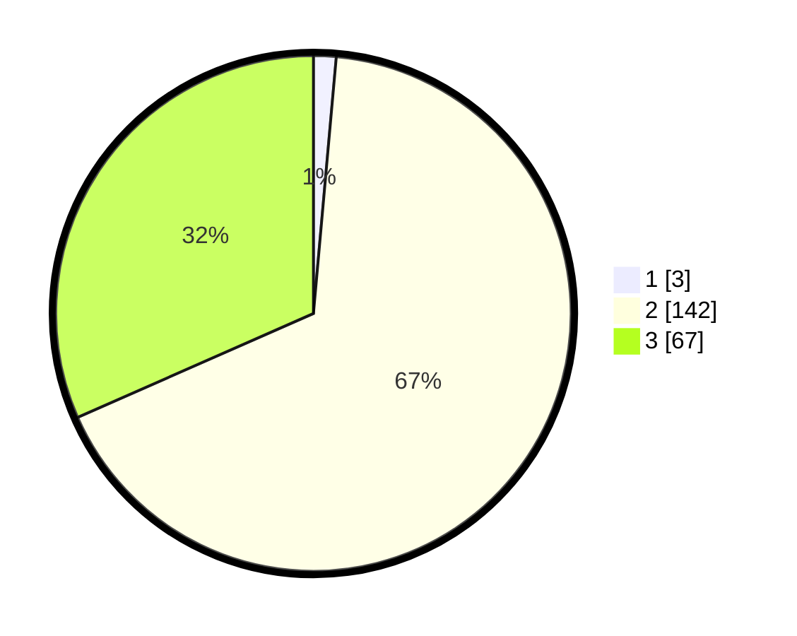

# Hasil

## Grafik

## Tabel

| No. | Nama Paslon    | Suara | Suara (raw) | Persentase |
|:--- |:-------------- | -----:| -----------:| ----------:|
| 1   | ANIES MUHAIMIN | 3     | [3][p-1]    | 1,42       |
| 2   | PRABOWO GIBRAN | 142   | [142][p-2]  | 66,98      |
| 3   | GANJAR MAHFUD  | 67    | [67][p-3]   | 31,60      |

[p-1]: https://github.com/gigit-pemilu/pemilu-2024/blob/main/pilpres/hitung-suara/sub/51-bali/sub/01-jembrana/sub/02-mendoyo/sub/2004-pergung/sub/008-tps/sub/paslon-1.txt
[p-2]: https://github.com/gigit-pemilu/pemilu-2024/blob/main/pilpres/hitung-suara/sub/51-bali/sub/01-jembrana/sub/02-mendoyo/sub/2004-pergung/sub/008-tps/sub/paslon-2.txt
[p-3]: https://github.com/gigit-pemilu/pemilu-2024/blob/main/pilpres/hitung-suara/sub/51-bali/sub/01-jembrana/sub/02-mendoyo/sub/2004-pergung/sub/008-tps/sub/paslon-3.txt

## Foto C Plano

https://sirekap-obj-formc.kpu.go.id/d26c/pemilu/ppwp/51/01/02/20/04/5101022004008-20240214-133009--d945cf1b-629d-4ea5-b499-1165b6abb2e1.jpg

https://sirekap-obj-formc.kpu.go.id/d26c/pemilu/ppwp/51/01/02/20/04/5101022004008-20240214-133130--dbda2d1c-d352-4433-863a-4c6e3c5a894f.jpg

https://sirekap-obj-formc.kpu.go.id/d26c/pemilu/ppwp/51/01/02/20/04/5101022004008-20240214-141037--0f9b95f5-6a1c-4dd8-85c0-ce11f1f7bec4.jpg

## Metadata

| Key        | Value               |
| ---------- | ------------------- |
| Time Stamp | 2024-02-14 21:46:01 |

## DATA PEMILIH TETAP

Jumlah pemilih dalam DPT: **278**.
 * L: **131**.
 * P: **147**.

## DATA PENGGUNA HAK PILIH

Jumlah pengguna hak pilih dalam DPT: **215**.
 * L: **102**.
 * P: **113**.

Jumlah pengguna hak pilih dalam DPTb: **0**.
 * L: **0**.
 * P: **0**.

Jumlah pengguna hak pilih dalam DPK: **0**.
 * L: **0**.
 * P: **0**.

Jumlah pengguna hak pilih: **215**.
 * L: **102**.
 * P: **113**.

## JUMLAH SUARA SAH DAN TIDAK SAH

JUMLAH SELURUH SUARA SAH: **212**.

JUMLAH SUARA TIDAK SAH: **3**.

JUMLAH SELURUH SUARA SAH DAN SUARA TIDAK SAH: **215**.

