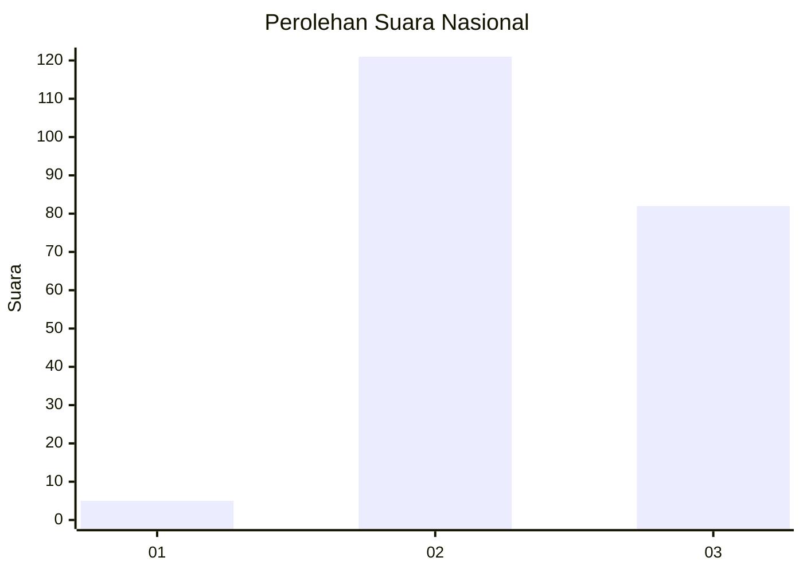
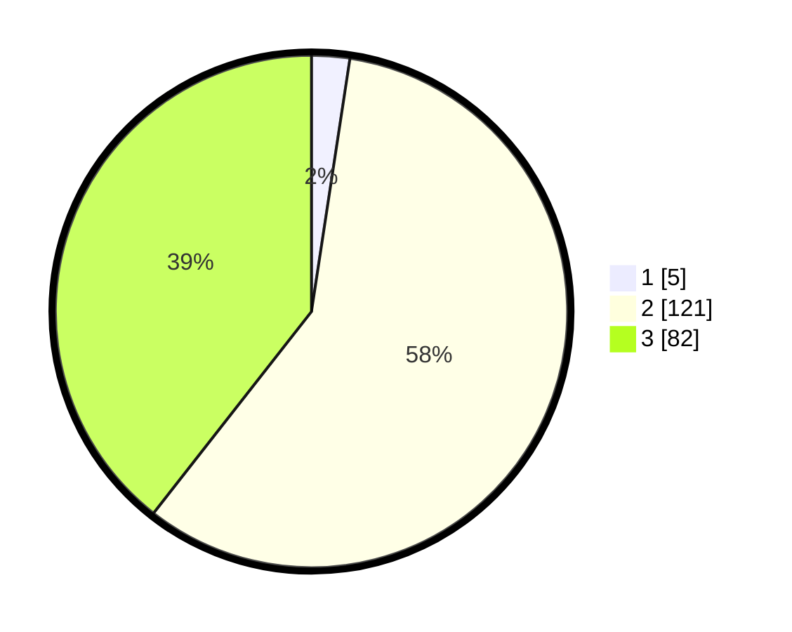

# Hasil

## Grafik

## Tabel

| No. | Nama Paslon    | Suara | Suara (raw) | Persentase |
|:--- |:-------------- | -----:| -----------:| ----------:|
| 1   | ANIES MUHAIMIN | 5     | [5][p-1]    | 2,40       |
| 2   | PRABOWO GIBRAN | 121   | [121][p-2]  | 58,17      |
| 3   | GANJAR MAHFUD  | 82    | [82][p-3]   | 39,42      |

[p-1]: https://github.com/gigit-pemilu/pemilu-2024/blob/main/pilpres/hitung-suara/sub/51-bali/sub/01-jembrana/sub/02-mendoyo/sub/2004-pergung/sub/009-tps/sub/paslon-1.txt
[p-2]: https://github.com/gigit-pemilu/pemilu-2024/blob/main/pilpres/hitung-suara/sub/51-bali/sub/01-jembrana/sub/02-mendoyo/sub/2004-pergung/sub/009-tps/sub/paslon-2.txt
[p-3]: https://github.com/gigit-pemilu/pemilu-2024/blob/main/pilpres/hitung-suara/sub/51-bali/sub/01-jembrana/sub/02-mendoyo/sub/2004-pergung/sub/009-tps/sub/paslon-3.txt

## Foto C Plano

https://sirekap-obj-formc.kpu.go.id/7d87/pemilu/ppwp/51/01/02/20/04/5101022004009-20240214-140927--010e37ca-6fb7-4f5e-a755-93bd02de626a.jpg

https://sirekap-obj-formc.kpu.go.id/7d87/pemilu/ppwp/51/01/02/20/04/5101022004009-20240214-141005--400d1653-2b7c-45e4-b202-f1dbc0da10c9.jpg

https://sirekap-obj-formc.kpu.go.id/7d87/pemilu/ppwp/51/01/02/20/04/5101022004009-20240214-141922--e16cc9aa-d93a-4bb3-beed-6410a3876328.jpg

## Metadata

| Key        | Value               |
| ---------- | ------------------- |
| Time Stamp | 2024-02-14 21:46:01 |

