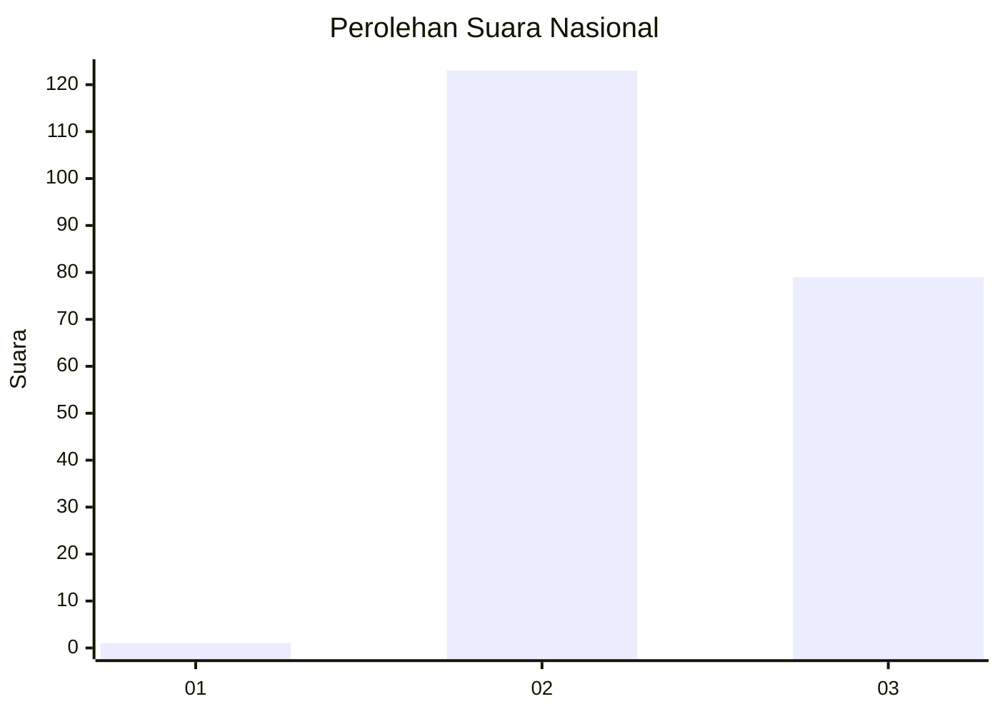
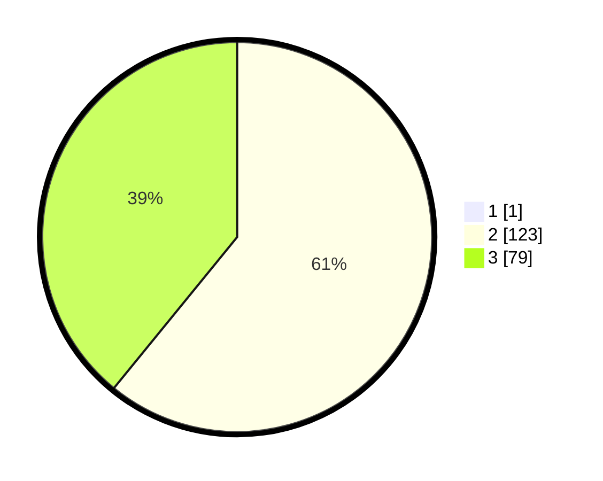

# Hasil

## Grafik

## Tabel

| No. | Nama Paslon    | Suara | Suara (raw) | Persentase |
|:--- |:-------------- | -----:| -----------:| ----------:|
| 1   | ANIES MUHAIMIN | 1     | [1][p-1]    | 0,49       |
| 2   | PRABOWO GIBRAN | 123   | [123][p-2]  | 60,59      |
| 3   | GANJAR MAHFUD  | 79    | [79][p-3]   | 38,92      |

[p-1]: https://github.com/gigit-pemilu/pemilu-2024/blob/main/pilpres/hitung-suara/sub/51-bali/sub/01-jembrana/sub/02-mendoyo/sub/2004-pergung/sub/011-tps/sub/paslon-1.txt
[p-2]: https://github.com/gigit-pemilu/pemilu-2024/blob/main/pilpres/hitung-suara/sub/51-bali/sub/01-jembrana/sub/02-mendoyo/sub/2004-pergung/sub/011-tps/sub/paslon-2.txt
[p-3]: https://github.com/gigit-pemilu/pemilu-2024/blob/main/pilpres/hitung-suara/sub/51-bali/sub/01-jembrana/sub/02-mendoyo/sub/2004-pergung/sub/011-tps/sub/paslon-3.txt

## Foto C Plano

https://sirekap-obj-formc.kpu.go.id/9477/pemilu/ppwp/51/01/02/20/04/5101022004011-20240214-155347--c012665a-bf10-44de-8c77-6fa6f5f380da.jpg

https://sirekap-obj-formc.kpu.go.id/9477/pemilu/ppwp/51/01/02/20/04/5101022004011-20240214-155357--93a4be00-3254-4af8-ab0f-5e98104b0dd4.jpg

https://sirekap-obj-formc.kpu.go.id/9477/pemilu/ppwp/51/01/02/20/04/5101022004011-20240214-155406--f565e0eb-9085-4595-ab38-56ced1596443.jpg

## Metadata

| Key        | Value               |
| ---------- | ------------------- |
| Time Stamp | 2024-02-14 21:46:01 |

## DATA PEMILIH TETAP

Jumlah pemilih dalam DPT: **247**.
 * L: **126**.
 * P: **121**.

## DATA PENGGUNA HAK PILIH

Jumlah pengguna hak pilih dalam DPT: **207**.
 * L: **106**.
 * P: **101**.

Jumlah pengguna hak pilih dalam DPTb: **0**.
 * L: **0**.
 * P: **0**.

Jumlah pengguna hak pilih dalam DPK: **0**.
 * L: **0**.
 * P: **0**.

Jumlah pengguna hak pilih: **207**.
 * L: **106**.
 * P: **101**.

## JUMLAH SUARA SAH DAN TIDAK SAH

JUMLAH SELURUH SUARA SAH: **203**.

JUMLAH SUARA TIDAK SAH: **4**.

JUMLAH SELURUH SUARA SAH DAN SUARA TIDAK SAH: **207**.

