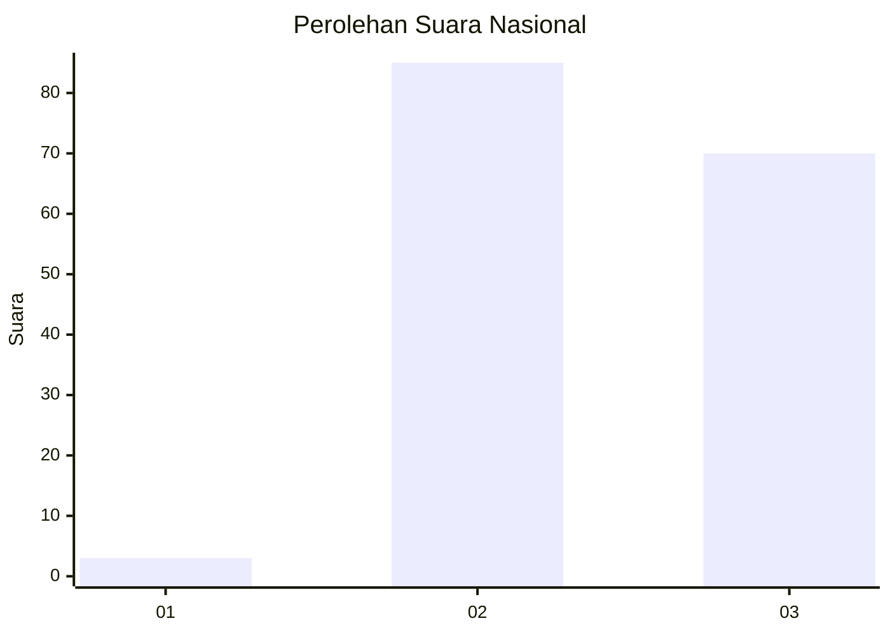
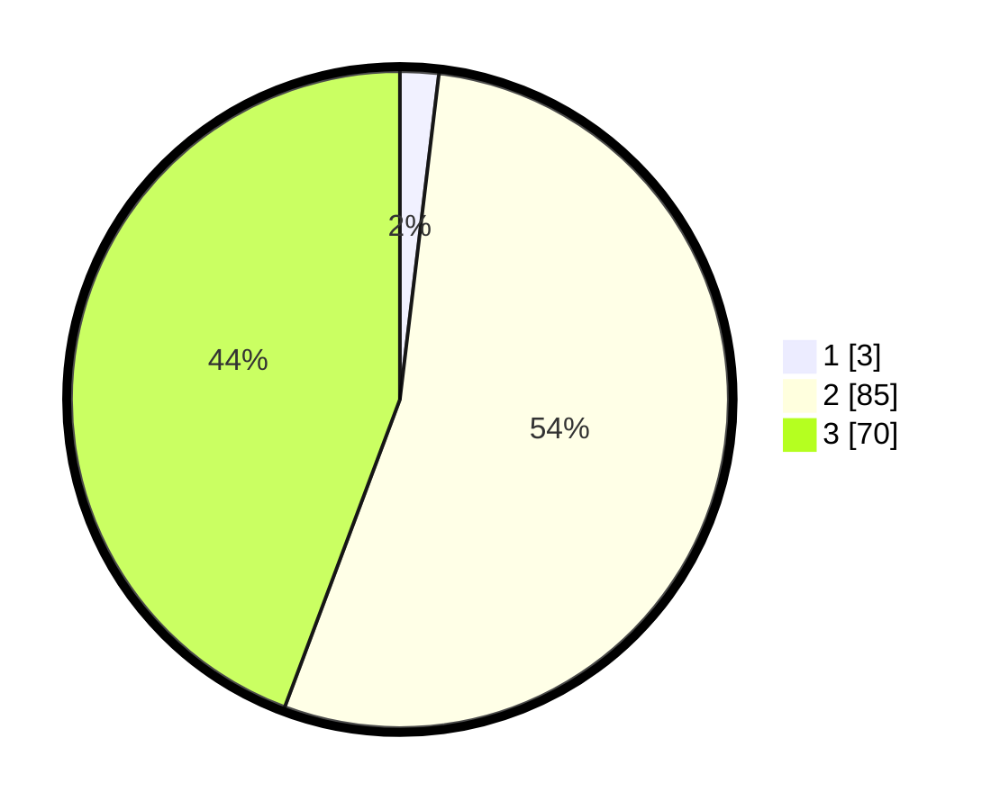

# Hasil

## Grafik

## Tabel

| No. | Nama Paslon    | Suara | Suara (raw) | Persentase |
|:--- |:-------------- | -----:| -----------:| ----------:|
| 1   | ANIES MUHAIMIN | 3     | [3][p-1]    | 1,90       |
| 2   | PRABOWO GIBRAN | 85    | [85][p-2]   | 53,80      |
| 3   | GANJAR MAHFUD  | 70    | [70][p-3]   | 44,30      |

[p-1]: https://github.com/gigit-pemilu/pemilu-2024/blob/main/pilpres/hitung-suara/sub/51-bali/sub/01-jembrana/sub/02-mendoyo/sub/2004-pergung/sub/014-tps/sub/paslon-1.txt
[p-2]: https://github.com/gigit-pemilu/pemilu-2024/blob/main/pilpres/hitung-suara/sub/51-bali/sub/01-jembrana/sub/02-mendoyo/sub/2004-pergung/sub/014-tps/sub/paslon-2.txt
[p-3]: https://github.com/gigit-pemilu/pemilu-2024/blob/main/pilpres/hitung-suara/sub/51-bali/sub/01-jembrana/sub/02-mendoyo/sub/2004-pergung/sub/014-tps/sub/paslon-3.txt

## Foto C Plano

https://sirekap-obj-formc.kpu.go.id/da30/pemilu/ppwp/51/01/02/20/04/5101022004014-20240214-221426--31bd9768-3c52-46c1-892a-6268e7b4422c.jpg

https://sirekap-obj-formc.kpu.go.id/da30/pemilu/ppwp/51/01/02/20/04/5101022004014-20240214-221442--291d59fa-38a7-4dea-ba2a-3ae33f7833fa.jpg

## Metadata

| Key        | Value               |
| ---------- | ------------------- |
| Time Stamp | 2024-02-15 09:00:24 |

