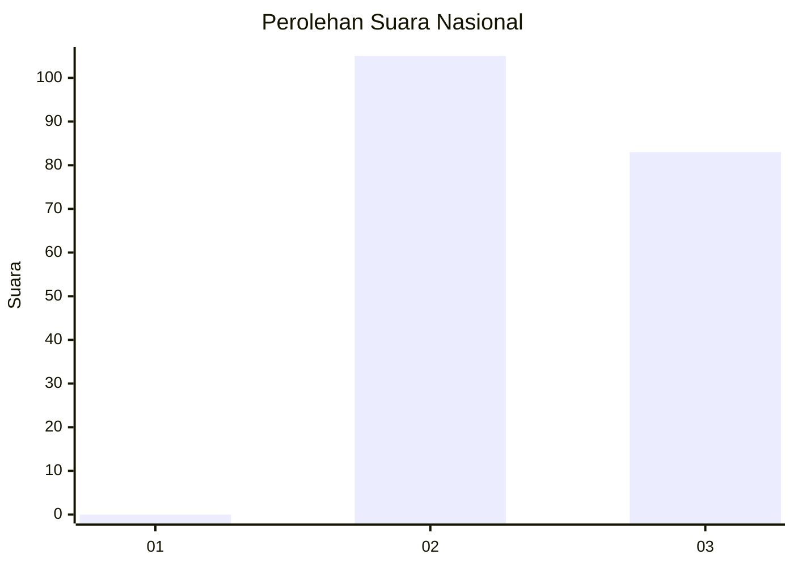
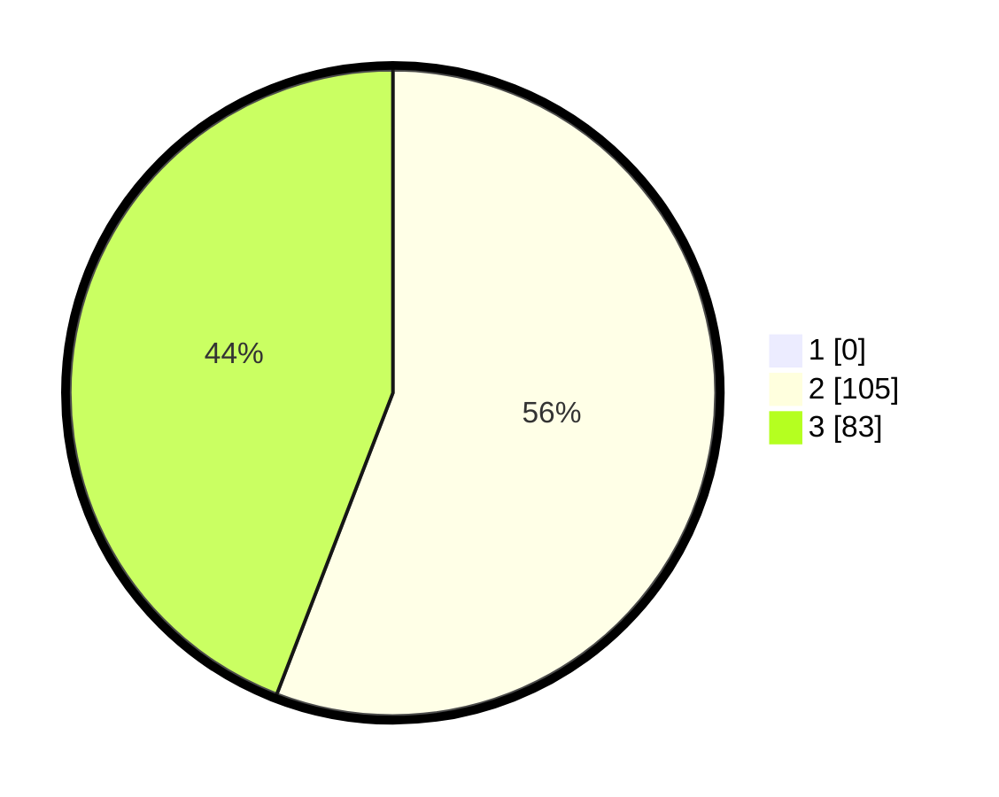

# Hasil

## Grafik

## Tabel

| No. | Nama Paslon    | Suara | Suara (raw) | Persentase |
|:--- |:-------------- | -----:| -----------:| ----------:|
| 1   | ANIES MUHAIMIN | 0     | [0][p-1]    | 0,00       |
| 2   | PRABOWO GIBRAN | 105   | [105][p-2]  | 55,85      |
| 3   | GANJAR MAHFUD  | 83    | [83][p-3]   | 44,15      |

[p-1]: https://github.com/gigit-pemilu/pemilu-2024/blob/main/pilpres/hitung-suara/sub/51-bali/sub/01-jembrana/sub/02-mendoyo/sub/2004-pergung/sub/016-tps/sub/paslon-1.txt
[p-2]: https://github.com/gigit-pemilu/pemilu-2024/blob/main/pilpres/hitung-suara/sub/51-bali/sub/01-jembrana/sub/02-mendoyo/sub/2004-pergung/sub/016-tps/sub/paslon-2.txt
[p-3]: https://github.com/gigit-pemilu/pemilu-2024/blob/main/pilpres/hitung-suara/sub/51-bali/sub/01-jembrana/sub/02-mendoyo/sub/2004-pergung/sub/016-tps/sub/paslon-3.txt

## Foto C Plano

https://sirekap-obj-formc.kpu.go.id/42f3/pemilu/ppwp/51/01/02/20/04/5101022004016-20240214-132130--6566633b-274c-4142-94c3-284635c2cdbb.jpg

https://sirekap-obj-formc.kpu.go.id/42f3/pemilu/ppwp/51/01/02/20/04/5101022004016-20240214-132305--022dcca5-d299-4083-874b-96cd3d1b2980.jpg

https://sirekap-obj-formc.kpu.go.id/42f3/pemilu/ppwp/51/01/02/20/04/5101022004016-20240214-132557--e511fc1b-363f-492e-9ca8-c0bb7803d8ad.jpg

## Metadata

| Key        | Value               |
| ---------- | ------------------- |
| Time Stamp | 2024-02-15 15:00:29 |

## DATA PEMILIH TETAP

Jumlah pemilih dalam DPT: **234**.
 * L: **121**.
 * P: **113**.

## DATA PENGGUNA HAK PILIH

Jumlah pengguna hak pilih dalam DPT: **190**.
 * L: **98**.
 * P: **92**.

Jumlah pengguna hak pilih dalam DPTb: **0**.
 * L: **0**.
 * P: **0**.

Jumlah pengguna hak pilih dalam DPK: **0**.
 * L: **0**.
 * P: **0**.

Jumlah pengguna hak pilih: **190**.
 * L: **98**.
 * P: **92**.

## JUMLAH SUARA SAH DAN TIDAK SAH

JUMLAH SELURUH SUARA SAH: **188**.

JUMLAH SUARA TIDAK SAH: **2**.

JUMLAH SELURUH SUARA SAH DAN SUARA TIDAK SAH: **190**.

