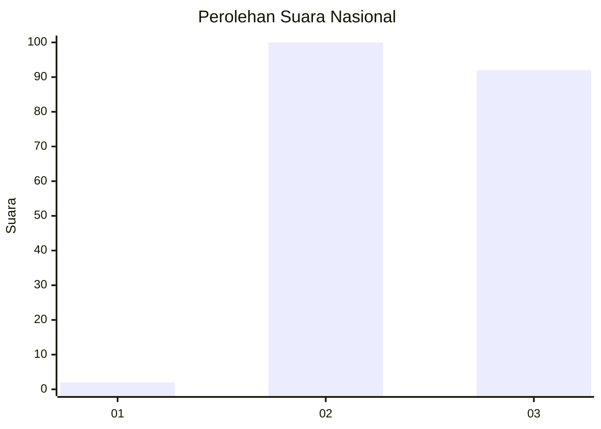
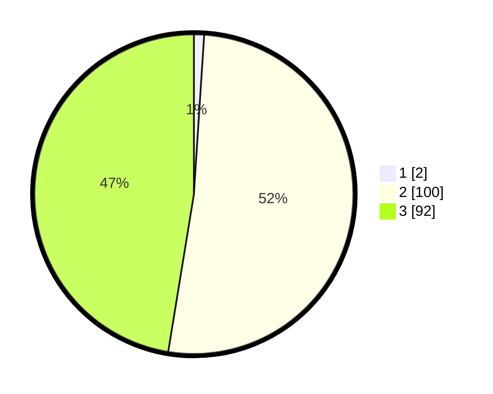

# Hasil

## Grafik

## Tabel

| No. | Nama Paslon    | Suara | Suara (raw) | Persentase |
|:--- |:-------------- | -----:| -----------:| ----------:|
| 1   | ANIES MUHAIMIN | 2     | [2][p-1]    | 1,03       |
| 2   | PRABOWO GIBRAN | 100   | [100][p-2]  | 51,55      |
| 3   | GANJAR MAHFUD  | 92    | [92][p-3]   | 47,42      |

[p-1]: https://github.com/gigit-pemilu/pemilu-2024/blob/main/pilpres/hitung-suara/sub/51-bali/sub/01-jembrana/sub/02-mendoyo/sub/2004-pergung/sub/017-tps/sub/paslon-1.txt
[p-2]: https://github.com/gigit-pemilu/pemilu-2024/blob/main/pilpres/hitung-suara/sub/51-bali/sub/01-jembrana/sub/02-mendoyo/sub/2004-pergung/sub/017-tps/sub/paslon-2.txt
[p-3]: https://github.com/gigit-pemilu/pemilu-2024/blob/main/pilpres/hitung-suara/sub/51-bali/sub/01-jembrana/sub/02-mendoyo/sub/2004-pergung/sub/017-tps/sub/paslon-3.txt

## Foto C Plano

https://sirekap-obj-formc.kpu.go.id/cbed/pemilu/ppwp/51/01/02/20/04/5101022004017-20240214-231034--09ed0bdd-a8da-4ab4-ba96-33c72b9adb66.jpg

https://sirekap-obj-formc.kpu.go.id/cbed/pemilu/ppwp/51/01/02/20/04/5101022004017-20240214-231216--93720973-1e54-4a47-90a8-5111bd3025eb.jpg

https://sirekap-obj-formc.kpu.go.id/cbed/pemilu/ppwp/51/01/02/20/04/5101022004017-20240214-231322--fe1cf085-419e-42a0-911b-23d4b855de39.jpg

## Metadata

| Key        | Value               |
| ---------- | ------------------- |
| Time Stamp | 2024-02-15 15:30:25 |

## DATA PEMILIH TETAP

Jumlah pemilih dalam DPT: **243**.
 * L: **120**.
 * P: **123**.

## DATA PENGGUNA HAK PILIH

Jumlah pengguna hak pilih dalam DPT: **199**.
 * L: **100**.
 * P: **99**.

Jumlah pengguna hak pilih dalam DPTb: **0**.
 * L: **0**.
 * P: **0**.

Jumlah pengguna hak pilih dalam DPK: **0**.
 * L: **0**.
 * P: **0**.

Jumlah pengguna hak pilih: **199**.
 * L: **100**.
 * P: **99**.

## JUMLAH SUARA SAH DAN TIDAK SAH

JUMLAH SELURUH SUARA SAH: **194**.

JUMLAH SUARA TIDAK SAH: **5**.

JUMLAH SELURUH SUARA SAH DAN SUARA TIDAK SAH: **199**.

