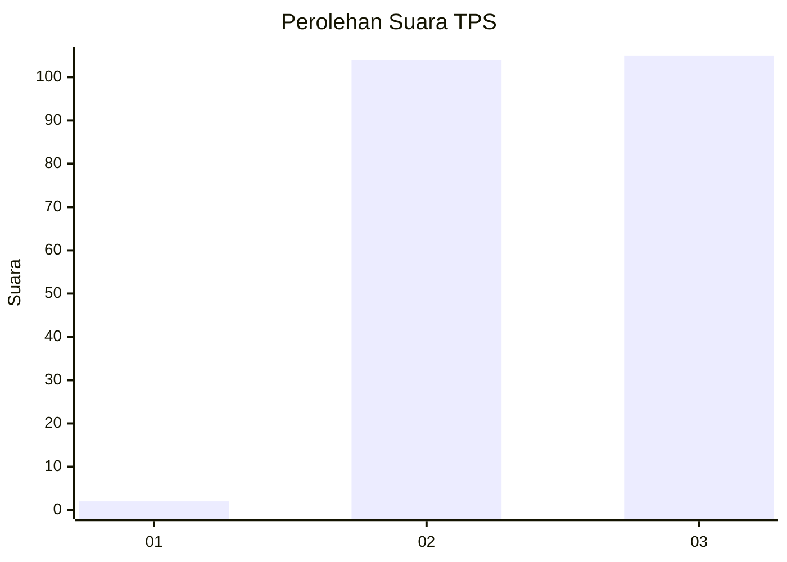
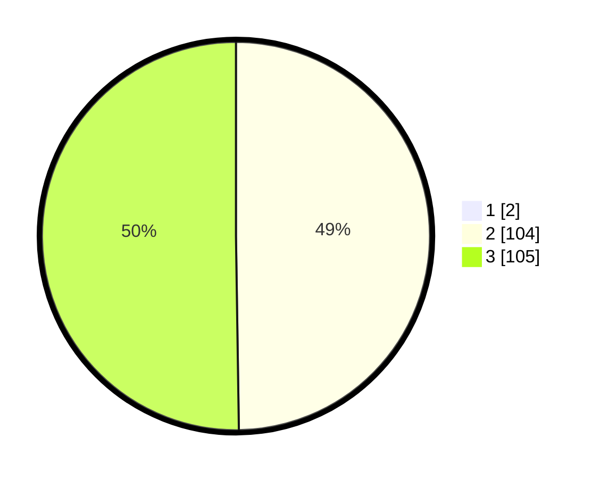

# Hasil

## Grafik

## Tabel

| No. | Nama Paslon    | Suara | Suara (raw) | Persentase |
|:--- |:-------------- | -----:| -----------:| ----------:|
| 1   | ANIES MUHAIMIN | 2     | [2][p-1]    | 0,95       |
| 2   | PRABOWO GIBRAN | 104   | [104][p-2]  | 49,29      |
| 3   | GANJAR MAHFUD  | 105   | [105][p-3]  | 49,76      |

[p-1]: https://github.com/gigit-pemilu/pemilu-2024-51-bali/blob/main/pilpres/hitung-suara/sub/51-bali/sub/01-jembrana/sub/02-mendoyo/sub/2005-delodberawah/sub/006-tps/sub/paslon-1.txt
[p-2]: https://github.com/gigit-pemilu/pemilu-2024-51-bali/blob/main/pilpres/hitung-suara/sub/51-bali/sub/01-jembrana/sub/02-mendoyo/sub/2005-delodberawah/sub/006-tps/sub/paslon-2.txt
[p-3]: https://github.com/gigit-pemilu/pemilu-2024-51-bali/blob/main/pilpres/hitung-suara/sub/51-bali/sub/01-jembrana/sub/02-mendoyo/sub/2005-delodberawah/sub/006-tps/sub/paslon-3.txt

## Foto C Plano

https://sirekap-obj-formc.kpu.go.id/2adf/pemilu/ppwp/51/01/02/20/05/5101022005006-20240215-103136--f7ea5742-0e1b-48a8-8c49-6d218060cf4a.jpg

https://sirekap-obj-formc.kpu.go.id/2adf/pemilu/ppwp/51/01/02/20/05/5101022005006-20240215-103206--a0fb2d26-7da5-40e4-a74d-cf2c8c237a5c.jpg

https://sirekap-obj-formc.kpu.go.id/2adf/pemilu/ppwp/51/01/02/20/05/5101022005006-20240215-103219--cf1ef9e0-1f94-4a39-87c1-40e752837a25.jpg

## Metadata

| Key        | Value               |
| ---------- | ------------------- |
| Time Stamp | 2024-02-16 06:00:27 |

## DATA PEMILIH TETAP

Jumlah pemilih dalam DPT: **268**.
 * L: **135**.
 * P: **133**.

## DATA PENGGUNA HAK PILIH

Jumlah pengguna hak pilih dalam DPT: **213**.
 * L: **107**.
 * P: **106**.

Jumlah pengguna hak pilih dalam DPTb: **1**.
 * L: **0**.
 * P: **1**.

Jumlah pengguna hak pilih dalam DPK: **0**.
 * L: **0**.
 * P: **0**.

Jumlah pengguna hak pilih: **214**.
 * L: **107**.
 * P: **107**.

## JUMLAH SUARA SAH DAN TIDAK SAH

JUMLAH SELURUH SUARA SAH: **211**.

JUMLAH SUARA TIDAK SAH: **3**.

JUMLAH SELURUH SUARA SAH DAN SUARA TIDAK SAH: **214**.

