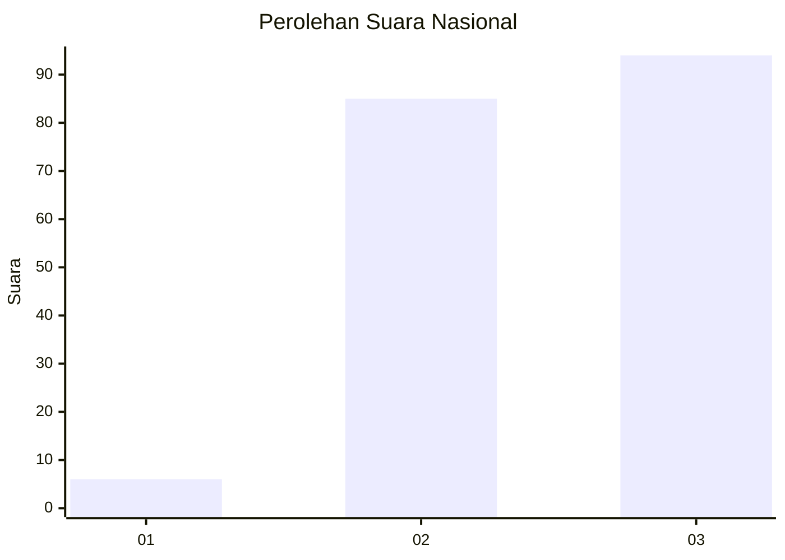
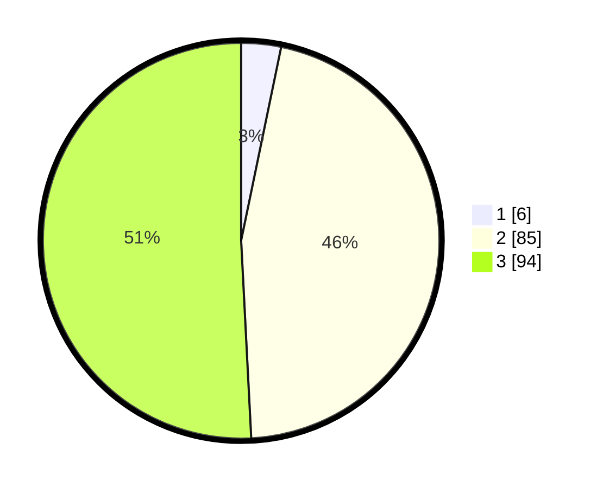

# Hasil

## Grafik

## Tabel

| No. | Nama Paslon    | Suara | Suara (raw) | Persentase |
|:--- |:-------------- | -----:| -----------:| ----------:|
| 1   | ANIES MUHAIMIN | 6     | [6][p-1]    | 3,24       |
| 2   | PRABOWO GIBRAN | 85    | [85][p-2]   | 45,95      |
| 3   | GANJAR MAHFUD  | 94    | [94][p-3]   | 50,81      |

[p-1]: https://github.com/gigit-pemilu/pemilu-2024/blob/main/pilpres/hitung-suara/sub/51-bali/sub/01-jembrana/sub/02-mendoyo/sub/2007-penyaringan/sub/001-tps/sub/paslon-1.txt
[p-2]: https://github.com/gigit-pemilu/pemilu-2024/blob/main/pilpres/hitung-suara/sub/51-bali/sub/01-jembrana/sub/02-mendoyo/sub/2007-penyaringan/sub/001-tps/sub/paslon-2.txt
[p-3]: https://github.com/gigit-pemilu/pemilu-2024/blob/main/pilpres/hitung-suara/sub/51-bali/sub/01-jembrana/sub/02-mendoyo/sub/2007-penyaringan/sub/001-tps/sub/paslon-3.txt

## Foto C Plano

https://sirekap-obj-formc.kpu.go.id/2b62/pemilu/ppwp/51/01/02/20/07/5101022007001-20240214-220023--c4b934b1-c77d-452e-bcda-7775e48ca0c2.jpg

https://sirekap-obj-formc.kpu.go.id/2b62/pemilu/ppwp/51/01/02/20/07/5101022007001-20240214-215948--b00adcce-94fb-468e-92fe-1897c90482a0.jpg

https://sirekap-obj-formc.kpu.go.id/2b62/pemilu/ppwp/51/01/02/20/07/5101022007001-20240214-215952--01549fe7-824c-4e95-a9c9-31a6e1bcc6f1.jpg

## Metadata

| Key        | Value               |
| ---------- | ------------------- |
| Time Stamp | 2024-02-15 09:00:24 |

## DATA PEMILIH TETAP

Jumlah pemilih dalam DPT: **241**.
 * L: **123**.
 * P: **118**.

## DATA PENGGUNA HAK PILIH

Jumlah pengguna hak pilih dalam DPT: **187**.
 * L: **93**.
 * P: **94**.

Jumlah pengguna hak pilih dalam DPTb: **0**.
 * L: **0**.
 * P: **0**.

Jumlah pengguna hak pilih dalam DPK: **0**.
 * L: **0**.
 * P: **0**.

Jumlah pengguna hak pilih: **187**.
 * L: **93**.
 * P: **94**.

## JUMLAH SUARA SAH DAN TIDAK SAH

JUMLAH SELURUH SUARA SAH: **185**.

JUMLAH SUARA TIDAK SAH: **2**.

JUMLAH SELURUH SUARA SAH DAN SUARA TIDAK SAH: **187**.

