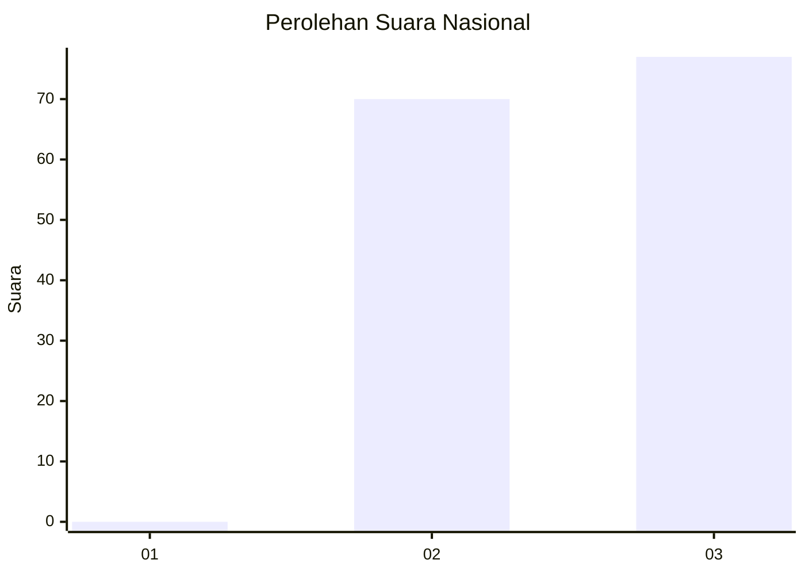
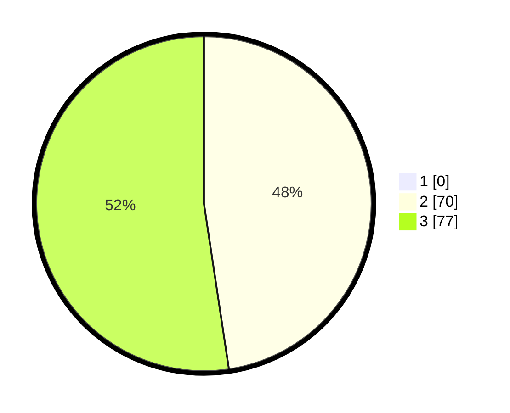

# Hasil

## Grafik

## Tabel

| No. | Nama Paslon    | Suara | Suara (raw) | Persentase |
|:--- |:-------------- | -----:| -----------:| ----------:|
| 1   | ANIES MUHAIMIN | 0     | [0][p-1]    | 0,00       |
| 2   | PRABOWO GIBRAN | 70    | [70][p-2]   | 47,62      |
| 3   | GANJAR MAHFUD  | 77    | [77][p-3]   | 52,38      |

[p-1]: https://github.com/gigit-pemilu/pemilu-2024/blob/main/pilpres/hitung-suara/sub/51-bali/sub/01-jembrana/sub/02-mendoyo/sub/2007-penyaringan/sub/002-tps/sub/paslon-1.txt
[p-2]: https://github.com/gigit-pemilu/pemilu-2024/blob/main/pilpres/hitung-suara/sub/51-bali/sub/01-jembrana/sub/02-mendoyo/sub/2007-penyaringan/sub/002-tps/sub/paslon-2.txt
[p-3]: https://github.com/gigit-pemilu/pemilu-2024/blob/main/pilpres/hitung-suara/sub/51-bali/sub/01-jembrana/sub/02-mendoyo/sub/2007-penyaringan/sub/002-tps/sub/paslon-3.txt

## Foto C Plano

https://sirekap-obj-formc.kpu.go.id/b5ee/pemilu/ppwp/51/01/02/20/07/5101022007002-20240214-133030--46fb19ff-f2d5-4b3d-8c3b-6fa999c08877.jpg

https://sirekap-obj-formc.kpu.go.id/b5ee/pemilu/ppwp/51/01/02/20/07/5101022007002-20240214-190032--a149f72b-fd6d-490e-9de4-f31f771729f0.jpg

https://sirekap-obj-formc.kpu.go.id/b5ee/pemilu/ppwp/51/01/02/20/07/5101022007002-20240214-141019--19c35fa7-947e-41fa-8205-44791b95c9b9.jpg

## Metadata

| Key        | Value               |
| ---------- | ------------------- |
| Time Stamp | 2024-02-14 21:46:01 |

## DATA PEMILIH TETAP

Jumlah pemilih dalam DPT: **212**.
 * L: **99**.
 * P: **113**.

## DATA PENGGUNA HAK PILIH

Jumlah pengguna hak pilih dalam DPT: **149**.
 * L: **80**.
 * P: **69**.

Jumlah pengguna hak pilih dalam DPTb: **0**.
 * L: **0**.
 * P: **0**.

Jumlah pengguna hak pilih dalam DPK: **0**.
 * L: **0**.
 * P: **0**.

Jumlah pengguna hak pilih: **149**.
 * L: **80**.
 * P: **69**.

## JUMLAH SUARA SAH DAN TIDAK SAH

JUMLAH SELURUH SUARA SAH: **147**.

JUMLAH SUARA TIDAK SAH: **2**.

JUMLAH SELURUH SUARA SAH DAN SUARA TIDAK SAH: **149**.

