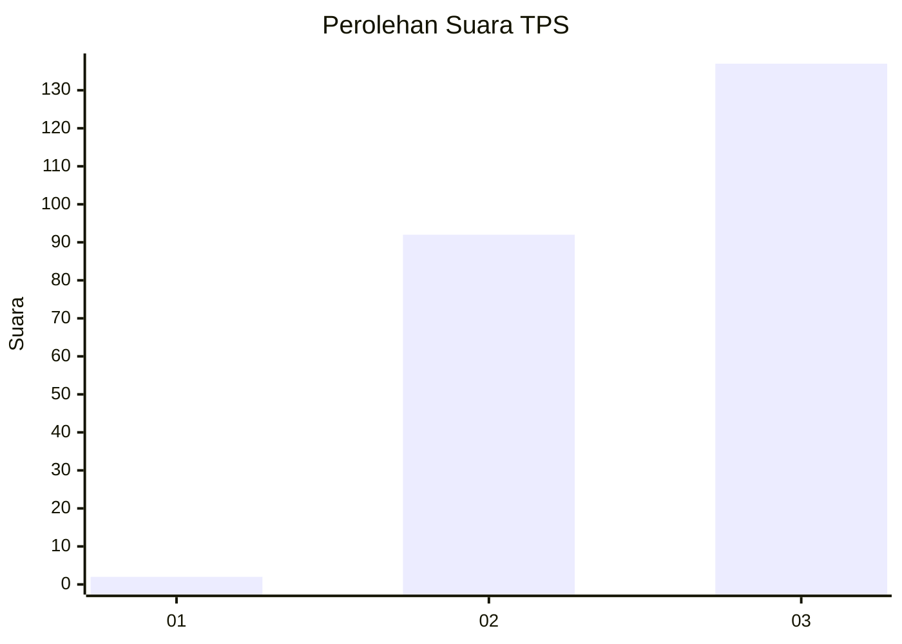
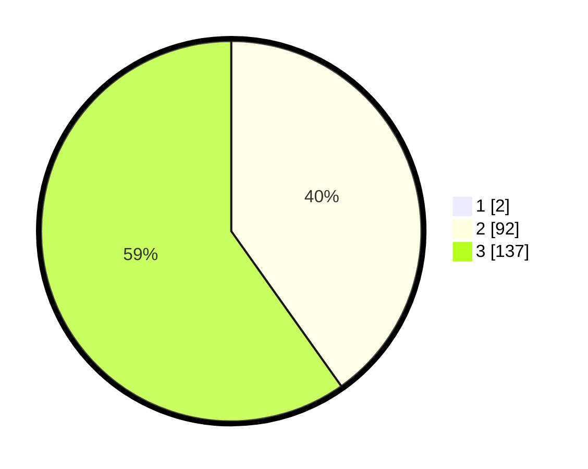

# Hasil

## Grafik

## Tabel

| No. | Nama Paslon    | Suara | Suara (raw) | Persentase |
|:--- |:-------------- | -----:| -----------:| ----------:|
| 1   | ANIES MUHAIMIN | 2     | [2][p-1]    | 0,87       |
| 2   | PRABOWO GIBRAN | 92    | [92][p-2]   | 39,83      |
| 3   | GANJAR MAHFUD  | 137   | [137][p-3]  | 59,31      |

[p-1]: https://github.com/gigit-pemilu/pemilu-2024-51-bali/blob/main/pilpres/hitung-suara/sub/51-bali/sub/01-jembrana/sub/02-mendoyo/sub/2007-penyaringan/sub/003-tps/sub/paslon-1.txt
[p-2]: https://github.com/gigit-pemilu/pemilu-2024-51-bali/blob/main/pilpres/hitung-suara/sub/51-bali/sub/01-jembrana/sub/02-mendoyo/sub/2007-penyaringan/sub/003-tps/sub/paslon-2.txt
[p-3]: https://github.com/gigit-pemilu/pemilu-2024-51-bali/blob/main/pilpres/hitung-suara/sub/51-bali/sub/01-jembrana/sub/02-mendoyo/sub/2007-penyaringan/sub/003-tps/sub/paslon-3.txt

## Foto C Plano

https://sirekap-obj-formc.kpu.go.id/f6d7/pemilu/ppwp/51/01/02/20/07/5101022007003-20240214-131708--fd005143-d445-4574-ba7f-87b1489efae1.jpg

https://sirekap-obj-formc.kpu.go.id/f6d7/pemilu/ppwp/51/01/02/20/07/5101022007003-20240215-002226--59d5c5d0-e7ca-4f2a-96a2-63c360141624.jpg

https://sirekap-obj-formc.kpu.go.id/f6d7/pemilu/ppwp/51/01/02/20/07/5101022007003-20240214-132706--b1ce2da2-c070-4722-b02c-d4e248737032.jpg

## Metadata

| Key        | Value               |
| ---------- | ------------------- |
| Time Stamp | 2024-02-15 12:00:28 |

## DATA PEMILIH TETAP

Jumlah pemilih dalam DPT: **282**.
 * L: **136**.
 * P: **146**.

## DATA PENGGUNA HAK PILIH

Jumlah pengguna hak pilih dalam DPT: **232**.
 * L: **111**.
 * P: **121**.

Jumlah pengguna hak pilih dalam DPTb: **0**.
 * L: **0**.
 * P: **0**.

Jumlah pengguna hak pilih dalam DPK: **2**.
 * L: **0**.
 * P: **2**.

Jumlah pengguna hak pilih: **234**.
 * L: **111**.
 * P: **123**.

## JUMLAH SUARA SAH DAN TIDAK SAH

JUMLAH SELURUH SUARA SAH: **231**.

JUMLAH SUARA TIDAK SAH: **3**.

JUMLAH SELURUH SUARA SAH DAN SUARA TIDAK SAH: **234**.

