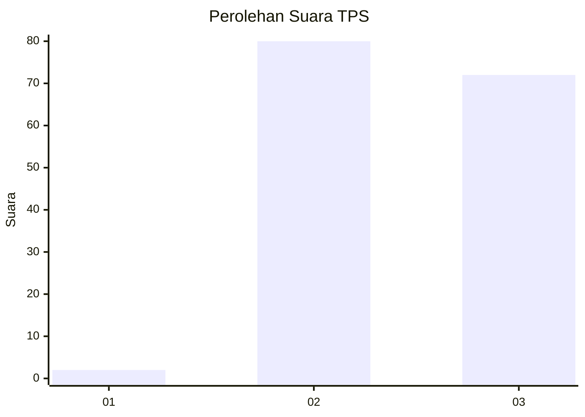
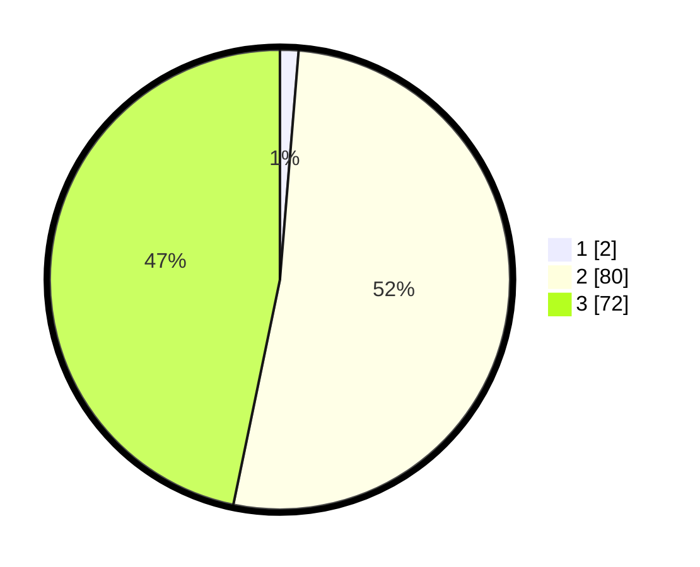

# Hasil

## Grafik

## Tabel

| No. | Nama Paslon    | Suara | Suara (raw) | Persentase |
|:--- |:-------------- | -----:| -----------:| ----------:|
| 1   | ANIES MUHAIMIN | 2     | [2][p-1]    | 1,30       |
| 2   | PRABOWO GIBRAN | 80    | [80][p-2]   | 51,95      |
| 3   | GANJAR MAHFUD  | 72    | [72][p-3]   | 46,75      |

[p-1]: https://github.com/gigit-pemilu/pemilu-2024-51-bali/blob/main/pilpres/hitung-suara/sub/51-bali/sub/01-jembrana/sub/02-mendoyo/sub/2007-penyaringan/sub/005-tps/sub/paslon-1.txt
[p-2]: https://github.com/gigit-pemilu/pemilu-2024-51-bali/blob/main/pilpres/hitung-suara/sub/51-bali/sub/01-jembrana/sub/02-mendoyo/sub/2007-penyaringan/sub/005-tps/sub/paslon-2.txt
[p-3]: https://github.com/gigit-pemilu/pemilu-2024-51-bali/blob/main/pilpres/hitung-suara/sub/51-bali/sub/01-jembrana/sub/02-mendoyo/sub/2007-penyaringan/sub/005-tps/sub/paslon-3.txt

## Foto C Plano

https://sirekap-obj-formc.kpu.go.id/7176/pemilu/ppwp/51/01/02/20/07/5101022007005-20240214-130819--041b0a49-972d-44f6-b975-c7289691a599.jpg

https://sirekap-obj-formc.kpu.go.id/7176/pemilu/ppwp/51/01/02/20/07/5101022007005-20240214-131557--f4f18ec8-0e2a-4684-8db4-e69b2a142046.jpg

https://sirekap-obj-formc.kpu.go.id/7176/pemilu/ppwp/51/01/02/20/07/5101022007005-20240214-131422--6531cc0a-5424-4e98-9e9a-55a94a1dd94f.jpg

## Metadata

| Key        | Value               |
| ---------- | ------------------- |
| Time Stamp | 2024-02-14 21:46:01 |

## DATA PEMILIH TETAP

Jumlah pemilih dalam DPT: **229**.
 * L: **109**.
 * P: **120**.

## DATA PENGGUNA HAK PILIH

Jumlah pengguna hak pilih dalam DPT: **155**.
 * L: **68**.
 * P: **87**.

Jumlah pengguna hak pilih dalam DPTb: **0**.
 * L: **0**.
 * P: **0**.

Jumlah pengguna hak pilih dalam DPK: **0**.
 * L: **0**.
 * P: **0**.

Jumlah pengguna hak pilih: **155**.
 * L: **68**.
 * P: **87**.

## JUMLAH SUARA SAH DAN TIDAK SAH

JUMLAH SELURUH SUARA SAH: **154**.

JUMLAH SUARA TIDAK SAH: **1**.

JUMLAH SELURUH SUARA SAH DAN SUARA TIDAK SAH: **155**.

