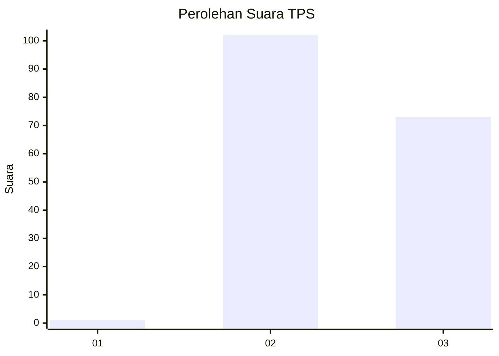
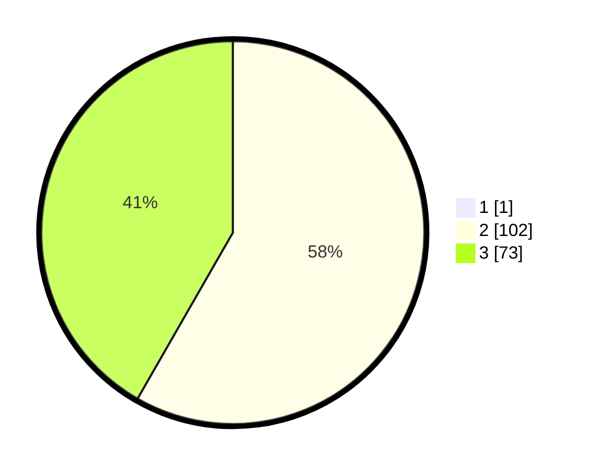

# Hasil

## Grafik

## Tabel

| No. | Nama Paslon    | Suara | Suara (raw) | Persentase |
|:--- |:-------------- | -----:| -----------:| ----------:|
| 1   | ANIES MUHAIMIN | 1     | [1][p-1]    | 0,57       |
| 2   | PRABOWO GIBRAN | 102   | [102][p-2]  | 57,95      |
| 3   | GANJAR MAHFUD  | 73    | [73][p-3]   | 41,48      |

[p-1]: https://github.com/gigit-pemilu/pemilu-2024-51-bali/blob/main/pilpres/hitung-suara/sub/51-bali/sub/01-jembrana/sub/02-mendoyo/sub/2007-penyaringan/sub/006-tps/sub/paslon-1.txt
[p-2]: https://github.com/gigit-pemilu/pemilu-2024-51-bali/blob/main/pilpres/hitung-suara/sub/51-bali/sub/01-jembrana/sub/02-mendoyo/sub/2007-penyaringan/sub/006-tps/sub/paslon-2.txt
[p-3]: https://github.com/gigit-pemilu/pemilu-2024-51-bali/blob/main/pilpres/hitung-suara/sub/51-bali/sub/01-jembrana/sub/02-mendoyo/sub/2007-penyaringan/sub/006-tps/sub/paslon-3.txt

## Foto C Plano

https://sirekap-obj-formc.kpu.go.id/128d/pemilu/ppwp/51/01/02/20/07/5101022007006-20240214-141224--ad853ff5-7f25-4a78-9c9d-661a7fcadfc6.jpg

https://sirekap-obj-formc.kpu.go.id/128d/pemilu/ppwp/51/01/02/20/07/5101022007006-20240215-012951--dd1472c7-a24a-46a3-a704-bb8825d669e5.jpg

https://sirekap-obj-formc.kpu.go.id/128d/pemilu/ppwp/51/01/02/20/07/5101022007006-20240214-141418--41e209fd-1c2f-4663-b4f7-84150177b389.jpg

## Metadata

| Key        | Value               |
| ---------- | ------------------- |
| Time Stamp | 2024-02-15 15:00:29 |

## DATA PEMILIH TETAP

Jumlah pemilih dalam DPT: **227**.
 * L: **116**.
 * P: **111**.

## DATA PENGGUNA HAK PILIH

Jumlah pengguna hak pilih dalam DPT: **176**.
 * L: **86**.
 * P: **90**.

Jumlah pengguna hak pilih dalam DPTb: **1**.
 * L: **0**.
 * P: **1**.

Jumlah pengguna hak pilih dalam DPK: **0**.
 * L: **0**.
 * P: **0**.

Jumlah pengguna hak pilih: **177**.
 * L: **86**.
 * P: **91**.

## JUMLAH SUARA SAH DAN TIDAK SAH

JUMLAH SELURUH SUARA SAH: **176**.

JUMLAH SUARA TIDAK SAH: **1**.

JUMLAH SELURUH SUARA SAH DAN SUARA TIDAK SAH: **177**.

