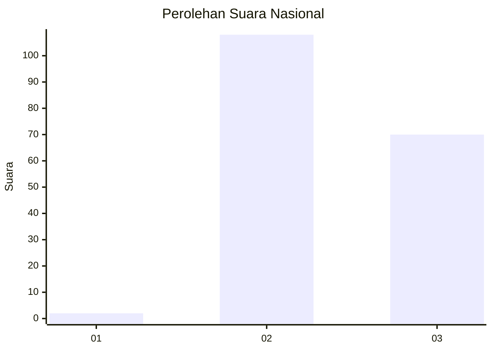
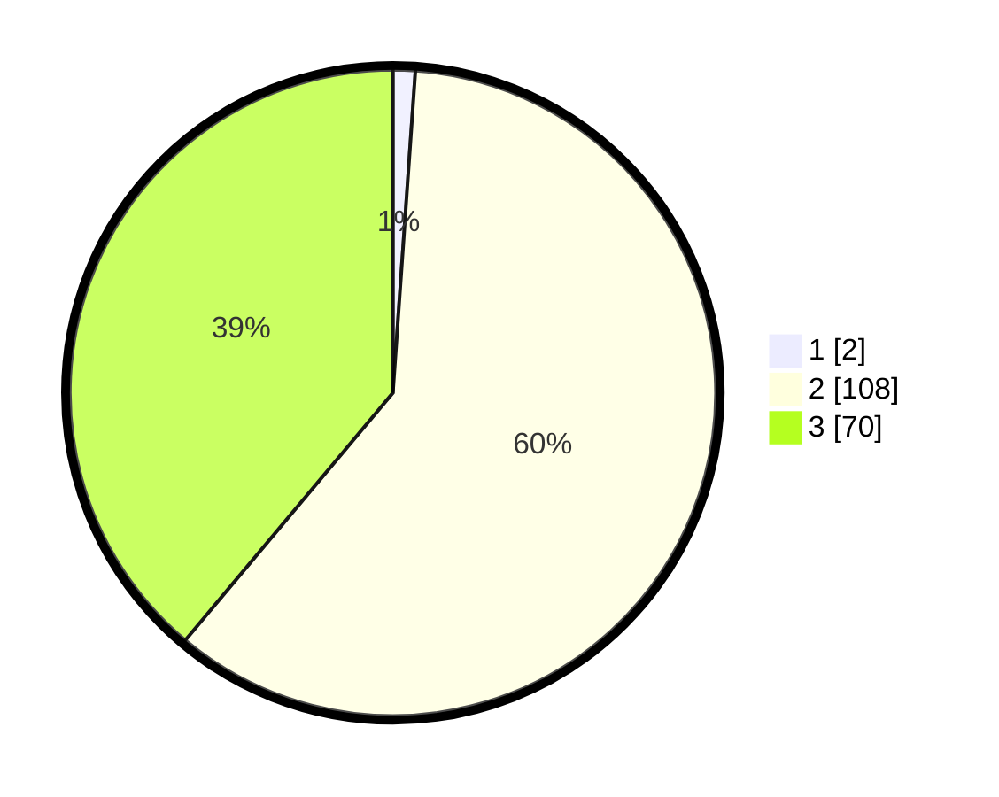

# Hasil

## Grafik

## Tabel

| No. | Nama Paslon    | Suara | Suara (raw) | Persentase |
|:--- |:-------------- | -----:| -----------:| ----------:|
| 1   | ANIES MUHAIMIN | 2     | [2][p-1]    | 1,11       |
| 2   | PRABOWO GIBRAN | 108   | [108][p-2]  | 60,00      |
| 3   | GANJAR MAHFUD  | 70    | [70][p-3]   | 38,89      |

[p-1]: https://github.com/gigit-pemilu/pemilu-2024/blob/main/pilpres/hitung-suara/sub/51-bali/sub/01-jembrana/sub/02-mendoyo/sub/2007-penyaringan/sub/008-tps/sub/paslon-1.txt
[p-2]: https://github.com/gigit-pemilu/pemilu-2024/blob/main/pilpres/hitung-suara/sub/51-bali/sub/01-jembrana/sub/02-mendoyo/sub/2007-penyaringan/sub/008-tps/sub/paslon-2.txt
[p-3]: https://github.com/gigit-pemilu/pemilu-2024/blob/main/pilpres/hitung-suara/sub/51-bali/sub/01-jembrana/sub/02-mendoyo/sub/2007-penyaringan/sub/008-tps/sub/paslon-3.txt

## Foto C Plano

https://sirekap-obj-formc.kpu.go.id/877f/pemilu/ppwp/51/01/02/20/07/5101022007008-20240214-141916--afbc8979-26f6-43f2-a80e-701fda59953f.jpg

https://sirekap-obj-formc.kpu.go.id/877f/pemilu/ppwp/51/01/02/20/07/5101022007008-20240214-141935--73df53f7-dc80-4008-91a1-d8e7e6467afc.jpg

https://sirekap-obj-formc.kpu.go.id/877f/pemilu/ppwp/51/01/02/20/07/5101022007008-20240214-141934--742bcc37-657c-428b-ad7f-9abf27c26bd7.jpg

## Metadata

| Key        | Value               |
| ---------- | ------------------- |
| Time Stamp | 2024-02-15 15:00:29 |

