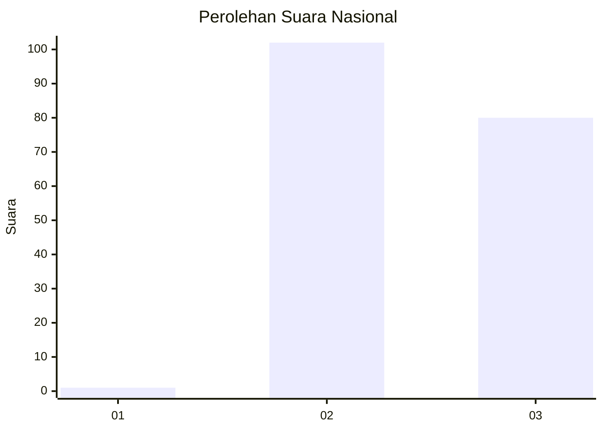
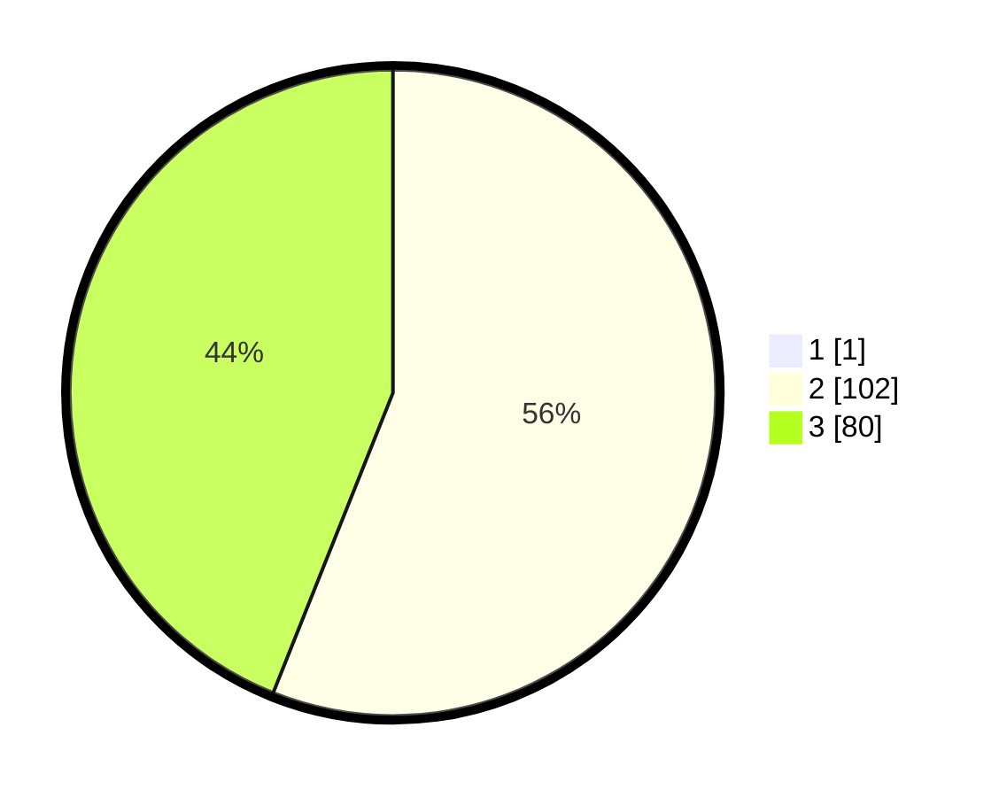

# Hasil

## Grafik

## Tabel

| No. | Nama Paslon    | Suara | Suara (raw) | Persentase |
|:--- |:-------------- | -----:| -----------:| ----------:|
| 1   | ANIES MUHAIMIN | 1     | [1][p-1]    | 0,55       |
| 2   | PRABOWO GIBRAN | 102   | [102][p-2]  | 55,74      |
| 3   | GANJAR MAHFUD  | 80    | [80][p-3]   | 43,72      |

[p-1]: https://github.com/gigit-pemilu/pemilu-2024/blob/main/pilpres/hitung-suara/sub/51-bali/sub/01-jembrana/sub/02-mendoyo/sub/2007-penyaringan/sub/012-tps/sub/paslon-1.txt
[p-2]: https://github.com/gigit-pemilu/pemilu-2024/blob/main/pilpres/hitung-suara/sub/51-bali/sub/01-jembrana/sub/02-mendoyo/sub/2007-penyaringan/sub/012-tps/sub/paslon-2.txt
[p-3]: https://github.com/gigit-pemilu/pemilu-2024/blob/main/pilpres/hitung-suara/sub/51-bali/sub/01-jembrana/sub/02-mendoyo/sub/2007-penyaringan/sub/012-tps/sub/paslon-3.txt

## Foto C Plano

https://sirekap-obj-formc.kpu.go.id/dd99/pemilu/ppwp/51/01/02/20/07/5101022007012-20240214-141043--720e344f-23d6-4ba2-a5cc-8d3ac66ab5ec.jpg

https://sirekap-obj-formc.kpu.go.id/dd99/pemilu/ppwp/51/01/02/20/07/5101022007012-20240214-141033--7e1a72c4-87e2-4399-97d0-8677e0285d25.jpg

https://sirekap-obj-formc.kpu.go.id/dd99/pemilu/ppwp/51/01/02/20/07/5101022007012-20240214-141232--d580fc7d-d574-44db-bbe8-5d4287193fc0.jpg

## Metadata

| Key        | Value               |
| ---------- | ------------------- |
| Time Stamp | 2024-02-15 05:00:24 |

## DATA PEMILIH TETAP

Jumlah pemilih dalam DPT: **241**.
 * L: **110**.
 * P: **131**.

## DATA PENGGUNA HAK PILIH

Jumlah pengguna hak pilih dalam DPT: **185**.
 * L: **84**.
 * P: **101**.

Jumlah pengguna hak pilih dalam DPTb: **0**.
 * L: **0**.
 * P: **0**.

Jumlah pengguna hak pilih dalam DPK: **1**.
 * L: **0**.
 * P: **1**.

Jumlah pengguna hak pilih: **186**.
 * L: **84**.
 * P: **102**.

## JUMLAH SUARA SAH DAN TIDAK SAH

JUMLAH SELURUH SUARA SAH: **183**.

JUMLAH SUARA TIDAK SAH: **3**.

JUMLAH SELURUH SUARA SAH DAN SUARA TIDAK SAH: **186**.

