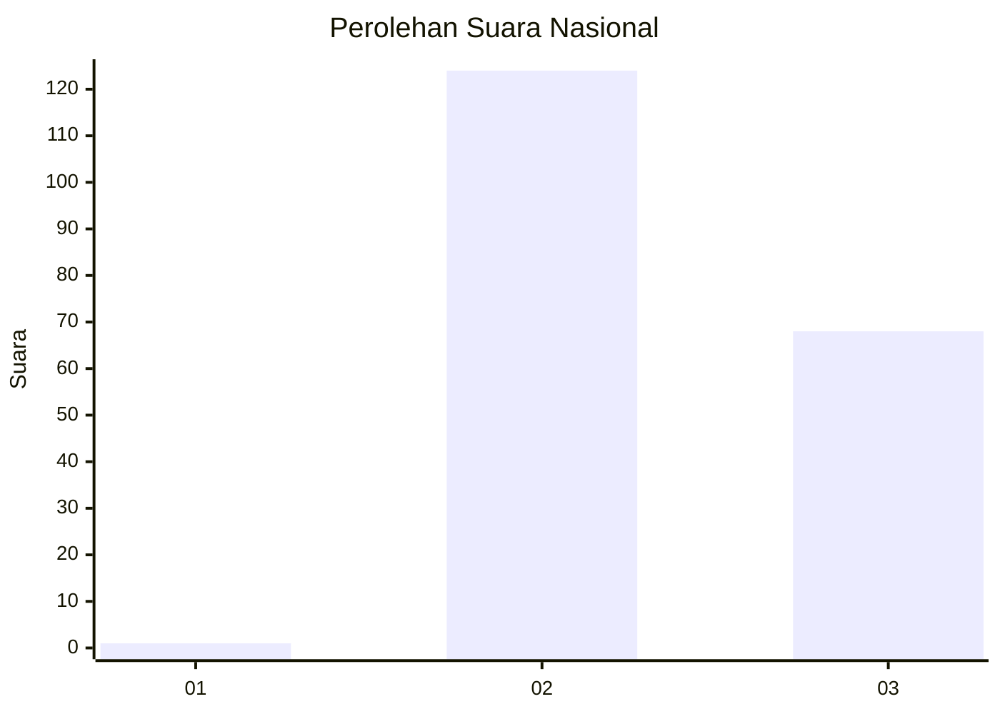
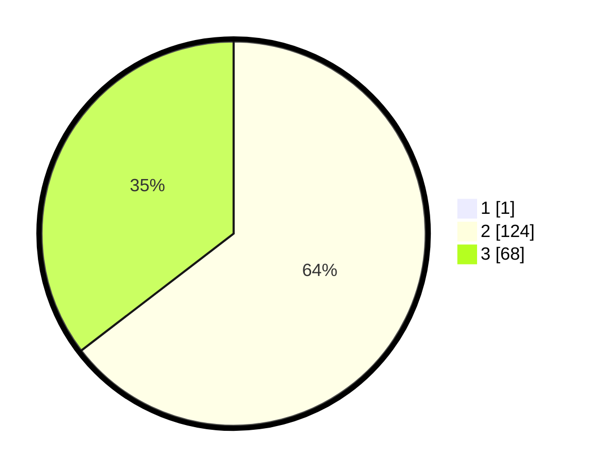

# Hasil

## Grafik

## Tabel

| No. | Nama Paslon    | Suara | Suara (raw) | Persentase |
|:--- |:-------------- | -----:| -----------:| ----------:|
| 1   | ANIES MUHAIMIN | 1     | [1][p-1]    | 0,52       |
| 2   | PRABOWO GIBRAN | 124   | [124][p-2]  | 64,25      |
| 3   | GANJAR MAHFUD  | 68    | [68][p-3]   | 35,23      |

[p-1]: https://github.com/gigit-pemilu/pemilu-2024/blob/main/pilpres/hitung-suara/sub/51-bali/sub/01-jembrana/sub/02-mendoyo/sub/2007-penyaringan/sub/017-tps/sub/paslon-1.txt
[p-2]: https://github.com/gigit-pemilu/pemilu-2024/blob/main/pilpres/hitung-suara/sub/51-bali/sub/01-jembrana/sub/02-mendoyo/sub/2007-penyaringan/sub/017-tps/sub/paslon-2.txt
[p-3]: https://github.com/gigit-pemilu/pemilu-2024/blob/main/pilpres/hitung-suara/sub/51-bali/sub/01-jembrana/sub/02-mendoyo/sub/2007-penyaringan/sub/017-tps/sub/paslon-3.txt

## Foto C Plano

https://sirekap-obj-formc.kpu.go.id/3a3b/pemilu/ppwp/51/01/02/20/07/5101022007017-20240214-125952--ac833293-6f4d-45e8-a6b9-acac74f5109b.jpg

https://sirekap-obj-formc.kpu.go.id/3a3b/pemilu/ppwp/51/01/02/20/07/5101022007017-20240214-130214--dcc338d7-eb5e-4014-bf45-e9cf6fe0ddc9.jpg

https://sirekap-obj-formc.kpu.go.id/3a3b/pemilu/ppwp/51/01/02/20/07/5101022007017-20240216-002652--322d8c63-8951-4989-a7c9-5fc86b84284f.jpg

## Metadata

| Key        | Value               |
| ---------- | ------------------- |
| Time Stamp | 2024-02-16 00:30:27 |

## DATA PEMILIH TETAP

Jumlah pemilih dalam DPT: **236**.
 * L: **113**.
 * P: **123**.

## DATA PENGGUNA HAK PILIH

Jumlah pengguna hak pilih dalam DPT: **195**.
 * L: **94**.
 * P: **101**.

Jumlah pengguna hak pilih dalam DPTb: **0**.
 * L: **0**.
 * P: **0**.

Jumlah pengguna hak pilih dalam DPK: **0**.
 * L: **0**.
 * P: **0**.

Jumlah pengguna hak pilih: **195**.
 * L: **94**.
 * P: **101**.

## JUMLAH SUARA SAH DAN TIDAK SAH

JUMLAH SELURUH SUARA SAH: **193**.

JUMLAH SUARA TIDAK SAH: **2**.

JUMLAH SELURUH SUARA SAH DAN SUARA TIDAK SAH: **195**.

